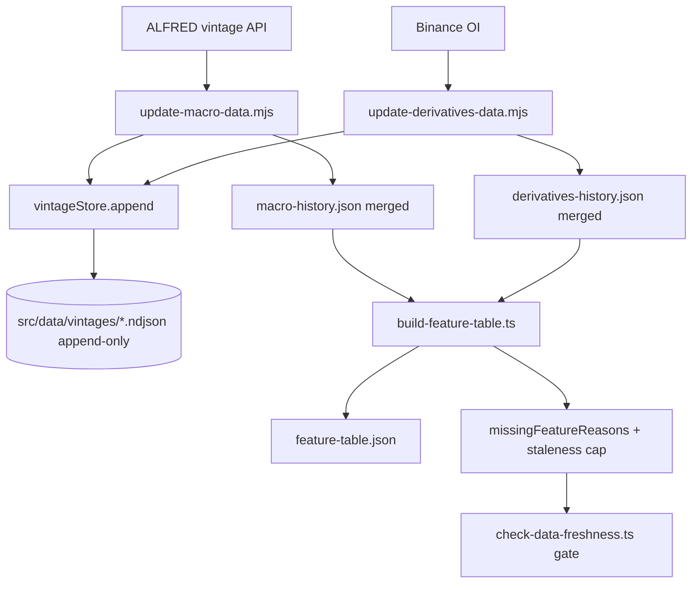
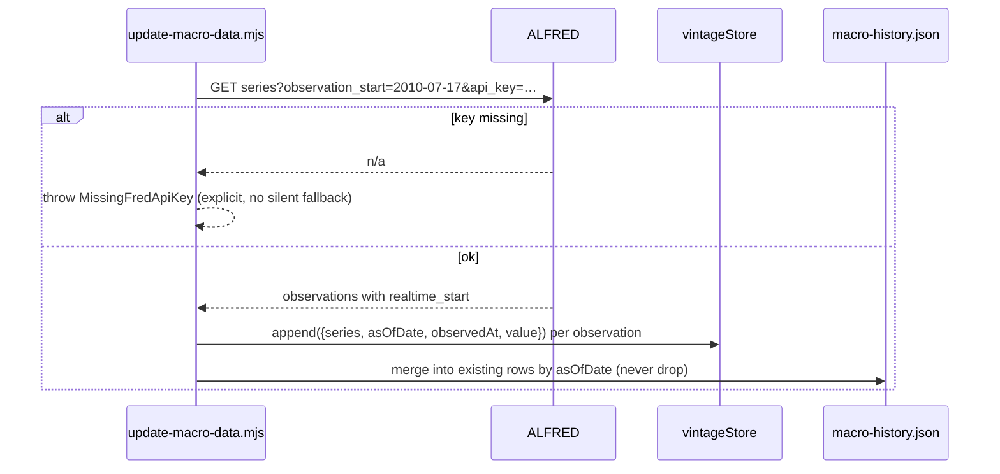

# PRD: Data History Recovery and Vintage Archive

Complexity: 7 -> HIGH mode

Score: +3 for 10+ files across updaters, feature build, validators and tests; +2 for a new vintage store module; +1 for a new persisted store schema; +1 for the ALFRED external API integration.

Status: Proposed — Phases 1-2 are defect fixes that invalidate a recorded experiment verdict; Phases 3-4 add the vintage archive.

Owner: Data / Forecasting

Source assessment: [`docs/reports/forecast-model-improvement-proposals-2026-08-02.md`](../../reports/forecast-model-improvement-proposals-2026-08-02.md) §2 (D1, D2, D5), §3 P2

---

## 1. Context

**Problem:** Three data sources silently carry a fraction of the history their
scripts claim to fetch, and no source retains vintages — so every backtest in
this repo runs on restated data, and at least one recorded experiment rejection
(macro liquidity, 2026-06-26) was decided on three years of a single regime.

**Files analyzed:**

- `scripts/update-macro-data.mjs`
- `scripts/update-derivatives-data.mjs`
- `scripts/update-btc-data.mjs`
- `scripts/update-onchain-data.mjs`
- `scripts/update-etf-flow-data.mjs`
- `scripts/update-cot-data.mjs`
- `scripts/update-stablecoin-data.mjs`
- `scripts/build-feature-table.ts`
- `scripts/validate-feature-table.ts`
- `scripts/check-data-freshness.ts`
- `src/lib/regimeModel.ts`
- `docs/reports/data-sources.md`
- `docs/reports/experiments-backlog.md`
- `.env.example`

**Current behavior:**

- `update-macro-data.mjs:45` requests
  `https://fred.stlouisfed.org/graph/fredgraph.csv?id=${seriesId}` with **no**
  `cosd` / `observation_start` parameter. `START_DATE = '2010-07-17'` (`:15`) is
  applied only as a post-fetch filter (`:41`, `:88`). FRED's graph CSV returns a
  rolling ~3-year window, and `main()` overwrites the file wholesale (`:152`), so
  history can never accumulate. Measured result: **1,093 rows from 2023-07-07**,
  not 16 years. Zero coverage of 2018, 2020 or 2022.
- `.env.example:11` declares `FRED_API_KEY` "required for `npm run update:macro`".
  The script never reads it. The ALFRED vintage path named in
  `docs/reports/data-sources.md:20` as the promotion prerequisite is unimplemented.
- `update-derivatives-data.mjs:13,131` caps open-interest history at
  `OPEN_INTEREST_LOOKBACK_DAYS = 30` and writes the whole file (`:243`), so
  `futuresOpenInterestUSD` exists on **28 of 5,836** feature rows.
  `regimeModel.ts:53` gates `elevated-futures-leverage` on that field, making the
  reason code unreachable for 99.5% of history.
- `build-feature-table.ts:50-53` joins MVRV and on-chain on an exact
  `sourceDate = rowDate - 1` key with no forward-fill and no staleness flag.
  CoinMetrics runs ~4 days behind BTC, so the newest rows carry 57/72 features,
  `networkContext` is `null`, and `classifyRegime` evaluates
  `undefined > 1.8` (`regimeModel.ts:45`) — the `valuation-stretched` branch
  fails silently rather than reporting missing data.
- `check-data-freshness.ts:4,33` only fails above a 7-day lag, so the committed
  `source-freshness.json` records `onchain: {status: "stale", lagDays: 5}` and
  passes.
- `latestTimedRow` (`build-feature-table.ts:282-289`) forward-fills COT, macro
  and ETF indefinitely with no staleness cap. Measured max carry: COT 16 days,
  macro 30 days, ETF 4 days. 429 weekly COT reports become 3,009 "daily" rows,
  and any regression treats the repeats as independent samples.
- **No updater retains vintages.** All do a wholesale `writeFileSync`.
  `update-btc-data.mjs:15,167-169` additionally rewrites the trailing 365 days
  every run. Yahoo re-adjusts VOO/GLD for every dividend. So `availableAfter`
  protects timing but not revision, and the reports concede it
  ("latest-revised rather than vintage data").

### Root-cause statement

One pattern, four symptoms: **the caches are projections of the vendor's current
state, not an archive of what was knowable at a point in time.** Fixing the two
truncation defects without fixing the archive would restore history that is
still restated.

### Goals

- `macro-history.json` covers 2010-07-17 onward, from a vintage-aware source.
- `futuresOpenInterestUSD` accumulates instead of resetting to a 30-day window.
- Missing on-chain data is reported as missing rather than evaluated as
  `undefined`, and the freshness gate catches it.
- An append-only `(series, as_of_date, observed_at, value)` archive exists and is
  written by every updater, so a future backtest can reconstruct any vintage.

### Non-goals

- Ingesting new series (Deribit, net-liquidity components, Coinbase premium).
  Those are separate registered experiments and are blocked on this archive.
- Re-running the macro experiment. That is a new backlog entry citing D1, filed
  after Phase 2 lands — not part of this PRD.

---

## 2. Solution

**Approach:**

- Fix the FRED request to ALFRED with an explicit observation start and a
  vintage date, using `FRED_API_KEY` via a shared config accessor rather than
  bare `process.env`.
- Change derivatives, and then every updater, from overwrite to **merge**:
  read existing rows, union by key, never drop a row that the vendor stopped
  returning.
- Introduce `scripts/lib/vintageStore.mjs` writing an append-only NDJSON archive
  under `src/data/vintages/<series>.ndjson`, one record per
  `(as_of_date, observed_at, value)`. Updaters append; nothing rewrites.
- Make missing-data explicit: `build-feature-table.ts` emits a
  `missingFeatureReasons` entry and a bounded forward-fill with a declared
  staleness cap; `check-data-freshness.ts` fails on a per-source cap; and
  `classifyRegime` refuses to compare `undefined`.

**Architecture:**



**Key decisions:**

- [ ] Archive format is NDJSON, not JSON — append is O(1) and a truncated write
      cannot corrupt prior records. One file per series.
- [ ] The archive is **additive only**. A record is never edited. A vendor
      restatement produces a *new* record with a later `observed_at` and the same
      `as_of_date`; the reconstruction reads the latest `observed_at <= cutoff`.
- [ ] `FRED_API_KEY` is read through a small `scripts/lib/env.mjs` accessor that
      throws a named error when absent, per the repo convention of not touching
      `process.env` at call sites.
- [ ] The staleness cap is per-source and declared in one place, not per-call.
      Proposed: COT 10 days, macro 45 days, ETF 5 days, on-chain 3 days.
      Exceeding it emits `missingFeatureReasons`, not a stale value.
- [ ] Archive files are committed. They are the evidence base for every future
      point-in-time claim; a `.gitignore`d archive is not evidence.

**Data changes:** New `src/data/vintages/<series>.ndjson`. Existing cache files
keep their schema; `derivatives-history.json` gains rows, `macro-history.json`
gains ~13 years of rows.

---

## 3. Sequence flow



---

## 4. Execution phases

### Phase 1: Open-interest history accumulates — `futuresOpenInterestToMarketCap` covers more than 28 rows and grows daily

Chosen first because it is the smallest complete proof of the merge pattern that
every later phase reuses, and its subject is a real production cache.

**Files (3 existing, 1 new):**

- `scripts/lib/mergeRows.mjs` — NEW: `mergeByKey(existing, incoming, key)`,
  union preserving existing rows the vendor no longer returns.
- `scripts/update-derivatives-data.mjs` — EDIT: read the existing cache and
  merge instead of overwriting (`:243`, `:294`).
- `scripts/validate-feature-table.ts` — EDIT: add a per-feature minimum-coverage
  assertion so a 28-row field can never pass silently again.
- `src/lib/__tests__/scriptGuards.test.ts` — EDIT: cover `mergeByKey`.

**Implementation:**

- [ ] `mergeByKey` returns rows sorted by key with incoming values winning on
      collision, and **never** drops an existing key.
- [ ] `update-derivatives-data.mjs` loads the existing file, merges, writes.
      `OPEN_INTEREST_LOOKBACK_DAYS` stays at 30 — it is the vendor's window, not
      the retention policy.
- [ ] `validate-feature-table.ts` gains a declared per-feature minimum coverage
      table; a feature below its floor fails with the measured count.

**Wiring:**

- [ ] Caller edited: `scripts/update-derivatives-data.mjs` invokes `mergeByKey`
      before both `writeFileSync` sites.
- [ ] Registration: `update:derivatives` already runs in `predev` and
      `update:forecast-data` (`package.json:7,58`) — the merge is on the daily path.
- [ ] Old path: the wholesale overwrite is **replaced**, not kept behind a flag.
- [ ] Ledger rows filled: #1, #2.

**Tests required:**

| Test file | Test name | Assertion | Negative control (observed red) |
|---|---|---|---|
| `scriptGuards.test.ts` | `should retain an existing row when the incoming payload omits its key` | merged length > incoming length | goes red with plain assignment in place of `mergeByKey` |
| `scriptGuards.test.ts` | `should prefer the incoming value when both payloads carry the same key` | merged value equals incoming | goes red if merge order is inverted |
| `scriptGuards.test.ts` | `should fail validation when a declared feature falls below its minimum coverage` | throws naming the feature and count | goes red at `HEAD~1`, where the 28-row OI field passes |

**Revert check:** restoring the wholesale write fails
`should retain an existing row when the incoming payload omits its key`.

**User verification:**

- Action: `yarn update:derivatives` twice, with the second run's fixture
  returning a shorter window.
- Expected: `derivatives-history.json` row count does not decrease, and
  `yarn validate:features` reports the new OI coverage count.

---

### Phase 2: Macro history recovered to 2010 via ALFRED — the macro feature family becomes testable across 2018, 2020 and 2022

**Proof subject:** this phase is proved on the real production subject —
`macro-history.json` regenerated from ALFRED for all five series, not a fixture.

**Files (3 existing, 2 new):**

- `scripts/lib/env.mjs` — NEW: `requireEnv(name)` throwing a named error.
- `scripts/lib/vintageStore.mjs` — NEW: `appendVintageRecords(series, records)`.
- `scripts/update-macro-data.mjs` — EDIT: ALFRED request with
  `observation_start`, `api_key`, and `realtime_start`; merge instead of
  overwrite; append vintages.
- `scripts/check-data-freshness.ts` — EDIT: per-source staleness caps.
- `.env.example` — EDIT: `FRED_API_KEY` promoted from "Optional" to required for
  `update:macro`, matching what the script now enforces.

**Implementation:**

- [ ] Replace the `fredgraph.csv` URL (`:45`) with the ALFRED/FRED observations
      endpoint carrying `observation_start=2010-07-17` and `api_key`.
- [ ] Capture each observation's `realtime_start` as `observedAt` and its
      `date` as `asOfDate`; append both to the vintage store.
- [ ] Merge into `macro-history.json` with `mergeByKey` from Phase 1. Keep
      `CONSERVATIVE_LAG_DAYS = 30` (`:17,138`) for now — it becomes removable
      once real vintages exist, which is a follow-up entry, not this phase.
- [ ] `requireEnv('FRED_API_KEY')` throws with an actionable message. **No silent
      fallback to the graph CSV** — a silent fallback is how the current
      truncation went unnoticed for two months.
- [ ] `check-data-freshness.ts`: per-source caps replace the single 7-day rule.

**Wiring:**

- [ ] Caller edited: `scripts/update-macro-data.mjs` calls `requireEnv` and
      `appendVintageRecords`; `update:macro` runs inside `update:forecast-data`
      (`package.json:58`), which the daily CI workflow invokes.
- [ ] Registration: `.github/workflows/forecast-data-update.yml` needs
      `FRED_API_KEY` in repository secrets — the phase is not done until the
      workflow has it.
- [ ] Old path: `fredgraph.csv` request **deleted**.
- [ ] Ledger rows filled: #3, #4, #5.

**Tests required:**

| Test file | Test name | Assertion | Negative control |
|---|---|---|---|
| `scriptGuards.test.ts` | `should throw a named error when FRED_API_KEY is absent` | error message names the variable and the script | goes red if a fallback path is reintroduced |
| `scriptGuards.test.ts` | `should request an observation start of 2010-07-17 for every macro series` | constructed URL contains the parameter for all five ids | goes red at `HEAD~1`, where no such parameter exists |
| `scriptGuards.test.ts` | `should fail freshness when a source exceeds its declared per-source cap` | on-chain at 5 days fails the 3-day cap | goes red at `HEAD~1`, where 5 days passes the blanket 7-day rule |
| `scriptGuards.test.ts` | `should append one vintage record per observation without rewriting prior records` | archive line count grows; earlier lines byte-identical | goes red if the store rewrites the file |

**Revert check:** removing the `observation_start` parameter fails the URL test;
removing `requireEnv` fails the key test.

**Manual checkpoint (required — external API integration):**

```
## PHASE 2 COMPLETE - CHECKPOINT
Files changed: [list]
yarn test: [pass/fail]   yarn lint: [pass/fail]

Manual verification needed:
1. [ ] FRED_API_KEY set locally → yarn update:macro → macro-history.json first
       row is 2010-07-17 or the earliest date the series exists, not 2023-07-07.
       Paste the row count before and after.
2. [ ] src/data/vintages/macro-*.ndjson exists and is non-empty.
3. [ ] FRED_API_KEY added to GitHub repository secrets and referenced in
       .github/workflows/forecast-data-update.yml.

Reply "continue" or report issues.
```

---

### Phase 3: Missing on-chain data is reported, not silently evaluated — the regime panel says "unavailable" instead of showing a wrong state

**Files (4 existing, 0 new):**

- `scripts/build-feature-table.ts` — EDIT: bounded forward-fill with the declared
  per-source cap for MVRV/on-chain (`:50-53`), emitting `missingFeatureReasons`
  beyond the cap.
- `src/lib/regimeModel.ts` — EDIT: guard every threshold comparison with
  `Number.isFinite`; emit an explicit `insufficient-data` classification rather
  than falling through.
- `scripts/write-runtime-summaries.ts` — EDIT: surface `insufficient-data` in
  `current-regime-summary.json`.
- `src/lib/__tests__/` (new file `regimeModel.test.ts` if absent) — tests below.

**Implementation:**

- [ ] Forward-fill MVRV/on-chain up to the declared cap (3 days), carrying the
      original `sourceDate` so the lag-safety assertion still sees the true age.
- [ ] Beyond the cap, omit the feature and record the reason.
- [ ] `classifyRegime`: any branch reading an absent feature contributes nothing
      to the score and is listed in the returned reason codes as unavailable.
- [ ] If more than a declared fraction of inputs are unavailable, return
      `insufficient-data` rather than a confident label.

**Wiring:**

- [ ] Caller edited: `write-runtime-summaries.ts` renders the new state;
      `src/lib/reliabilityReport.ts` and `App.tsx:23,26` already read that JSON,
      so the state reaches the UI without a new component.
- [ ] Old path: the `undefined > threshold` comparisons are **removed**.
- [ ] Ledger rows filled: #6, #7.

**Tests required:**

| Test file | Test name | Assertion | Negative control |
|---|---|---|---|
| `regimeModel.test.ts` | `should return insufficient-data when required on-chain features are absent` | classification is `insufficient-data`, not a confident label | goes red at `HEAD~1`, which returns a scored label |
| `regimeModel.test.ts` | `should not count an absent feature toward the regime score` | score with a feature omitted equals the score with that branch removed | goes red if `undefined` coerces into a comparison |
| `scriptGuards.test.ts` | `should record a missing reason when a source exceeds its forward-fill cap` | `missingFeatureReasons` names the source and the age | goes red with unbounded forward-fill |

**Revert check:** reverting the `Number.isFinite` guards fails
`should return insufficient-data when required on-chain features are absent`.

**User verification (visual):**

- Action: `yarn build:features && yarn write:runtime-summaries && yarn dev`
- Expected: with CoinMetrics 4+ days behind, the regime panel reads
  "insufficient data" rather than showing a state derived from `undefined`.

---

### Phase 4: Every updater writes vintages — a backtest can reconstruct what was knowable on any past date

**Files (5 existing, 0 new):**

- `scripts/update-btc-data.mjs`, `update-onchain-data.mjs`,
  `update-etf-flow-data.mjs`, `update-cot-data.mjs`,
  `update-stablecoin-data.mjs` — EDIT: each appends to the vintage store and
  merges rather than overwriting.

**Implementation:**

- [ ] Each updater calls `appendVintageRecords` before writing its cache.
- [ ] `update-btc-data.mjs`'s 365-day repair (`:15,167-169`) becomes an append of
      revised values with a new `observedAt`, not an in-place rewrite of history.
- [ ] Add `scripts/reconstruct-vintage.mjs` — given a series and a cutoff date,
      emits the values as they stood. This is the consumer that makes the archive
      load-bearing; without it the archive is write-only and therefore dead.

**Wiring:**

- [ ] Caller edited: all five updaters, all already on the `update:forecast-data`
      path.
- [ ] Registration: add `reconstruct:vintage` to `package.json` scripts.
- [ ] Old path: wholesale overwrites replaced by merges in each updater.
- [ ] Ledger rows filled: #8, #9.

**Tests required:**

| Test file | Test name | Assertion | Negative control |
|---|---|---|---|
| `scriptGuards.test.ts` | `should reconstruct the pre-revision value when the cutoff precedes the revision` | reconstructed value equals the first observation, not the latest | goes red if the store keeps only the newest record per `asOfDate` |
| `scriptGuards.test.ts` | `should reconstruct the revised value when the cutoff follows the revision` | reconstructed value equals the revision | goes red if `observed_at` is ignored |
| `scriptGuards.test.ts` | `should never shrink a cache file across two updater runs` | row count monotone for each of the five caches | goes red with any wholesale write restored |

**Revert check:** removing `appendVintageRecords` from any updater fails
`should reconstruct the pre-revision value when the cutoff precedes the revision`
for that series.

---

## Integration Ledger

| # | New thing | Live caller (`file:line`, non-test) | Replaces | Old path removed? | Negative control |
|---|---|---|---|---|---|
| 1 | `mergeByKey` | `scripts/update-derivatives-data.mjs` before both write sites | wholesale `writeFileSync` at `:243,:294` | replaced, Phase 1 | omitted-key row must survive |
| 2 | per-feature minimum coverage | `scripts/validate-feature-table.ts`, run by `validate:data` | implicit "≥365 rows" only | extended, Phase 1 | 28-row OI field passes at `HEAD~1` |
| 3 | `requireEnv` | `scripts/update-macro-data.mjs` | bare absence of any key use | n/a | missing key must throw, not fall back |
| 4 | ALFRED request with `observation_start` | `scripts/update-macro-data.mjs:45` | `fredgraph.csv` request | deleted, Phase 2 | URL assertion red at `HEAD~1` |
| 5 | per-source staleness caps | `scripts/check-data-freshness.ts`, run by `check:freshness` in `update:forecast-data` | blanket 7-day rule | replaced, Phase 2 | on-chain at 5 days passes at `HEAD~1` |
| 6 | `insufficient-data` classification | `src/lib/regimeModel.ts` → `scripts/write-runtime-summaries.ts` → `App.tsx:23,26` | `undefined > threshold` fall-through | removed, Phase 3 | absent feature yields a confident label at `HEAD~1` |
| 7 | bounded forward-fill + missing reasons | `scripts/build-feature-table.ts:50-53` | unbounded exact-key join / unbounded `latestTimedRow` | replaced, Phase 3 | stale value carried silently at `HEAD~1` |
| 8 | `appendVintageRecords` | all seven updaters | n/a — no archive existed | n/a | archive rewrite fails the append test |
| 9 | `scripts/reconstruct-vintage.mjs` + `reconstruct:vintage` script | `package.json` scripts; consumed by future point-in-time backtests | n/a | n/a | pre-revision reconstruction test |

---

## Reachability

**How will this feature be reached?**

- [x] Entry points: `yarn update:forecast-data` (daily GitHub Actions workflow),
      `yarn predev`, `yarn validate:data`, `yarn check:freshness`,
      `yarn reconstruct:vintage`.
- [x] Pre-existing files EDITED: seven `scripts/update-*.mjs`,
      `scripts/build-feature-table.ts`, `scripts/validate-feature-table.ts`,
      `scripts/check-data-freshness.ts`, `src/lib/regimeModel.ts`,
      `scripts/write-runtime-summaries.ts`, `package.json`, `.env.example`.
- [x] Registration: `FRED_API_KEY` added to repository secrets and referenced in
      `.github/workflows/forecast-data-update.yml`; `reconstruct:vintage` added
      to `package.json`.

**Is this user-facing?**

- [x] Phase 3: YES — the regime panel renders `insufficient-data` through the
      existing `current-regime-summary.json` → `App.tsx` path. No new component.
- [x] Phases 1, 2, 4: NO — background data pipeline. Trigger is the daily cron.

**Full flow:**

1. The daily workflow runs `update:forecast-data`.
2. Triggers each `scripts/update-*.mjs`.
3. Reaches the new code via `requireEnv`, `mergeByKey` and
   `appendVintageRecords` inside those scripts.
4. Result observable in: row counts in `src/data/*.json`, files under
   `src/data/vintages/`, the freshness gate's exit status, and the regime panel.

**What does this replace?**

- [x] Replaces the `fredgraph.csv` request, the wholesale-overwrite pattern in
      every updater, the blanket 7-day freshness rule, and the
      `undefined`-comparison branches in `classifyRegime`.

---

## Verification plan

```bash
# 1. Caller census
grep -rn "appendVintageRecords\|mergeByKey\|requireEnv" scripts src \
  | grep -v "__tests__" | grep -v ".test."
# Expected: hits in all seven updaters, not only the definitions

# 2. Truncation proof — macro history actually recovered
node -e "const m=require('./src/data/macro-history.json'); const r=m.rows??m; console.log(r.length, r[0].date)"
# Expected: substantially more than 1093 rows; first date near 2010-07-17

# 3. OI coverage proof
node -e "const f=require('./src/data/feature-table.json'); const r=f.rows??f; console.log(r.filter(x=>Number.isFinite(x.futuresOpenInterestUSD)).length)"
# Expected: grows on every subsequent daily run; 28 at HEAD~1

# 4. Monotonicity proof — run each updater twice, cache must never shrink
# 5. Revert check
#    Restore the wholesale write in update-derivatives-data.mjs, then:
yarn test src/lib/__tests__/scriptGuards.test.ts
# Expected: FAIL on the omitted-key retention test

# 6. Archive is committed, not ignored
git check-ignore -v src/data/vintages/ ; echo "exit=$?"
# Expected: exit=1 (not ignored)
```

**Evidence required:**

- [ ] `yarn test`, `yarn lint`, `yarn validate:data` pass
- [ ] Every gate has an observed negative control recorded inline
- [ ] Row counts pasted before/after for `macro-history.json` and
      `derivatives-history.json`
- [ ] `yarn backtest` re-run and the artifact diffed — feature-family results
      will move, and that movement must be recorded
- [ ] Backlog entries filed: (a) the macro-liquidity rejection of 2026-06-26 is
      annotated as **void — decided on 3 years of a single regime, see D1**;
      (b) a new pre-registered macro rerun entry citing the recovered history

---

## Acceptance criteria

Consumer-scoped. Each must be false on the current build.

- [ ] A reviewer opening `src/data/macro-history.json` sees observations from
      2010, spanning the 2018 tightening cycle, the 2020 COVID shock and the 2022
      drawdown — not a 2023-07-07 start.
- [ ] `futuresOpenInterestToMarketCap` is present on a growing number of feature
      rows after each daily run, and `regimeModel`'s `elevated-futures-leverage`
      reason code is reachable on historical origins.
- [ ] With CoinMetrics behind, the regime panel a user sees reads
      "insufficient data" rather than a confident state computed from `undefined`.
- [ ] `yarn reconstruct:vintage --series WALCL --as-of 2024-03-01` prints the
      value as it stood on that date, and it differs from today's value for at
      least one revised series — proving the archive holds vintages rather than a
      copy of current state.
- [ ] `yarn check:freshness` fails on a source that is stale by its own declared
      cap, and that failure is visible in the daily workflow.

**Integration gates:**

- [ ] Integration Ledger has zero `TBD` cells
- [ ] Every new exported symbol has a non-test consumer (census pasted)
- [ ] Revert check passed for rows #1, #4, #6, #8
- [ ] Every `Replaces` row's old path is deleted — no updater retains a wholesale
      write, no second freshness rule survives
- [ ] Every gate has an observed negative control
- [ ] The capability was proved on the real production subject (all five FRED
      series, all seven caches), not a fixture
