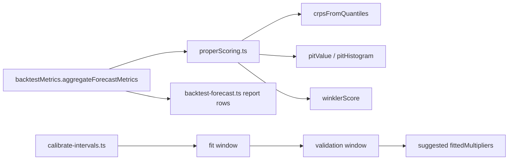
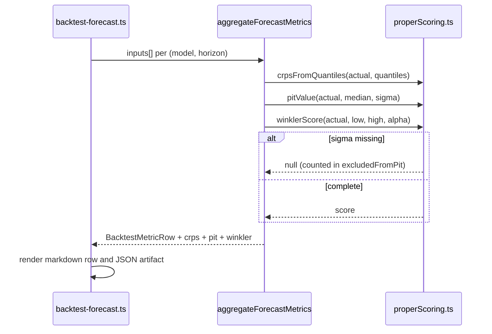

# PRD: Evaluation Integrity and Proper Scoring

Complexity: 5 -> MEDIUM mode

Score: +3 for 10+ files across metrics, calibration, backtest harness, config and tests; +2 for a new proper-scoring module (CRPS / PIT / Winkler).

Status: Proposed — defect remediation plus a new scoring surface. No forecast behaviour changes in Phases 1-3; Phase 4 changes shipped interval multipliers and is gated.

Owner: Forecasting / Engineering

Source assessment: [`docs/reports/forecast-model-improvement-proposals-2026-08-02.md`](../../reports/forecast-model-improvement-proposals-2026-08-02.md) §2 (D3, D4), §3 P1

---

## 1. Context

**Problem:** The metrics layer that gates every model decision in this repo is
improper (pinball divided by the realized value), incomplete (no CRPS, no PIT
histogram, no Winkler score), and self-confirming (interval multipliers are
grid-searched on the exact window they are then reported as validated on).

**Files analyzed:**

- `src/lib/backtestMetrics.ts`
- `src/lib/pointInTimeForecast.ts`
- `src/lib/featureExperimentDataset.ts`
- `src/lib/modelConfig.ts`
- `src/lib/forecastInterval.ts`
- `scripts/calibrate-intervals.ts`
- `scripts/backtest-forecast.ts`
- `scripts/backtest-point-in-time-core.ts`
- `scripts/backtest-feature-family.ts`
- `scripts/backtest-residual-model.ts`
- `src/lib/__tests__/backtestMetrics.test.ts`
- `src/lib/__tests__/pointInTimeForecast.test.ts`
- `docs/reports/experiments-backlog.md`

**Current behavior:**

- `aggregateForecastMetrics` (`backtestMetrics.ts:82-126`) returns median/mean
  abs log error, bias, Gaussian NLL, 5-point pinball, 3-level coverage, and
  width ratio. There is no CRPS, no squared-error metric, no PIT/rank histogram
  and no Winkler score anywhere in the repository.
- `backtestMetrics.ts:97` computes `pinballLoss(actual, predicted, q) / actual`.
  Normalising a pinball loss by the outcome destroys the propriety of the
  scoring rule and makes it price-level dependent: a 2022 origin at $16k is
  weighted ~6x a 2025 origin at $100k for the same relative error.
- `backtestMetrics.ts:96-97` and `:137,154` gate on truthiness (`predicted ?`,
  `low && high`) rather than `Number.isFinite`, silently dropping legitimate `0`
  values.
- `pointInTimeForecast.ts:93-96` computes `embargoBoundary` and `embargoed`,
  reports `excludedByEmbargo` in `supervisedPolicy`, and then calls
  `intervalSnapshot(matured)` — the **un-embargoed** set. The embargo is
  measured and discarded.
- `featureExperimentDataset.ts:64-108` exports `purgeResidualRowsForEvaluation`
  and `purgeAndEmbargoResidualRows`. Their only importer is
  `src/lib/__tests__/pointInTimeForecast.test.ts`. No production script calls
  either.
- `scripts/calibrate-intervals.ts:84-101` builds calibration points from origins
  where `origin.date >= BACKTEST_CONFIG.holdoutStartDate` (line 90) and
  `fitHorizon` (`:69-78`) grid-searches 381 multipliers minimising
  `|cov80-0.80| + |cov90-0.90| + |cov95-0.95|`. The winners are pasted into
  `INTERVAL_CONFIG.fittedMultipliers` (`modelConfig.ts:33-40`). There is **no
  train/validation split** — the fitting window and the reporting window are the
  same set of origins.
- Consequence: the 80/90/95% coverage column in every artifact under
  `docs/reports/results/backtest-*.md` is a fitted quantity presented as an
  out-of-sample result.

### Root-cause statement

Two distinct classes of defect share one symptom — decisions made on numbers
that cannot support them:

1. **Improper / incomplete scoring.** The rule used to rank candidates is not a
   proper scoring rule, and the diagnostic that would reveal distributional
   mis-specification (PIT histogram) does not exist.
2. **Self-confirming calibration.** The only tuned parameters in the shipped
   interval model are tuned on their own evaluation window.

### Goals

- Pinball becomes a proper scoring rule; every historical pinball figure is
  marked superseded in the backlog.
- CRPS, PIT histogram and Winkler score are computed for every model x horizon
  row in the main backtest report.
- The embargo that `pointInTimeForecast.ts` already computes is applied.
- Interval multipliers are fitted on a window disjoint from the window they are
  scored on, and the resulting coverage is reported as validation, not fit.

### Non-goals

- Changing the median forecast. No phase here touches `powerLaw.ts` or
  `cycle.ts`.
- Changing the distribution family — that is [`FAT_TAIL_INTERVAL_DISTRIBUTION.md`](./FAT_TAIL_INTERVAL_DISTRIBUTION.md).
  This PRD builds the instrument that will judge it.

---

## 2. Solution

**Approach:**

- Add `src/lib/properScoring.ts`: CRPS (from the quantile set, via the pinball
  integral identity), PIT value per observation, PIT histogram + uniformity
  statistic, and Winkler interval score. Pure functions, no I/O.
- Fix `pinballLoss` usage in `aggregateForecastMetrics` — remove the `/ actual`
  normalisation, add the new fields to `BacktestMetricRow`, replace truthiness
  guards with `Number.isFinite`.
- Apply the already-computed embargo in `pointInTimeForecast.ts` by routing
  `matured` through the existing `purgeAndEmbargoResidualRows` helper rather
  than a second hand-rolled filter.
- Split `calibrate-intervals.ts` into a fit window and a disjoint validation
  window, and refuse to emit a suggested config when validation coverage
  diverges from fit coverage beyond a declared tolerance.
- Render the new columns in `scripts/backtest-forecast.ts` report output so the
  metrics are visible in the artifact that gates promotions.

**Architecture:**



**Key decisions:**

- [ ] CRPS is computed from the existing 5-quantile set via the pinball-integral
      identity, **not** by adding new quantiles. Approximation error is bounded
      and reported; a denser grid is a later change, not a blocker.
- [ ] PIT values require a CDF. For log-normal forecasts, use the existing
      `normalCdf` (`forecastInterval.ts:336-348`) on `(log actual - log median)/sigma`.
      Observations without `sigma` yield `null` and are excluded, with the
      excluded count reported (mirrors the existing `nll: null` convention).
- [ ] No new dependencies. `properScoring.ts` imports only from
      `forecastInterval.ts` for `normalCdf`.
- [ ] Errors are explicit: functions return `null` on undefined input rather
      than substituting a default.

**Data changes:** None. `BacktestMetricRow` gains fields; no cached JSON schema
changes.

---

## 3. Sequence flow



---

## 4. Execution phases

### Phase 1: Proper pinball and finiteness guards — the main backtest report shows corrected pinball columns and flags the change

**Files (2 existing, 0 new):**

- `src/lib/backtestMetrics.ts` — EDIT: drop `/ actual` at line 97; replace
  truthiness guards at `:96-97, :137, :154` with `Number.isFinite`.
- `src/lib/__tests__/backtestMetrics.test.ts` — EDIT: add the propriety and
  scale-invariance cases below.

**Implementation:**

- [ ] Change line 97 to `Number.isFinite(predicted) ? pinballLoss(actual, predicted as number, quantile) : null`.
- [ ] `coverageRate`: `Number.isFinite(low) && Number.isFinite(high) ? … : null`.
- [ ] `intervalWidthRatioMean`: same guard.
- [ ] Add a `pinballScale: 'absolute'` discriminator to `BacktestMetricRow` so an
      artifact written before this change is distinguishable from one after.

**Wiring:**

- [ ] Caller edited: `aggregateForecastMetrics` is already called by
      `scripts/backtest-forecast.ts`, `scripts/backtest-market-forecast.ts` and
      `scripts/backtest-point-in-time-core.ts`. Confirm each renders
      `pinballScale` in its artifact so the discontinuity is legible.
- [ ] Old path: n/a — in-place correction.
- [ ] Ledger rows filled: #1, #2.

**Tests required:**

| Test file | Test name | Assertion | Negative control (must be observed red) |
|---|---|---|---|
| `backtestMetrics.test.ts` | `should score a perfect median at zero pinball loss when actual equals prediction` | `pinball.q50 === 0` | passes trivially — not a gate, listed for completeness |
| `backtestMetrics.test.ts` | `should weight equal relative errors equally across price levels when scaled` | two inputs with identical `actual/median` ratio at $16k and $100k, scaled by price, produce proportional (not equal) absolute loss; the *ratio* of losses equals the ratio of price levels | run against the previous implementation: `/ actual` makes the losses equal, so this assertion goes red at `HEAD~1` |
| `backtestMetrics.test.ts` | `should retain a zero-valued quantile when computing coverage` | an input with `q10 = 0` is counted, not dropped | goes red with the `low && high` guard restored |
| `backtestMetrics.test.ts` | `should mark pinballScale absolute on every emitted row` | `row.pinballScale === 'absolute'` | goes red if the field is removed |

**Revert check:** restoring `/ actual` at line 97 fails
`should weight equal relative errors equally across price levels when scaled`.

**User verification:**

- Action: `yarn backtest:report-only`
- Expected: the report's pinball columns differ from
  `docs/reports/results/backtest-2026-07-13T18-10-43-134Z.md`, and the artifact
  carries `pinballScale: "absolute"`.

---

### Phase 2: Proper scoring module wired into the main report — CRPS, PIT and Winkler appear per model x horizon

**Files (1 new, 3 existing):**

- `src/lib/properScoring.ts` — NEW: `crpsFromQuantiles`, `pitValue`,
  `pitHistogram`, `pitUniformityStatistic`, `winklerScore`.
- `src/lib/backtestMetrics.ts` — EDIT: `aggregateForecastMetrics` calls the
  above; `BacktestMetricRow` gains `crps`, `winkler80/90/95`,
  `pitHistogram`, `pitUniformity`, `excludedFromPit`.
- `scripts/backtest-forecast.ts` — EDIT: render the new columns in the markdown
  table and the JSON artifact.
- `src/lib/__tests__/properScoring.test.ts` — NEW.

**Implementation:**

- [ ] `crpsFromQuantiles(actual, quantiles)`: sum `2 * pinballLoss(actual, q_p, p)`
      over the available quantile grid, weighted by the grid spacing. Return
      `null` when fewer than 3 quantiles are present. Document the discretisation
      error in the function's doc comment.
- [ ] `pitValue(actual, median, sigma)`: `normalCdf((log(actual) - log(median)) / sigma)`.
      Return `null` when `sigma` is absent or non-positive.
- [ ] `pitHistogram(values, bins = 10)`: counts plus expected count per bin.
- [ ] `pitUniformityStatistic(values, bins)`: chi-square against uniform,
      returned with its degrees of freedom. **No p-value is emitted** — PIT
      values from overlapping origins are serially dependent and a nominal
      p-value would be misleading. Record that in the doc comment and in the
      report legend.
- [ ] `winklerScore(actual, low, high, alpha)`: `(high - low) + (2/alpha)·(low - actual)⁺ + (2/alpha)·(actual - high)⁺`.

**Wiring:**

- [ ] Caller edited: `src/lib/backtestMetrics.ts` invokes all five functions
      inside `aggregateForecastMetrics`.
- [ ] Registration: `scripts/backtest-forecast.ts` renders the new fields — the
      module reaches the artifact that gates promotions, not just the type.
- [ ] Old path: n/a — new diagnostic.
- [ ] Ledger rows filled: #3, #4, #5.

**Tests required:**

| Test file | Test name | Assertion | Negative control |
|---|---|---|---|
| `properScoring.test.ts` | `should return a lower CRPS for a sharper forecast when both are centred on the actual` | tight quantile set scores below wide set | goes red if `crpsFromQuantiles` returns a constant |
| `properScoring.test.ts` | `should return a PIT value near 0.5 when the actual equals the median` | `abs(pit - 0.5) < 1e-9` | goes red if the log ratio is inverted |
| `properScoring.test.ts` | `should produce a uniform PIT histogram when observations are drawn from the forecast distribution` | 10-bin chi-square below the 0.99 critical value for a seeded lognormal sample | goes red when the sample is drawn with a sigma 2x the forecast sigma |
| `properScoring.test.ts` | `should penalise a miss above the upper bound proportionally to 2/alpha` | `winklerScore` matches the closed form | goes red if the `2/alpha` factor is dropped |
| `backtestMetrics.test.ts` | `should report excludedFromPit when a forecast has no sigma` | count matches the number of sigma-less inputs | goes red if sigma-less rows are silently coerced |

**Revert check:** deleting `properScoring.ts` breaks the compile of
`backtestMetrics.ts` and fails `backtestMetrics.test.ts`, which asserts the new
fields are present on every emitted row.

**User verification:**

- Action: `yarn backtest:report-only`
- Expected: the markdown table has CRPS, Winkler and PIT-uniformity columns, and
  the PIT histogram is printed per gated horizon for `powerlaw-current`.

---

### Phase 3: Apply the embargo that is already computed — the point-in-time benchmark stops leaking overlapping rows

**Files (2 existing, 0 new):**

- `src/lib/pointInTimeForecast.ts` — EDIT: line 96 `intervalSnapshot(matured)`
  becomes `intervalSnapshot(embargoEligible)`, where `embargoEligible` comes from
  the existing `purgeAndEmbargoResidualRows` helper rather than the local
  `matured`/`embargoed` pair.
- `src/lib/__tests__/pointInTimeForecast.test.ts` — EDIT: assert the interval
  snapshot excludes embargoed rows.

**Implementation:**

- [ ] Import `purgeAndEmbargoResidualRows` from `featureExperimentDataset.ts`
      into `pointInTimeForecast.ts`, or extract the shared predicate if the row
      shapes differ — do not hand-roll a third filter.
- [ ] Keep `supervisedPolicy.excludedByEmbargo` reporting; it now describes rows
      that were actually excluded.
- [ ] If the eligible set falls below a minimum (declare it — suggest 30 rows),
      emit `null` for the interval rather than a snapshot built on too little
      data, and record the skip reason.

**Wiring:**

- [ ] Caller edited: `scripts/backtest-point-in-time-core.ts` consumes the
      changed interval; its artifact coverage numbers will move.
- [ ] Old path: the local `matured`/`embargoed` filter pair is **deleted**, not
      left alongside — two live definitions of the eligible set is the defect.
- [ ] Ledger rows filled: #6.

**Tests required:**

| Test file | Test name | Assertion | Negative control |
|---|---|---|---|
| `pointInTimeForecast.test.ts` | `should exclude rows whose origin falls inside the embargo window from interval quantiles` | a fixture row at `origin - horizon + 1` days does not affect the emitted quantiles | goes red at `HEAD~1`, where `intervalSnapshot(matured)` includes it |
| `pointInTimeForecast.test.ts` | `should skip the interval when fewer than the minimum eligible rows remain` | returns `null` with a recorded reason | goes red if the minimum check is removed |
| `pointInTimeForecast.test.ts` | `should report excludedByEmbargo equal to the number of rows actually withheld` | `supervisedPolicy.excludedByEmbargo` matches the fixture | goes red if the two sets drift apart again |

**Revert check:** restoring `intervalSnapshot(matured)` fails the first test.

**User verification:**

- Action: `yarn backtest:pit-core`
- Expected: coverage figures differ from
  `point-in-time-core-2026-07-10T19-52-43-293Z.md`, and `excludedByEmbargo` is
  non-zero at every gated horizon.

---

### Phase 4: Disjoint interval calibration — multipliers are fitted and validated on separate windows

**Files (3 existing, 0 new):**

- `scripts/calibrate-intervals.ts` — EDIT: add fit/validation split.
- `src/lib/modelConfig.ts` — EDIT: add `INTERVAL_CALIBRATION_CONFIG` with the
  two window boundaries and the divergence tolerance; refresh
  `fittedMultipliers` from the validated output.
- `src/lib/__tests__/forecastInterval.test.ts` — EDIT: pin the new multipliers
  and the monotonicity invariant.

**Implementation:**

- [ ] Add `INTERVAL_CALIBRATION_CONFIG = { fitStart, fitEnd, validationStart, tolerance }`.
      Proposed: fit on `2017-01-01 → 2021-12-31`, validate on `2022-01-01 →` —
      this inverts the current arrangement and lets the fit window see the 2018
      bear market and the 2020 COVID crash, which the present 2022+ window
      contains no analogue of.
- [ ] `fitHorizon` selects the multiplier on the fit window only.
- [ ] A new `validateHorizon` reports fit-window and validation-window coverage
      side by side, plus the new CRPS/Winkler from Phase 2.
- [ ] The script **refuses to print a suggested config** for a horizon whose
      validation coverage deviates from nominal by more than `tolerance` at any
      of the three levels; it prints a `DIVERGENT` row instead. This is the gate
      that stops the self-confirming loop from re-forming.
- [ ] Record the resulting multipliers in `modelConfig.ts` only after
      `yarn backtest` passes its existing quality and robustness gates.

**Wiring:**

- [ ] Caller edited: `INTERVAL_CONFIG.fittedMultipliers` is consumed by
      `intervalMultiplierForHorizon` (`forecastInterval.ts:132-151`), which is on
      the live forecast path via `computePowerLawInterval` → `data.ts:340`.
      Changing these values changes the shipped chart.
- [ ] Old path: the single-window `fitHorizon` is replaced, not kept alongside.
- [ ] Ledger rows filled: #7, #8.

**Tests required:**

| Test file | Test name | Assertion | Negative control |
|---|---|---|---|
| `forecastInterval.test.ts` | `should widen the interval monotonically with horizon up to 365 days` | `sigma(h+1) >= sigma(h)` for h in 1..364 | goes red if a refit produces a non-monotone multiplier table |
| `forecastInterval.test.ts` | `should match the recorded fittedMultipliers exactly` | table equals the committed config | goes red on any unrecorded config edit |
| `scriptGuards.test.ts` | `should refuse to emit a suggested multiplier when validation coverage diverges` | `DIVERGENT` row emitted for a synthetic divergent horizon | goes red if the tolerance check is bypassed |

**Revert check:** reverting `INTERVAL_CALIBRATION_CONFIG` to a single window
fails `should refuse to emit a suggested multiplier when validation coverage diverges`.

**Manual checkpoint (required — this phase changes a shipped product surface):**

```
## PHASE 4 COMPLETE - CHECKPOINT
Files changed: [list]
yarn test: [pass/fail]   yarn lint: [pass/fail]   yarn backtest: [gate status]

Manual verification needed:
1. [ ] yarn dev → BTC tab → the 95% band at 90d and 365d is visibly different
       from the pre-change build; screenshot both.
2. [ ] The quality gate in the new artifact still PASSes at 14/30/60/90d, or
       the failure is recorded in the backlog as the honest result.

Reply "continue" or report issues.
```

---

## Integration Ledger

| # | New thing | Live caller (`file:line`, non-test) | Replaces | Old path removed? | Negative control |
|---|---|---|---|---|---|
| 1 | absolute-scale pinball in `aggregateForecastMetrics` | `scripts/backtest-forecast.ts` (metric aggregation call site) | `/ actual` normalisation at `backtestMetrics.ts:97` | in-place, Phase 1 | scale test goes red at `HEAD~1` |
| 2 | `pinballScale` discriminator | rendered by `scripts/backtest-forecast.ts` artifact writer | n/a | n/a | field removal fails the row-shape test |
| 3 | `crpsFromQuantiles` | `src/lib/backtestMetrics.ts` inside `aggregateForecastMetrics` | n/a — no CRPS existed | n/a | constant return fails the sharpness test |
| 4 | `pitValue` / `pitHistogram` / `pitUniformityStatistic` | `src/lib/backtestMetrics.ts`; rendered by `scripts/backtest-forecast.ts` | n/a | n/a | inflated-sigma sample fails uniformity |
| 5 | `winklerScore` | `src/lib/backtestMetrics.ts` | n/a | n/a | dropping `2/alpha` fails the closed-form test |
| 6 | embargo-applied interval snapshot | `src/lib/pointInTimeForecast.ts:96` → `scripts/backtest-point-in-time-core.ts` | local `matured`/`embargoed` filter pair | deleted in Phase 3 | fixture row inside the embargo window changes quantiles at `HEAD~1` only |
| 7 | `INTERVAL_CALIBRATION_CONFIG` | `scripts/calibrate-intervals.ts` | implicit single-window use of `BACKTEST_CONFIG.holdoutStartDate` | replaced in Phase 4 | divergent synthetic horizon must print `DIVERGENT` |
| 8 | revised `fittedMultipliers` | `forecastInterval.ts:132-151` → `data.ts:340` (shipped chart) | current 6-row table | replaced in Phase 4 | committed-table equality test |

---

## Reachability

**How will this feature be reached?**

- [x] Entry points: `yarn backtest`, `yarn backtest:report-only`,
      `yarn backtest:pit-core`, `yarn calibrate:intervals` (CLI); and for
      Phase 4 only, the live forecast render path.
- [x] Pre-existing files EDITED to call it: `src/lib/backtestMetrics.ts`,
      `src/lib/pointInTimeForecast.ts`, `scripts/backtest-forecast.ts`,
      `scripts/calibrate-intervals.ts`, `src/lib/modelConfig.ts`.
- [x] Registration: new metric columns rendered in the markdown + JSON artifacts
      under `docs/reports/results/`.

**Is this user-facing?**

- [x] Phases 1-3: NO — internal research surface. Trigger is the CLI backtest.
- [x] Phase 4: YES — the interval multipliers feed the rendered confidence band.
      No new UI component; the existing band changes width.

**Full flow:**

1. Engineer runs `yarn backtest`.
2. Triggers `scripts/backtest-forecast.ts` → `aggregateForecastMetrics`.
3. Reaches the new code via the `properScoring.ts` calls inside
   `aggregateForecastMetrics`.
4. Result observable in the new columns of
   `docs/reports/results/backtest-<timestamp>.md`, and for Phase 4 in the chart's
   confidence band.

**What does this replace?**

- [x] Replaces the improper pinball normalisation, the discarded embargo filter,
      and the single-window calibration. All three are deleted in their phase.

---

## Verification plan

```bash
# 1. Caller census — every new exported symbol has a non-test consumer
grep -rn "crpsFromQuantiles\|pitValue\|pitHistogram\|winklerScore\|pitUniformityStatistic" \
  --include=*.ts src scripts | grep -v "__tests__" | grep -v ".test."
# Expected: hits in src/lib/backtestMetrics.ts and scripts/backtest-forecast.ts,
# beyond the definitions in src/lib/properScoring.ts

# 2. Revert check — the embargo fix must break something pre-existing
#    (restore intervalSnapshot(matured), then:)
yarn test src/lib/__tests__/pointInTimeForecast.test.ts
# Expected: FAIL on the embargo-window test

# 3. Incumbent check — no second definition of the eligible-row filter survives
grep -rn "targetDate < origin.date" --include=*.ts src scripts
# Expected: one site, inside the shared purge helper

# 4. Baseline check — the scale-invariance test must fail before the fix
git stash && yarn test src/lib/__tests__/backtestMetrics.test.ts; git stash pop
# Expected: FAIL (proves the gate measures the change, not the pre-existing state)
```

**Evidence required:**

- [ ] `yarn test` passes; every new gate has an observed red recorded inline
- [ ] `yarn lint` passes
- [ ] `yarn backtest` artifact regenerated and diffed against
      `backtest-2026-07-13T18-10-43-134Z.md`, with the pinball delta explained
- [ ] Integration Proof commands pasted, not summarised
- [ ] Backlog entry filed recording that all pre-2026-08 pinball figures are
      superseded (required by `AGENTS.md`)

---

## Acceptance criteria

Consumer-scoped. Each must be false on the current build.

- [ ] The backtest report a reviewer opens shows CRPS, Winkler and a PIT
      histogram per gated horizon — not merely that the functions exist.
- [ ] The reported pinball for `powerlaw-current` at 30d differs from
      `0.0` -normalised history, and the artifact says which scale it is on, so
      a reader cannot silently compare across the change.
- [ ] The point-in-time benchmark's interval coverage is computed from a row set
      that provably excludes horizon-overlapping origins, and the excluded count
      is printed.
- [ ] The interval multipliers shipped in `modelConfig.ts` were selected on
      origins that are not in the window their coverage is reported on, and a
      reader can see both windows' coverage side by side.
- [ ] Every backlog entry citing a pinball figure produced before this PRD is
      annotated as superseded.

**Integration gates:**

- [ ] Integration Ledger has zero `TBD` cells
- [ ] Every new exported symbol has a non-test consumer (census pasted)
- [ ] Revert check passed for rows #1, #3, #6, #7
- [ ] Every `Replaces` row's old path is deleted — no two live filters, no two
      pinball scales
- [ ] Every gate has an observed negative control
