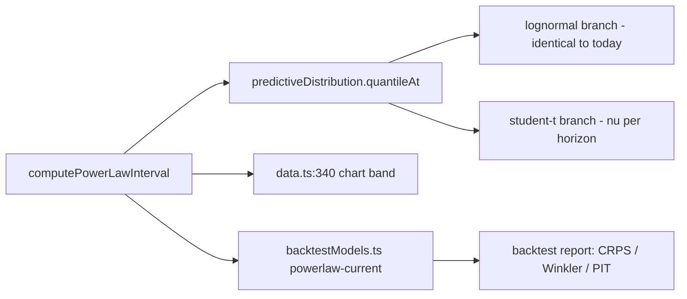
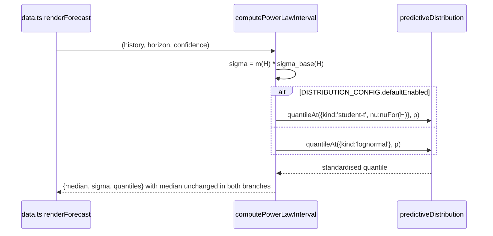

# PRD: Fat-Tailed Predictive Distribution

Complexity: 4 -> MEDIUM mode

Score: +2 for 6-10 files across the interval model, config, chart data path and tests; +2 for a new predictive-distribution module.

Status: Proposed — report-only until the promotion gate passes. `DISTRIBUTION_CONFIG.defaultEnabled = false` at merge, per `AGENTS.md` forecast safety.

Owner: Forecasting

Depends on: [`EVALUATION_INTEGRITY_AND_PROPER_SCORING.md`](./EVALUATION_INTEGRITY_AND_PROPER_SCORING.md) Phases 1-2. The gate
below is stated in CRPS, Winkler and PIT, none of which exist yet.

Source assessment: [`docs/reports/forecast-model-improvement-proposals-2026-08-02.md`](../../reports/forecast-model-improvement-proposals-2026-08-02.md) §3 P3

---

## 1. Context

**Problem:** The predictive distribution is log-normal by construction on an
asset with strongly leptokurtic daily log returns. Twenty-four registered
experiments have adjusted the median or the *scale* of the interval; none has
touched its *shape*.

**Files analyzed:**

- `src/lib/forecastInterval.ts`
- `src/lib/modelConfig.ts`
- `src/lib/data.ts`
- `src/lib/backtestModels.ts`
- `src/lib/powerLaw.ts`
- `scripts/calibrate-intervals.ts`
- `scripts/backtest-forecast.ts`
- `src/lib/__tests__/forecastInterval.test.ts`
- `docs/reports/results/backtest-2026-07-13T18-10-43-134Z.md`
- `docs/reports/experiments-backlog.md`

**Current behavior:**

- `quantilePrice` (`forecastInterval.ts:51`) is
  `median · exp(sigma · normalQuantile(p))` — log-normal, no shape parameter.
- `powerLawResidualVariance` (`:163-174`) sums `exp(-2k/tau)` over the horizon.
  With tau = 210 the sum converges to ~105.5, so `sigma_base` **saturates at
  10.3 · sigma_d** regardless of horizon.
- `intervalMultiplierForHorizon` (`:132-151`) interpolates log-linearly between
  six frozen points and **freezes at 0.59 above 365 days** (`:139`,
  `modelConfig.ts:41-44`). Combined with the saturation above, the 10-year band
  is the same width as the 1-year band. This is a rendered product surface, not
  a research artifact.
- `computeResidualBootstrapSigmaMultiplier` (`:69-102`) moving-block-bootstraps
  real residuals — then collapses the resampled distribution to a **single sd
  ratio** (`:94`) clipped to `[0.7, 1.8]` (`:99`). The shape it measures is
  discarded, and the result is used only by `backtestModels.ts:212`.
- The chart median (`data.ts:331`) uses `powerLawForecast`, which has no drift.
  The heatmap Monte Carlo (`data.ts:387,411`) applies
  `powerLawShockDrift = -0.3 · sigma^2` — neither the Itô correction (0.5) nor
  zero. Two different processes are drawn on one chart; the modal MC path sits
  roughly 5.7% below the median in log terms.
- `computeLogReturnStats` divides by `n` (`:211`) while `sampleStandardDeviation`
  divides by `n-1` (`:290`), so the numerator and denominator of the bootstrap
  ratio at `:99` use different conventions.

### Root-cause statement

The current coverage profile is the textbook signature of a Gaussian fitted to a
leptokurtic law. From `backtest-2026-07-13T18-10-43-134Z.md`:

| Horizon | 80% coverage | 90% coverage | 95% coverage |
|---|---|---|---|
| 30d | 79.3% | 89.7% | 94.6% |
| 60d | **79.4%** | 93.1% | **97.9%** |
| 90d | **76.9%** | 90.3% | 95.8% |
| 365d | 78.4% | 91.9% | 96.7% |

Too thin in the middle, too fat at the edges. **A single scale multiplier cannot
correct both directions simultaneously** — widening to fix 80% over-covers 95%
further. That is precisely why every scale experiment in the ledger failed
(dynamic volatility, EWMA/HAR, vol-of-vol, asymmetric widening, scalar
rescaling). The unexplored degree of freedom is the shape parameter.

### Goals

- Introduce a shape-parameterised predictive distribution behind a config flag,
  defaulting off.
- Score it against the log-normal baseline on CRPS, Winkler, PIT uniformity and
  three-level coverage at the gated horizons.
- Fix the long-horizon saturation and the median/Monte-Carlo drift
  inconsistency, which are defects independent of the distribution choice.

### Non-goals

- Changing the median. `powerLaw.ts` and `cycle.ts` are untouched; a shape change
  must leave q50 identical. This is testable and is a gate below.
- Adding features or new data. Implied volatility is a separate later experiment.
- Enabling the candidate at merge. Per `AGENTS.md`, it stays report-only until
  the gate passes.

---

## 2. Solution

**Approach:**

- Add `src/lib/predictiveDistribution.ts` with a discriminated union:
  `{ kind: 'lognormal' }` (exact current behaviour) and
  `{ kind: 'student-t', nu }` (log-scale Student-t, standardised so the variance
  matches `sigma^2`, leaving q50 unchanged by construction).
- Route `quantilePrice` and `probabilityUp` through it. The log-normal branch
  must be **bit-identical** to today's output — that is a test, not an aspiration.
- Fit `nu` per horizon with the same disjoint fit/validation split introduced by
  the evaluation PRD, minimising CRPS rather than absolute coverage error.
- Independently: extend the multiplier table above 365 days so the band keeps
  widening, and reconcile the heatmap drift with the median.

**Why Student-t rather than an empirical bootstrap shape:** the bootstrap path
already exists and already fails — `computeResidualBootstrapSigmaMultiplier`
throws its shape away, and the ledger's `residual-bootstrap` policy suite was
scored and retained at `recent-730d` without improvement. A one-parameter shape
family is the smallest change that addresses the diagnosed defect, is
identifiable from the available sample, and cannot silently move the median.
An empirical-shape variant is registered as the follow-up if `nu` proves
unstable across the fit/validation split.

**Architecture:**



**Key decisions:**

- [ ] `nu` is standardised: the t variate is scaled by `sqrt((nu-2)/nu)` so
      `sigma` retains its meaning as the predictive standard deviation and the
      existing multiplier table stays interpretable. `nu > 2` enforced.
- [ ] q50 is invariant by construction (both families are symmetric in log
      space about the median). Asserted as a gate.
- [ ] Selection metric is **CRPS**, not `|coverage - target|`. Optimising
      absolute coverage error at three points is what produced the current
      profile; CRPS scores the whole distribution.
- [ ] No new dependencies. The Student-t quantile uses a documented rational
      approximation with an accuracy assertion against known values.
- [ ] Config flag `DISTRIBUTION_CONFIG.defaultEnabled = false` with a
      `promotionPolicy` string, matching the existing convention in
      `modelConfig.ts` (`TAIL_RISK_CONFIG`, `RESIDUAL_MODEL_CONFIG`).

**Data changes:** None.

---

## 3. Sequence flow



---

## 4. Execution phases

### Phase 1: Distribution abstraction with a provably identical log-normal branch — the backtest report is byte-identical while the seam exists

The riskiest part of a refactor like this is a silent numerical change. This
phase proves the seam before any behaviour rides on it.

**Files (1 new, 3 existing):**

- `src/lib/predictiveDistribution.ts` — NEW: `quantileAt`, `cdfAt`,
  `studentTQuantile`, `PredictiveDistribution` union.
- `src/lib/forecastInterval.ts` — EDIT: `quantilePrice` (`:51`) and
  `probabilityUp` (`:56`) route through `quantileAt` / `cdfAt`.
- `src/lib/modelConfig.ts` — EDIT: add `DISTRIBUTION_CONFIG` with
  `defaultEnabled: false`, `kind: 'lognormal'`, `nuByHorizon: null`,
  `promotionPolicy`.
- `src/lib/__tests__/forecastInterval.test.ts` — EDIT: identity gate.

**Implementation:**

- [ ] `quantileAt(dist, p)` returns `normalQuantile(p)` for the log-normal branch
      — the same function, not a reimplementation.
- [ ] `studentTQuantile(p, nu)` with an accuracy assertion against published
      values at `nu` in {3, 5, 10, 30} and `p` in {0.025, 0.05, 0.10}.
- [ ] Unify the variance convention: `computeLogReturnStats` (`:211`) and
      `sampleStandardDeviation` (`:290`) both use `n-1`. Record the resulting
      shift in the artifact — it is small but real.

**Wiring:**

- [ ] Caller edited: `forecastInterval.ts:51,56` — on the live path via
      `computePowerLawInterval` → `data.ts:340` and via
      `backtestModels.ts` `powerlaw-current`.
- [ ] Old path: the inline `Math.exp(sigma * normalQuantile(p))` expression is
      **removed**, not left as a parallel branch.
- [ ] Ledger rows filled: #1, #2.

**Tests required:**

| Test file | Test name | Assertion | Negative control (observed red) |
|---|---|---|---|
| `forecastInterval.test.ts` | `should produce quantiles identical to the pre-refactor lognormal output` | every quantile matches a committed golden fixture to 1e-12 | goes red if the t branch is wired in by mistake, or if `sqrt((nu-2)/nu)` scaling is applied to the normal branch |
| `predictiveDistribution.test.ts` | `should match published Student-t quantiles within 1e-6 for nu in 3, 5, 10 and 30` | table comparison | goes red if the approximation is replaced by the normal quantile |
| `predictiveDistribution.test.ts` | `should converge to the normal quantile as nu grows large` | `abs(t(p,1e6) - z(p)) < 1e-4` | goes red if the standardisation factor is inverted |
| `predictiveDistribution.test.ts` | `should reject a degrees-of-freedom value at or below two` | throws | goes red if the guard is removed (infinite variance breaks the sigma contract) |

**Revert check:** deleting `predictiveDistribution.ts` breaks the compile of
`forecastInterval.ts` and fails the golden-fixture identity test.

**User verification:**

- Action: `yarn backtest:report-only`
- Expected: metric rows match `backtest-2026-07-13T18-10-43-134Z.md` except for
  the documented `n-1` variance-convention shift. Any other movement is a bug in
  this phase.

---

### Phase 2: Long-horizon band stops being frozen — the 5-year forecast is visibly wider than the 1-year forecast

Independent of the distribution family; a displayed defect.

**Files (3 existing, 0 new):**

- `src/lib/forecastInterval.ts` — EDIT: `intervalMultiplierForHorizon` (`:132-151`)
  and `powerLawResidualVariance` (`:163-174`).
- `src/lib/modelConfig.ts` — EDIT: replace `scenarioPolicy.aboveMaxMultiplier`
  with an explicit extrapolation rule.
- `src/lib/__tests__/forecastInterval.test.ts` — EDIT.

**Implementation:**

- [ ] Beyond the largest fitted horizon, grow the effective sigma with
      `sqrt(h / maxFittedHorizon)` rather than holding the multiplier flat. The
      residual process is mean-reverting, but the *trend* the residual reverts to
      carries its own estimation uncertainty that does not saturate — that is the
      component currently missing entirely.
- [ ] Keep `coverageStatus: 'scenario'` labelling beyond 365 days. This band is
      not calibrated and must not be presented as if it were.
- [ ] Document the saturation constant (`~105.5` for tau = 210) in a comment so
      the next reader does not rediscover it.

**Wiring:**

- [ ] Caller edited: `forecastInterval.ts:139` — reached from `data.ts:340`
      whenever a horizon above 365 days is selected in the UI.
- [ ] Old path: the flat `aboveMaxMultiplier` constant is **deleted** from
      `modelConfig.ts`.
- [ ] Ledger rows filled: #3.

**Tests required:**

| Test file | Test name | Assertion | Negative control |
|---|---|---|---|
| `forecastInterval.test.ts` | `should widen the band strictly between 365 and 1825 days` | `sigma(1825) > sigma(365) * 1.5` | goes red at `HEAD~1`, where the two are equal |
| `forecastInterval.test.ts` | `should label horizons beyond the fitted maximum as scenario` | `coverageStatus === 'scenario'` | goes red if the label is dropped |
| `forecastInterval.test.ts` | `should remain monotone in horizon across the whole supported range` | `sigma(h+1) >= sigma(h)` for h in 1..3650 | goes red on a discontinuity at the 365-day seam |

**Revert check:** restoring the flat multiplier fails the widening test.

**Manual checkpoint (visual product surface):**

```
## PHASE 2 COMPLETE - CHECKPOINT
yarn test: [pass/fail]   yarn lint: [pass/fail]

Manual verification needed:
1. [ ] yarn dev → BTC tab → select the longest available horizon.
       The 95% band is visibly wider than at 365d. Screenshot both.
2. [ ] The band is labelled "Scenario range", not "Calibrated".

Reply "continue" or report issues.
```

---

### Phase 3: Median and heatmap agree — the Monte Carlo modal path sits on the yellow line

**Files (2 existing, 1 test):**

- `src/lib/data.ts` — EDIT: reconcile `powerLawShockDrift` (`:387`) with the
  drift-free median at `:331`.
- `src/lib/modelConfig.ts` — EDIT: `logDriftScale` (`:27`) either derives from
  the Itô correction or is deleted; the `0.3` literal does not survive this phase
  unexplained.
- `src/lib/__tests__/forecastPathStability.test.ts` — EDIT.

**Implementation:**

- [ ] Decide and document which the heatmap represents: the distribution of the
      median-consistent process (drift 0 in log space, matching the yellow line)
      or the distribution of prices (Itô correction 0.5). Pick one; the current
      `0.3` is neither.
- [ ] Assert the chosen relationship in a test rather than a comment.
- [ ] Remove `INTERVAL_CONFIG.stressMultiplier` (`modelConfig.ts:28-32`) — it has
      zero references anywhere in the repo, and `data.ts:337` carries a comment
      describing a "fat-tail stress multiplier" that does not exist. Leaving dead
      config next to this change invites a future reader to wire it up.

**Wiring:**

- [ ] Caller edited: `data.ts:387` is on the rendered heatmap path.
- [ ] Old path: the `0.3` literal and `stressMultiplier` are **deleted**.
- [ ] Ledger rows filled: #4, #5.

**Tests required:**

| Test file | Test name | Assertion | Negative control |
|---|---|---|---|
| `forecastPathStability.test.ts` | `should place the Monte Carlo median within a declared tolerance of the forecast median at every horizon` | relative gap < 1% at 30/90/180/365d | goes red at `HEAD~1`, where the gap is ~5.7% in log terms at long horizons |
| `engineeringHygiene.test.ts` | `should not export unreferenced interval configuration` | `stressMultiplier` absent from `INTERVAL_CONFIG` | goes red if it is reintroduced |

**Revert check:** restoring `-0.3 * sigma^2` fails the MC-median agreement test.

---

### Phase 4: Student-t candidate scored against the log-normal baseline — the backlog gets a verdict, not a hunch

**Proof subject:** the real production model on the real gated horizons
(14/30/60/90d) and the real 2022+ evaluation window — not a synthetic sample.

**Files (2 new, 2 existing):**

- `scripts/backtest-distribution-family.ts` — NEW: fits `nu` per horizon on the
  fit window, scores on the disjoint validation window.
- `package.json` — EDIT: `backtest:distribution-family` script.
- `src/lib/modelConfig.ts` — EDIT: populate `nuByHorizon` from the run;
  `defaultEnabled` stays `false`.
- `docs/reports/experiments-backlog.md` — EDIT: pre-registered entry **before**
  the run, per `AGENTS.md`.

**Implementation:**

- [ ] Reuse `INTERVAL_CALIBRATION_CONFIG` from the evaluation PRD for the
      fit/validation split. Do not introduce a second window definition.
- [ ] Grid `nu` over {3, 4, 5, 6, 8, 10, 15, 20, 30, Infinity}, where `Infinity`
      is the log-normal baseline and must be scored identically to it — a
      self-check that the harness is comparing two genuinely different objects.
- [ ] Select on validation CRPS. Report CRPS, Winkler at 80/90/95, PIT histogram,
      three-level coverage, and median-error (which must be unchanged).
- [ ] Block-bootstrap the CRPS difference with block length = horizon, and apply
      Holm across the four gated horizons.

**Promotion gate (pre-registered, written before the run):**

`DISTRIBUTION_CONFIG.defaultEnabled` may flip to `true` only if, at **every** one
of 14/30/60/90d:

1. Validation CRPS improves versus log-normal, with a positive block-bootstrap
   5% lower bound after Holm correction across the four horizons;
2. 80% coverage moves toward nominal and 95% coverage does not move away from it;
3. PIT uniformity improves (lower chi-square statistic);
4. Median absolute log error is **identical** to the baseline — any movement
   means the median was touched, which is out of scope and voids the run;
5. The selected `nu` is within a factor of two between the fit and validation
   windows. Instability here is the ledger's most common failure signature
   (tau=120, close-sma200, MACD all reversed sign across subperiods) and must
   block promotion rather than be argued around.

Otherwise the entry is recorded as report-only with the numbers, and the
empirical-shape variant is registered as the follow-up.

**Wiring:**

- [ ] Caller edited: `package.json` registers the script;
      `src/lib/modelConfig.ts` carries the result.
- [ ] Registration: backlog entry filed **before** execution.
- [ ] Old path: n/a — the log-normal branch remains the default.
- [ ] Ledger rows filled: #6, #7.

**Tests required:**

| Test file | Test name | Assertion | Negative control |
|---|---|---|---|
| `predictiveDistribution.test.ts` | `should leave the median unchanged when the distribution family changes` | q50 identical across both branches for the same sigma | goes red if the t variate is not centred in log space |
| `scriptGuards.test.ts` | `should score the infinite-degrees-of-freedom candidate identically to the lognormal baseline` | CRPS difference < 1e-9 | goes red if the two sides resolve to different sigma paths — catches a self-comparison or a mis-wired harness |
| `forecastInterval.test.ts` | `should keep the shipped distribution disabled until the recorded gate passes` | `DISTRIBUTION_CONFIG.defaultEnabled === false` unless `nuByHorizon` and an evidence artifact path are both present | goes red if the flag is flipped without evidence |

**Revert check:** flipping `defaultEnabled` without populating the evidence
fields fails the config gate test — mirroring
`validateYellowLineForecastConfig` (`modelConfig.ts:136-146`).

---

## Integration Ledger

| # | New thing | Live caller (`file:line`, non-test) | Replaces | Old path removed? | Negative control |
|---|---|---|---|---|---|
| 1 | `predictiveDistribution.quantileAt` / `cdfAt` | `src/lib/forecastInterval.ts:51,56` → `data.ts:340` (chart band) and `backtestModels.ts` | inline `Math.exp(sigma * normalQuantile(p))` | removed, Phase 1 | golden-fixture identity to 1e-12 |
| 2 | `studentTQuantile` | `predictiveDistribution.quantileAt` t branch; exercised by Phase 4 harness | n/a | n/a | published-value table; normal-convergence limit |
| 3 | horizon extrapolation above the fitted maximum | `forecastInterval.ts:139` → `data.ts:340` | flat `aboveMaxMultiplier = 0.59` | deleted, Phase 2 | 365d vs 1825d width equality at `HEAD~1` |
| 4 | reconciled heatmap drift | `src/lib/data.ts:387` (rendered heatmap) | `-0.3 * sigma^2` literal | deleted, Phase 3 | MC-median vs forecast-median gap test |
| 5 | removal of `INTERVAL_CONFIG.stressMultiplier` | n/a — deletion | dead config with zero references | deleted, Phase 3 | hygiene test fails on reintroduction |
| 6 | `scripts/backtest-distribution-family.ts` + `backtest:distribution-family` | `package.json` scripts; artifact under `docs/reports/results/` | n/a | n/a | `nu = Infinity` must score identically to the baseline |
| 7 | `DISTRIBUTION_CONFIG` | `forecastInterval.ts` branch selection | n/a | n/a | flag cannot flip without evidence fields |

---

## Reachability

**How will this feature be reached?**

- [x] Entry points: the chart render path (`data.ts:340`) for Phases 1-3;
      `yarn backtest`, `yarn backtest:distribution-family` for Phase 4.
- [x] Pre-existing files EDITED: `src/lib/forecastInterval.ts`,
      `src/lib/modelConfig.ts`, `src/lib/data.ts`, `package.json`.
- [x] Registration: new script in `package.json`; backlog entry before the run.

**Is this user-facing?**

- [x] YES for Phases 2 and 3 — band width above 365 days and the heatmap's
      relationship to the yellow line are both rendered. No new component; the
      existing chart changes.
- [x] Phase 4 is research-only and ships disabled.

**Full flow:**

1. User opens the BTC tab and selects a horizon.
2. Triggers `data.ts` → `computePowerLawInterval`.
3. Reaches the new code at `forecastInterval.ts:51` via `quantileAt`.
4. Result observable in the rendered confidence band and, for Phase 4, in
   `docs/reports/results/distribution-family-<timestamp>.md`.

**What does this replace?**

- [x] Replaces the inline log-normal quantile expression, the flat above-365-day
      multiplier, the `-0.3 sigma^2` drift literal, and the dead
      `stressMultiplier` config.

---

## Verification plan

```bash
# 1. Caller census
grep -rn "quantileAt\|cdfAt\|studentTQuantile" --include=*.ts src scripts \
  | grep -v "__tests__" | grep -v ".test."
# Expected: hits in src/lib/forecastInterval.ts and the Phase 4 script

# 2. Identity proof — Phase 1 must not move any number
yarn backtest:report-only
diff <(jq -S .metrics docs/reports/results/backtest-2026-07-13T18-10-43-134Z.json) \
     <(jq -S .metrics docs/reports/results/backtest-<new>.json)
# Expected: differences confined to the documented n-1 variance shift

# 3. Self-comparison guard — the two sides of Phase 4 must differ
grep -rn "nu: Infinity\|kind: 'lognormal'" scripts/backtest-distribution-family.ts
# Expected: the baseline is constructed through the same code path, and the
# harness asserts CRPS equality for nu = Infinity

# 4. Revert check
#    Restore the flat aboveMaxMultiplier, then:
yarn test src/lib/__tests__/forecastInterval.test.ts
# Expected: FAIL on the 365-vs-1825-day widening test

# 5. Dead-config check
grep -rn "stressMultiplier" --include=*.ts --include=*.tsx src scripts
# Expected: no hits
```

**Evidence required:**

- [ ] `yarn test`, `yarn lint` pass; every gate has an observed red recorded
- [ ] Phase 1 artifact diff pasted, showing no unexplained metric movement
- [ ] Phase 2 screenshots at 365d and the longest horizon
- [ ] `yarn backtest` quality and robustness gates still PASS
- [ ] Backlog entry filed **before** the Phase 4 run, carrying the five-point
      promotion gate verbatim, and updated afterwards with the verdict — pass,
      fail, or report-only

---

## Acceptance criteria

Consumer-scoped. Each must be false on the current build.

- [ ] A user selecting a horizon beyond one year sees a band that keeps widening
      with horizon, labelled "Scenario range" — not a 5-year band identical in
      width to the 1-year band.
- [ ] The Monte Carlo heatmap's modal path visually coincides with the yellow
      median line, within the tolerance asserted in the test.
- [ ] The backtest report shows the Student-t candidate and the log-normal
      baseline side by side on CRPS, Winkler, PIT and coverage, with a recorded
      verdict against the pre-registered gate — whichever way it goes.
- [ ] `DISTRIBUTION_CONFIG.defaultEnabled` is `true` only if an evidence artifact
      path and per-horizon `nu` are both committed alongside it; the config
      validator refuses any other combination.
- [ ] The median absolute log error at every gated horizon is unchanged from the
      baseline, proving the shape change did not move the forecast.

**Integration gates:**

- [ ] Integration Ledger has zero `TBD` cells
- [ ] Every new exported symbol has a non-test consumer (census pasted)
- [ ] Revert check passed for rows #1, #3, #4
- [ ] Every `Replaces` row's old path is deleted — no inline quantile expression,
      no flat multiplier, no `0.3` literal, no dead `stressMultiplier`
- [ ] Every gate has an observed negative control
- [ ] The capability was proved on the real production subject (the shipped
      `powerlaw-current` model at the gated horizons), not a synthetic sample
