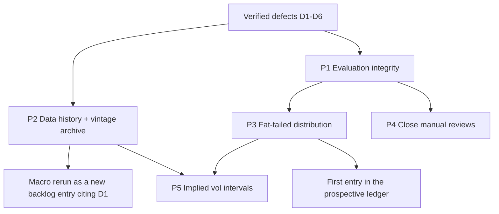

# PRD Bundle — 2026-08-02

Three PRDs from one codebase inspection of the BTC forecasting stack. They are
sequenced, not independent: P3's promotion gate is written in metrics that P1
creates, and P2's rerun of the macro family is only meaningful once P1's scoring
is proper.

Source assessment: [`docs/reports/forecast-model-improvement-proposals-2026-08-02.md`](../../reports/forecast-model-improvement-proposals-2026-08-02.md)

| # | PRD | Complexity | Phases | Status | Blocks |
|---|-----|-----------|--------|--------|--------|
| P1 | [Evaluation Integrity and Proper Scoring](./EVALUATION_INTEGRITY_AND_PROPER_SCORING.md) | 5 → MEDIUM | 4 | Proposed | P3, P4, P5 |
| P2 | [Data History Recovery and Vintage Archive](./DATA_HISTORY_RECOVERY_AND_VINTAGE_ARCHIVE.md) | 7 → HIGH | 4 | Proposed | macro rerun, P5 |
| P3 | [Fat-Tailed Predictive Distribution](./FAT_TAIL_INTERVAL_DISTRIBUTION.md) | 4 → MEDIUM | 4 | Proposed — ships disabled | prospective ledger entry |

P4 (close the two dangling `eligible-for-manual-review` items) and P5 (implied
volatility as an interval input) are described in the source assessment §3 and do
not yet have PRDs — P4 needs no new code, and P5 should not be scoped until P1
and P3 have settled what it would be scored against.

## Why this order

P1 first because every gate in this repo is currently stated in a metric that is
either improper (pinball ÷ actual) or absent (CRPS, PIT, Winkler). Running P3
before P1 would score a distribution change with the instrument that produced the
problem.

## Before implementing any of these

`AGENTS.md` requires a `docs/reports/experiments-backlog.md` entry before the
work, not after. Specifically:

- **P1** — a note recording that all pre-2026-08 pinball figures are superseded
  (D3), and that point-in-time interval coverage changes once the embargo is
  applied (D4).
- **P2** — the 2026-06-26 macro-liquidity rejection annotated **void** (D1,
  decided on three years of a single regime), plus a *new* pre-registered rerun
  entry. Not an appeal of the old verdict.
- **P3** — the five-point promotion gate written out verbatim **before** the
  Phase 4 run, then updated with the verdict whichever way it goes.

## Shared conventions across the three

- Every PRD carries an Integration Ledger; a `TBD` cell means the phase is
  incomplete.
- Every gate names a negative control that must be **observed red**. A gate that
  has never failed is recorded as UNVERIFIED, not PASS.
- Anything that changes forecast behaviour ships behind a config flag defaulting
  to `false`, following the existing `TAIL_RISK_CONFIG` /
  `YELLOW_LINE_FORECAST_CONFIG` pattern in `src/lib/modelConfig.ts`.
