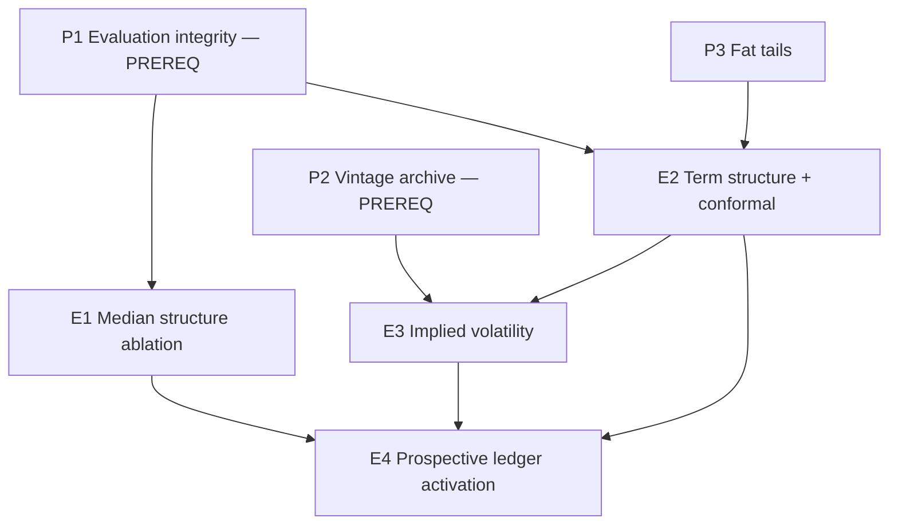

# PRD Bundle — 2026-08-07

Four experiment PRDs defining the next research cycle for BTC forecast accuracy.

Source of truth for what came before: [`docs/reports/experiments-backlog.md`](../../reports/experiments-backlog.md)
(28 registered experiments) and the 2026-08-02 inspection
[`forecast-model-improvement-proposals-2026-08-02.md`](../../reports/forecast-model-improvement-proposals-2026-08-02.md).

## State of the world at intake

Verified by reading the code on 2026-08-07, not inferred:

| Claim | Evidence |
|---|---|
| P1 (evaluation integrity) is **not implemented** | `backtestMetrics.ts:97` still divides pinball by `actual`; `pointInTimeForecast.ts:93-96` still computes `embargoed` then calls `intervalSnapshot(matured)`; no CRPS/PIT/Winkler anywhere in `src/` or `scripts/` |
| P2 (vintage archive) is **not implemented** | no vintage store; `update-macro-data.mjs:219,260` still self-labels `latest-revised … not an ALFRED vintage` |
| P3 (fat tails) is **not implemented** | `forecastInterval.ts:51` is still `median · exp(sigma · normalQuantile(p))` |
| The FRED macro rerun **did** complete | `9c97c2d`/`901d7d0`, 5,844 rows 2010-08-01 → 2026-07-31, verdict `context-only`, all three arms zero-or-negative NLL improvement |

So the three 2026-08-02 PRDs remain the blocking prerequisites. **Nothing in this
bundle should start before P1 Phases 1-2 land**, because every gate below is
written in CRPS / Winkler / PIT and in an embargoed point-in-time harness — none
of which exist yet.

## The four new experiments

| # | PRD | Targets | Complexity | Depends on |
|---|-----|---------|-----------|------------|
| E1 | [Median Structure Ablation](./E1_MEDIAN_STRUCTURE_ABLATION.md) | median accuracy | 3 → LOW-MEDIUM | P1 Ph.1-2 |
| E2 | [Interval Term Structure and Conformal Calibration](./E2_INTERVAL_TERM_STRUCTURE_AND_CONFORMAL.md) | interval calibration | 5 → MEDIUM | P1 Ph.1-2, coordinates with P3 |
| E3 | [Implied Volatility as an Interval Input](./E3_IMPLIED_VOLATILITY_INTERVAL_INPUT.md) | interval scale | 5 → MEDIUM | P1, P2 Ph.1, E2 |
| E4 | [Prospective Ledger Activation](./E4_PROSPECTIVE_LEDGER_ACTIVATION.md) | ability to promote anything at all | 4 → MEDIUM | E1 or E2 producing a development signal |

## Why these four, and why in this order

**E1 first because deletion has the only winning track record here.** Of 28
registered experiments, every *additive* signal has been rejected; the single
largest recorded improvement (`no-future-pivots`: 365d median error 0.19576 →
0.12978, 365d 90% coverage 68.5% → 91.9%) came from removing an assumption. The
repo's own strict point-in-time benchmark
(`point-in-time-core-2026-07-10T19-52-43-293Z.md`, 458 origins) shows the shipped
policy losing to naive-current-price at **all four gated horizons** (+1.48%,
+2.56%, +0.16%, +0.33% MALE). E1 asks the obvious unasked question: which term of
the structure is responsible?

**E2 second because that is where the remaining headroom is.** At 90d the best
model in the repo has MALE ≈ 0.331 — a ±39% multiplicative error. The median is
close to unimprovable at that horizon; the distribution is not, and the current
coverage profile (80% running 3-4 points light while 95% over-covers) is a shape
and *term-structure* defect, not a scale defect. E2 attacks horizon scaling and
nonparametric calibration; P3 attacks parametric shape. They are complementary
arms of the same question and must be scored against a common baseline.

**E3 third because it is the only untried input class, and it targets the only
quantity with genuine predictability.** Every rejected feature experiment tried to
move the median. Implied volatility is a forward-looking estimate of exactly the
backward-looking quantity `sigma_d` estimates. Median adjustment is explicitly out
of scope — it would be re-rejected under existing rerun criteria.

**E4 last, and non-negotiable.** `src/data/prospective-forecast-ledger.json` has
been hash-bound and empty since 2026-07-10 (`frozenCandidates: []`, `rows: []`).
Under the current protocol, promotion requires 30 non-overlapping outcomes at the
promoted horizon — 7.4 years of calendar time at 90d. **No accuracy improvement
can ever reach production until that clock starts and until short horizons are
allowed to promote independently.** E4 is the difference between a research repo
and a forecasting product.

## Not in this bundle, deliberately

- **P4 — the two dangling `eligible-for-manual-review` items** (tail-risk 1.10x
  multiplier; COT continuous residual family). These need a review and a decision,
  not a PRD. Both should be re-scored *after* E2/P3, since a correctly shaped base
  distribution may absorb the tail-risk effect entirely. `TAIL_RISK_CONFIG.defaultEnabled`
  is still `false` and `tailRiskWidthAdjustment` has zero callers in `src/`.
- **Anything on the backlog's blocked list**: `median x exp(coef x feature)` from
  ETF flow, funding, stablecoins, sentiment, on-chain states or latest-vintage
  macro; any neighbouring fixed-tau value; the ridge residual model; YL-1/YL-2
  neighbourhoods; validation-weighted ensembles; additional technical indicators.
  E1 is **not** a tau search — see its §1 non-goals, which address this directly.

## Shared conventions (inherited from the 2026-08-02 bundle)

- Every PRD carries an Integration Ledger; a `TBD` cell means the phase is incomplete.
- Every gate names a negative control that must be **observed red**. A gate that
  has never failed is recorded as UNVERIFIED, not PASS.
- Anything that changes forecast behaviour ships behind a config flag defaulting
  to `false`, following `TAIL_RISK_CONFIG` / `YELLOW_LINE_FORECAST_CONFIG`.
- Per `AGENTS.md`, each experiment is registered in
  `docs/reports/experiments-backlog.md` **before** implementation, with the
  promotion gate written out verbatim in advance.
