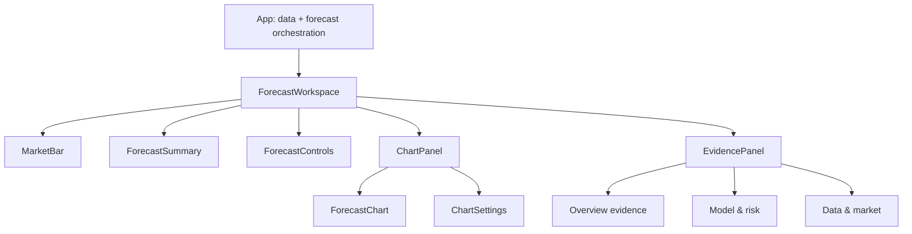
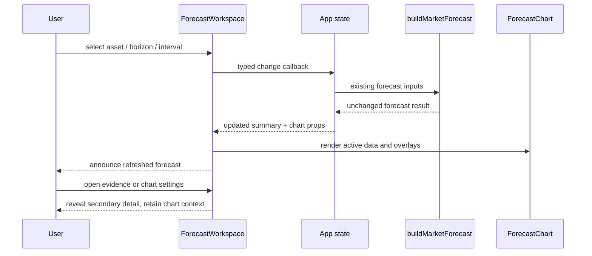

# PRD: Chart-First UI/UX Polish

Complexity: 7 -> HIGH mode

Status: Proposed
Date: 2026-07-10
Owner: Product / Frontend
Scope: Presentation and interaction architecture only; no forecast, calibration, or data-source behavior changes

## Context

**Problem:** The forecast chart is useful, but the surrounding interface presents controls, headline values, model diagnostics, market context, freshness, and Bitcoin-specific research panels at nearly equal visual weight, making the primary forecast difficult to scan and the page cumbersome on smaller screens.

**Files analyzed:**

- `src/App.tsx`
- `src/components/Chart.tsx`
- `src/components/chart/Legend.tsx`
- `src/components/chart/types.ts`
- `src/components/__tests__/Chart.component.test.tsx`
- `src/components/__tests__/Chart.test.ts`
- `src/components/ui/card.tsx`
- `src/components/ui/button.tsx`
- `src/index.css`
- `src/lib/marketForecast.ts`
- `docs/PRDs/SP500_MARKET_TABS_FORECAST.md`
- `docs/PRDs/v2/04-regime-model-ui-automation.md`

**Current behavior:**

- `src/App.tsx` is a 1,256-line component that owns data loading, forecast state, playback state, chart controls, formatting, and all page composition.
- The chart is correctly dominant in area, but its header combines range, playback, and up to ten overlay toggles in one horizontally scrolling toolbar.
- Five summary cards repeat or compete with forecast values also shown in the chart and right rail.
- The 320px right rail can contain forecast controls, buy-zone context, model reliability, regime/tail-risk/network details, cross-market context, source freshness, market stats, halvings, and drawdown analysis.
- At desktop widths the rail becomes an independent hidden-scrollbar region; below `lg`, every panel stacks under the chart, producing a very long page.
- Asset selection is implemented twice for desktop and mobile, and several controls rely on color/state without complete tab/switch semantics or explicit accessible names.
- Existing tests cover chart series behavior but not the app information hierarchy, keyboard operation, responsive disclosure, or forecast-control flow.

## Product Goal

Make the first screen answer three questions in order:

1. What asset am I viewing and how fresh is its quote?
2. What is the forecast outcome and uncertainty for the selected horizon?
3. What evidence and model diagnostics support that outcome, if I choose to inspect them?

The redesign should feel like a focused market instrument: dark, precise, restrained, and data-forward. Amber remains the active/forecast accent, while green/red are reserved for directional meaning and sky/violet for secondary context. The memorable element is a large uninterrupted chart paired with a compact forecast readout—not a wall of dashboard cards.

## Success Metrics

- On a 1440x900 viewport, the asset identity, freshness, forecast summary, horizon control, and at least 520px of chart height are visible without page scrolling.
- A user can change asset, horizon, interval, and chart range without opening diagnostics.
- No more than four primary numeric values appear outside the chart above the fold: current quote, forecast median, forecast move/probability, and scenario range.
- Secondary evidence is reachable in one action and its disclosure state is keyboard operable.
- At 390px width, there is no page-level horizontal overflow and the chart appears before research diagnostics.
- Automated accessibility checks have no critical/serious violations; keyboard-only users can operate asset tabs, forecast controls, chart settings, and detail disclosures with visible focus.
- Existing forecast outputs for a fixed asset/horizon/confidence remain unchanged before and after the UI refactor.

## Non-Goals And Safety Constraints

- Do not alter forecast mathematics, model gates, calibration labels, source freshness rules, or cached datasets.
- Do not promote context-only signals or make new claims about predictive accuracy.
- Do not remove evidence from the product; reduce its default prominence through grouping and progressive disclosure.
- Do not introduce a UI framework or state-management library. React state and existing Tailwind utilities are sufficient.
- Do not add decorative animation that delays access to market data. Respect `prefers-reduced-motion`.
- This is a product UX refactor, not a forecast/model/data-source/research experiment, so it does not require an experiment-backlog entry. If implementation later tests competing layouts or changes how forecast evidence is interpreted, register that research before running it.

## Solution

### Information Architecture

Use four layers, in this order:

1. **Market bar:** one asset tablist; selected asset name/ticker; latest quote date and freshness state. The ephemeral “recomputed at” state is subordinate to source date.
2. **Forecast workspace:** compact forecast summary and forecast controls above a large chart. Current quote, median, expected move/probability, and interval are presented as one coherent readout rather than five separate cards.
3. **Chart tools:** range and playback remain visible; overlays move into a labeled `Chart settings` popover/drawer with grouped switches (`Price`, `Forecast`, `Bitcoin context`). Unsupported asset controls are omitted, not disabled without explanation.
4. **Evidence:** a tabbed or segmented evidence region below the chart with `Overview`, `Model & risk`, and `Data & market`. Only one group is expanded at a time. Bitcoin-only content appears only where supported.

### Responsive Behavior

| Viewport | Composition |
| --- | --- |
| `>= 1280px` | Market bar; forecast summary/control strip; chart; compact evidence strip below. Optional evidence detail opens in a 360-400px right drawer without permanently shrinking the chart. |
| `768-1279px` | Two-row forecast summary/control strip; chart; full-width evidence tabs below. No independent hidden-scroll rail. |
| `< 768px` | Horizontally scrollable semantic asset tablist; two-column summary grid; full-width horizon/interval controls; chart with 360px minimum height; chart settings in bottom sheet; evidence as accessible accordions. |

No breakpoint should duplicate the asset navigation in the DOM. CSS changes its placement and sizing.

### Component Architecture

### Key Decisions

- Keep `App` as the integration point for loading market/reliability data and building forecasts, but extract presentational domains with typed props.
- Preserve `ForecastChart` and its data contract; improve its surrounding controls and legend rather than replacing the chart library.
- Use native buttons, `role="tablist"`/`role="tab"`, `aria-selected`, `aria-controls`, `aria-expanded`, and appropriately labeled switches. Use a native `<select>` for confidence unless a custom control can match native keyboard behavior.
- Use one shared control model for chart overlays so labels, capability filtering, state, and accessible descriptions are not repeated in JSX.
- Use CSS variables in `src/index.css` for surfaces, text hierarchy, accents, focus ring, and spacing. Keep numeric values in a legible tabular/monospace face; use a purposeful display/body pairing only if locally bundled or loaded without blocking the data view.
- Motion is limited to 120-180ms disclosure/focus transitions and the existing recompute indicator; reduced-motion disables nonessential transitions.
- Empty, stale, and unavailable data states must use text plus icon, never color alone.

**Data changes:** None.

## Integration Points

**How will this feature be reached?**

- [x] Entry point: existing root app rendered by `src/main.tsx`.
- [x] Caller: `src/App.tsx` loads data, owns forecast/chart state, and renders `ForecastWorkspace`.
- [x] Wiring: extracted components receive typed view models and event callbacks; no route or API changes.

**Is this user-facing?** Yes. Required components are `MarketBar`, `ForecastSummary`, `ForecastControls`, `ChartPanel`, `ChartSettings`, and `EvidencePanel`.

**Full user flow:**

1. User opens the app and immediately sees the selected asset, quote freshness, forecast summary, controls, and chart.
2. Selecting an asset tab updates all shared values and hides unsupported Bitcoin-only settings/evidence.
3. Selecting a horizon or confidence interval triggers the existing forecast refresh path and announces completion without moving focus.
4. Range and playback remain directly available; secondary overlays are changed in `Chart settings`.
5. The user opens one evidence category to inspect reliability, risk/regime, market context, freshness, or Bitcoin cycle details.

## Interaction Flow

## Execution Phases

Every phase is a user-testable vertical slice. Because this is HIGH-complexity visual work, implementation must run an automated `prd-work-reviewer` checkpoint and a manual desktop/mobile checkpoint after each phase; proceed only on PASS/approval.

### Phase 1: Semantic Market And Forecast Header — the first screen communicates asset, freshness, and forecast outcome clearly

**Files (max 5):**

- `src/App.tsx` — replace duplicated header/metric markup with extracted components and typed view models.
- `src/components/workspace/MarketBar.tsx` — single responsive asset tablist and quote freshness.
- `src/components/workspace/ForecastSummary.tsx` — unified current/forecast/interval summary.
- `src/components/workspace/ForecastControls.tsx` — horizon, confidence, and refresh controls.
- `src/components/__tests__/ForecastWorkspace.test.tsx` — interaction and semantic coverage.

**Implementation:**

- [ ] Create one `MarketBar` instance with roving/arrow-key tab behavior, `aria-selected`, and a visible keyboard focus state.
- [ ] Present source date/freshness as the durable status; expose recomputation through an `aria-live="polite"` region.
- [ ] Replace the five equal metric cards with a compact summary whose visual order is quote, median outcome, probability/move, interval.
- [ ] Move horizon and interval beside the summary; keep the existing automatic refresh and manual run behavior unchanged.
- [ ] Ensure long-horizon calibration/scenario copy remains visible and no forecast claim changes.

**Tests required:**

| Test File | Test Name | Assertion |
| --- | --- | --- |
| `src/components/__tests__/ForecastWorkspace.test.tsx` | `navigates assets as a semantic tablist` | one tablist exists; selection and arrow keys invoke the correct asset callback |
| same | `changes horizon and confidence without losing focus` | existing callbacks receive values and controls retain accessible names/state |
| same | `announces forecast recomputation` | busy/completed state is exposed through a polite live region |
| `npm run test` | regression suite | existing chart/model tests pass |

**User verification:** At 1440x900 and 390x844, open the app and switch BTC -> S&P 500 -> Gold, then change 6M -> 1Y. Asset, freshness, summary, controls, and chart must remain visible in logical order with no horizontal page overflow.

### Phase 2: Focused Chart Controls — the chart stays large while advanced overlays remain easy to find

**Files (max 5):**

- `src/components/workspace/ChartPanel.tsx` — chart title, primary range/playback actions, and settings trigger.
- `src/components/workspace/ChartSettings.tsx` — grouped overlay switches and capability filtering.
- `src/components/Chart.tsx` — accept only minimal presentational/accessibility additions needed by the new shell.
- `src/components/chart/Legend.tsx` — improve collision behavior and forecast labeling on narrow screens.
- `src/components/__tests__/ChartSettings.test.tsx` — settings keyboard/capability tests.

**Implementation:**

- [ ] Keep range and Play/Stop visible because they change chart navigation; move SMA, volume, path, scenarios, floor/lower, peak/top, heatmap, buy zones, and MVRV into `Chart settings`.
- [ ] Define overlay metadata once: id, label, group, checked state, callback, asset capability, and short explanation.
- [ ] Implement settings as an anchored dialog/popover on desktop and modal bottom sheet on mobile, with focus entry, Escape close, focus return, and a visible close action.
- [ ] Preserve all current defaults and `ForecastChart` props.
- [ ] Keep the legend inside chart bounds, abbreviate nonessential values on mobile, and do not obscure the latest candles.

**Tests required:**

| Test File | Test Name | Assertion |
| --- | --- | --- |
| `src/components/__tests__/ChartSettings.test.tsx` | `groups overlays and toggles the requested layer` | each switch reports checked state and calls only its matching handler |
| same | `omits unsupported Bitcoin overlays for other assets` | MVRV/buy-zone controls are absent for assets without capability |
| same | `closes with Escape and restores trigger focus` | dialog keyboard lifecycle is correct |
| `src/components/__tests__/Chart.component.test.tsx` | existing series tests | chart data, markers, and playback behavior remain unchanged |

**User verification:** At desktop and mobile widths, toggle every supported chart layer, play/stop history, close settings by Escape and close button, and verify the chart never becomes horizontally clipped.

### Phase 3: Progressive Evidence — all supporting information remains available without dominating the forecast

**Files (max 5):**

- `src/components/workspace/EvidencePanel.tsx` — responsive tab/accordion shell and disclosure state.
- `src/components/workspace/OverviewEvidence.tsx` — buy zone and concise market context.
- `src/components/workspace/ModelRiskEvidence.tsx` — reliability, feature gates, regime, tail risk, network, and drawdown.
- `src/components/workspace/DataMarketEvidence.tsx` — source freshness, market stats, cross-market context, supply/halving.
- `src/components/__tests__/EvidencePanel.test.tsx` — semantics, conditional content, and keyboard tests.

**Implementation:**

- [ ] Group evidence into `Overview`, `Model & risk`, and `Data & market`; render one open category by default, not all cards.
- [ ] Default `Overview` to a concise, asset-relevant snapshot; keep context-only/disabled labels adjacent to their values.
- [ ] Preserve every existing fact and capability condition, but remove repeated card chrome and repeated headings.
- [ ] Use tabs at tablet/desktop and accordions on mobile while keeping one logical source model and predictable focus order.
- [ ] Do not import raw feature-table/history data into these components; pass current summaries from `App`.

**Tests required:**

| Test File | Test Name | Assertion |
| --- | --- | --- |
| `src/components/__tests__/EvidencePanel.test.tsx` | `shows only the selected evidence category` | inactive content is hidden from tab order/accessibility tree |
| same | `preserves context-only and disabled signal labels` | trust qualifiers remain programmatically associated with evidence |
| same | `renders asset-capable evidence only` | BTC-only evidence disappears for S&P 500 and Gold |
| same | `operates disclosure with keyboard` | arrows/Enter/Space behavior matches tab or accordion semantics |

**User verification:** Compare all current right-rail facts against the new evidence groups for BTC, S&P 500, and Gold. Confirm nothing is silently lost and the mobile page no longer starts with a long unbroken card stack.

### Phase 4: Visual System, Responsive And Accessibility Hardening — the workspace is coherent and production-ready across input modes

**Files (max 5):**

- `src/index.css` — semantic design tokens, typography, focus, motion, and responsive utilities.
- `src/components/ui/card.tsx` — simplify shared surface variants without changing semantics.
- `src/components/ui/button.tsx` — add explicit visual variants/sizes and robust focus/disabled states.
- `tests/e2e/forecast-workspace.spec.ts` — critical desktop/mobile Playwright flows and screenshots.
- `package.json` — add scoped E2E/accessibility commands only if not already present.

**Implementation:**

- [ ] Define semantic tokens for canvas, surface, elevated surface, border, text tiers, directional colors, active accent, and focus ring.
- [ ] Establish a consistent spacing/type scale; use tabular numerals for financial values and minimum 12px supporting text except chart-native annotations where space is constrained.
- [ ] Meet WCAG 2.2 AA contrast, 44px mobile touch targets, visible focus, non-color status communication, and reduced-motion preference.
- [ ] Add 390x844, 768x1024, and 1440x900 E2E viewport coverage; assert no page-level horizontal overflow.
- [ ] Capture stable baseline screenshots for market bar, forecast workspace, chart settings, and evidence open states. Mask or freeze time-dependent “updated” content.

**Tests required:**

| Test File / Command | Test Name | Assertion |
| --- | --- | --- |
| `tests/e2e/forecast-workspace.spec.ts` | `completes the core forecast flow at desktop and mobile` | asset/horizon/settings/evidence flow succeeds at all target viewports |
| same | `has no horizontal page overflow` | document scroll width never exceeds viewport width |
| same | `supports keyboard-only navigation` | focus order and disclosure operation are complete and visible |
| accessibility runner | `has no critical or serious violations` | automated scan passes for default and open-dialog states |
| `npm run lint && npm run test && npm run build` | release gate | typecheck/lint, unit/component tests, and production build pass |

**User verification:** Review light-disabled dark UI at all target viewports, 200% zoom, keyboard-only operation, reduced-motion mode, and stale/missing-source states. Compare screenshots and approve before release.

## Checkpoint Protocol

After each phase:

1. Spawn `prd-work-reviewer` with: `Review checkpoint for phase N of PRD at docs/PRDs/CHART_FIRST_UI_UX_POLISH.md`.
2. Require `npm run lint`, `npm run test`, and `npm run build` to pass (plus phase-specific E2E when introduced).
3. Manually verify desktop and mobile requirements listed in the phase.
4. Record changed files, commands/results, screenshots, and any accepted variance. Do not proceed until automated review passes and the visual checkpoint is approved.

## Acceptance Criteria

- The chart and compact forecast outcome are the dominant first-screen elements at every target breakpoint.
- There is exactly one asset selector in the DOM and it has correct tab semantics.
- Quote/source freshness is visually distinct from local forecast recomputation time.
- Asset, horizon, confidence, range, and playback remain directly operable.
- Secondary overlay controls are discoverable under `Chart settings`, preserve existing defaults, and are keyboard accessible.
- All existing model/reliability/freshness/market/cycle evidence remains accessible through grouped progressive disclosure with trust qualifiers intact.
- BTC-only controls and evidence never appear for unsupported assets.
- `App.tsx` becomes orchestration-focused; extracted presentational components have typed props and direct component tests.
- The page has no horizontal overflow at 390, 768, 1280, or 1440px widths and remains usable at 200% zoom.
- Critical flows pass keyboard, automated accessibility, unit/component, E2E, build, and manual visual checks.
- Forecast results for identical input fixtures are unchanged; if any forecast/model/data behavior changes, stop and follow the repository experiment/backtest gate before shipping.

## Risks And Mitigations

- **Hidden information becomes undiscoverable:** keep a visible `Evidence` label, sensible Overview default, counts/status badges, and remember the open category only for the current session.
- **Refactor changes forecast behavior:** keep state ownership in `App`, pass callbacks downward, and add before/after fixture assertions around asset/horizon/confidence results.
- **Custom disclosure harms accessibility:** prefer native primitives where possible; test focus containment/return, Escape, arrow keys, labels, and 200% zoom.
- **Mobile chart becomes too short:** enforce a 360px minimum chart height and place evidence after it.
- **Visual polish adds bundle/network cost:** avoid a new component framework and remote blocking assets; measure the production build in the final checkpoint.
- **Existing hidden-scroll layout masks overflow:** remove independent rail scrolling and assert document width at each E2E viewport.

## Open Questions

- Should the desktop evidence detail be a nonmodal drawer that preserves chart interaction, or a below-chart panel everywhere? Prototype both using existing data before implementation; choose the version with clearer keyboard order and no chart-width instability. If evaluated as a behavioral experiment, register it in `docs/reports/experiments-backlog.md` first.
- Should a user’s evidence category and chart overlay choices persist across reloads? Default this PRD to session-only state to avoid surprising stale configurations; persistent preferences can be a follow-up.
- Is a locally bundled display/body font available under the project’s licensing constraints? If not, retain the current font stack and improve hierarchy through weight, size, spacing, and tabular numerals rather than adding a render-blocking dependency.
