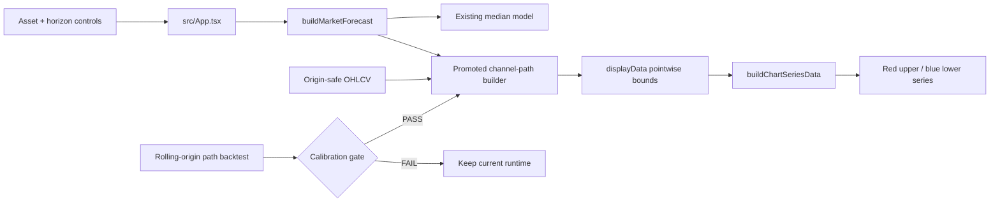
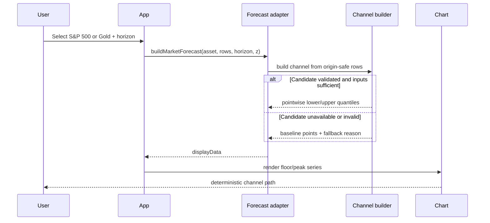

# PRD: Credible Market Forecast Channel Paths

Complexity: 7 -> HIGH mode

Score: +3 for 10+ files across research, evidence, tests, and gated integration; +2 for a new channel-path module; +2 for complex stochastic state and validation logic.

Status: Proposed — research and implementation are gated

Owner: Forecasting / Engineering

## 1. Context

**Problem:** The red upper and blue lower forecast-channel lines for S&P 500 and gold extend as straight paths because the runtime freezes the latest channel residuals and compounds one constant drift; this looks artificial and has not been validated as a multi-horizon channel forecast.

**Files analyzed:**

- `src/lib/marketForecast.ts`
- `src/lib/data.ts`
- `src/components/chart/dataTransforms.ts`
- `src/components/Chart.tsx`
- `src/App.tsx`
- `src/components/workspace/ChartSettings.tsx`
- `scripts/backtest-market-forecast.ts`
- `src/components/__tests__/Chart.test.ts`
- `src/components/__tests__/Chart.component.test.tsx`
- `tests/e2e/forecast-workspace.spec.ts`
- `docs/PRDs/SP500_MARKET_TABS_FORECAST.md`
- `docs/reports/experiments-backlog.md`

**Current behavior:**

- Historical S&P 500 and gold channels are rolling moving-average trends multiplied by rolling residual quantiles.
- At the forecast origin, the latest valid residual quantiles are frozen for the entire horizon.
- The future trend is `latestTrend * exp(constantDrift * day)`. Because the chart uses a logarithmic price scale, the resulting upper and lower lines are exactly straight in screen space.
- The existing market backtest checks contemporaneous historical channel coverage, but it does not evaluate the future channel path from each forecast origin at 30/90/180 days.
- The chart calls these lines `Lower channel` and `Upper channel`; they are visually separate from the green forecast-confidence lines.
- BTC uses a different power-law floor/peak model. Its appearance does not establish that the generic-asset channel method is valid, and it must not be changed by this work without separate evidence.

### Root-cause statement

For non-BTC assets, `processGenericData()` obtains one `latestChannel`, then projects both bounds with the same constant `drift`. Their log values are affine functions of forecast day:

```text
log(bound_day) = log(latestTrend) + drift * day + frozenResidualQuantile
```

This guarantees zero curvature and a constant log-width. The rendering layer is faithfully drawing the data it receives; the defect is in forecast-channel semantics, not Lightweight Charts.

### Goals

- Produce statistically defensible S&P 500 and gold future channel paths whose pointwise bounds are generated from an origin-safe forecast distribution.
- Evaluate the whole future path, not only terminal median accuracy or contemporaneous historical coverage.
- Preserve deterministic output for a fixed asset, origin, horizon, model configuration, and seed.
- Keep BTC behavior unchanged while explicitly auditing its floor/peak path for continuity and finite values.
- Make labels and tests distinguish structural reference channels from probabilistic confidence intervals.
- Promote a runtime change only after the market backtest gate demonstrates preserved or improved out-of-sample calibration.

### Non-goals

- Adding decorative noise, splines, or hand-authored bends to make lines look natural.
- Changing the yellow stochastic path or green confidence interval.
- Replacing VOO or GLD data sources.
- Changing the S&P 500 or gold median forecast unless a separately registered median experiment passes.
- Refitting or visually smoothing the BTC power-law floor/peak curves.

## 2. Integration Points

**How will this feature be reached?**

- [x] Entry point identified: selecting `S&P 500` or `Gold`, choosing a horizon, and leaving `Lower channel` / `Upper channel` enabled in Chart settings.
- [x] Caller identified: `src/App.tsx` calls `buildMarketForecast()` and passes `displayData` to `ForecastChart`.
- [x] Registration/wiring needed: the accepted channel builder must be called inside the non-BTC branches of `buildMarketForecast()`; no new route is required.

**Is this user-facing?**

- [x] YES — affected UI is the existing red upper channel, blue lower channel, chart settings labels/descriptions, and chart legend/crosshair behavior.

**Full user flow:**

1. User selects S&P 500 or gold and a forecast horizon.
2. `App.tsx` calls `buildMarketForecast(assetId, marketData, horizon, confidenceZ)`.
3. The generic forecast builder requests an origin-safe channel path from the promoted channel method.
4. `buildChartSeriesData()` maps the returned pointwise bounds to the existing floor/peak series.
5. The chart displays validated, deterministic upper/lower paths; settings accurately describe their semantics.

## 3. Solution

### Approach

- First add a report-only path backtest that scores the current straight-line channel and candidate methods from identical rolling origins.
- Define the channel as pointwise predictive quantiles of simulated future prices, while leaving the median forecast contract unchanged. Candidate simulations must use only information available at the origin and preserve serial dependence through the existing moving-block empirical innovation mechanism or a separately pre-registered alternative.
- Test a minimal candidate family: current frozen-residual projection as baseline; moving-block price-path quantiles as the primary candidate; optionally a volatility-regime block bootstrap only if pre-registered before results are inspected.
- Select parameters using an inner validation window and score once on an untouched outer holdout. Do not choose a method because it looks less straight.
- Integrate only a candidate that passes coverage, tail-loss, width, continuity, determinism, and regression gates. If none passes, retain current runtime behavior and improve explanatory copy only if that copy is factually warranted.

### Architecture



### Key decisions

- **Semantics:** red/blue future lines are predictive channel bounds only if their pointwise coverage is tested. Historical descriptive channels and future predictive channels must not silently share an undocumented meaning.
- **No cosmetic curvature target:** curvature is recorded as a diagnostic, not a promotion metric. A statistically correct straight path is preferable to an uncalibrated attractive path.
- **Origin safety:** every origin fits drift, volatility, empirical innovations, regime state, and calibration using rows at or before that origin.
- **Trading days:** candidate evaluation and runtime generation must use a single documented convention. Prefer asset-session steps for VOO/GLD and map them to dates with `shared/us-market-calendar.mjs`; do not pretend weekend prices are observed. Any retained calendar-day convention must be justified and tested.
- **Determinism:** seed derivation includes asset id, origin date, horizon, candidate id, and configuration version; changing UI render order cannot alter results.
- **Fallback:** invalid or insufficient input returns the validated baseline channel, with an explicit internal reason; it never emits `NaN`, inverted bounds, or a discontinuity at the origin.
- **BTC isolation:** BTC remains on `processRealData()` and its power-law floor/peak contract. Audit tests may be added, but no BTC runtime value or style changes in this PRD.

### Candidate channel contract

```ts
interface MarketForecastChannelPoint {
  date: string;
  lower: number;
  upper: number;
}

interface MarketForecastChannelResult {
  methodId: string;
  configurationVersion: string;
  points: MarketForecastChannelPoint[];
  fallbackReason: string | null;
}
```

Required invariants for every point: finite positive values, `lower <= median <= upper` when the median is defined as the distribution q50, strictly increasing dates, exact origin anchoring or a documented one-step transition, and reproducibility for identical inputs.

### Data changes

No production data source or database change. Research reports are written under `docs/reports/results/`, and the experiment is registered in `docs/reports/experiments-backlog.md`.

## 4. Sequence Flow



## 5. Execution Phases

#### Phase 1: Lock semantics and expose the failure mode — Engineers can reproduce and measure the straight-path behavior without changing production forecasts

**Files (max 5):**

- `src/lib/__tests__/marketForecastChannel.test.ts` — unit fixtures for current projection, invariants, and BTC isolation.
- `scripts/backtest-market-forecast.ts` — add future-path baseline scoring and machine-readable artifact output, or extract it in Phase 2 if the file would become unwieldy.
- `docs/reports/results/market-channel-path-baseline-YYYY-MM-DD.md` — baseline diagnostic artifact.
- `docs/reports/results/market-channel-path-baseline-YYYY-MM-DD.json` — complete baseline rows/configuration.

**Implementation:**

- [ ] Add a test proving that the current S&P 500 and gold future bounds have near-zero second differences in log-price because of the frozen-residual/constant-drift equation.
- [ ] Record origin continuity, inversion/finite failures, pointwise coverage by lead bucket, q05/q95 pinball loss, interval score, mean log-width, and width growth by horizon.
- [ ] Record curvature and direction-change statistics as diagnostics only.
- [ ] Add a BTC invariance test asserting representative floor/peak values and dates are unchanged by non-BTC work.
- [ ] Preserve the full per-origin result rows, origin dates, target dates, asset, source-data hash, git commit, configuration, and seed in JSON.

**Tests required:**

| Test file | Test name | Assertion |
|---|---|---|
| `src/lib/__tests__/marketForecastChannel.test.ts` | `should explain straight generic bounds when residuals and drift are frozen` | Log-bound second differences are zero within tolerance for current S&P 500 and gold projections. |
| `src/lib/__tests__/marketForecastChannel.test.ts` | `should keep BTC floor and peak output unchanged when auditing generic channels` | Frozen BTC fixture values and routing remain identical. |
| `src/lib/__tests__/marketForecastChannel.test.ts` | `should never score future rows before their target date` | Every scored target is after its origin and only origin-available inputs are used. |

**Verification plan:**

1. Run `npx vitest run src/lib/__tests__/marketForecastChannel.test.ts`.
2. Run `npm run backtest:market -- --channel-path-baseline` and confirm both artifacts are created.
3. Inspect a sample of origins to confirm source hashes, horizons, and lead buckets are present.

**User verification:**

- Action: open the baseline Markdown report.
- Expected: it identifies the algebraic straight-line cause separately for S&P 500 and gold and reports calibration metrics without proposing a cosmetic fix.

#### Phase 2: Evaluate origin-safe channel candidates — A report identifies whether any alternative deserves runtime promotion

**Files (max 5):**

- `src/lib/marketForecastChannel.ts` — pure baseline and candidate channel builders with deterministic seed/config contracts.
- `src/lib/__tests__/marketForecastChannel.test.ts` — candidate invariant, determinism, calendar, and leakage tests.
- `scripts/backtest-market-forecast.ts` — rolling-origin nested evaluation and promotion verdict.
- `docs/reports/results/market-channel-path-candidates-YYYY-MM-DD.md` — readable result and verdict.
- `docs/reports/results/market-channel-path-candidates-YYYY-MM-DD.json` — full reproducible evidence.

**Implementation:**

- [ ] Implement the frozen-residual projection as an explicit baseline, not implicit code inside `processGenericData()`.
- [ ] Implement the pre-registered moving-block path-quantile candidate using origin-safe empirical innovations and enough simulations for stable q05/q95 estimates.
- [ ] Use expanding or rolling origins with at least the current 1,000-row training minimum; score 30/90/180-session leads and intermediate lead buckets.
- [ ] Use an inner period for block length, lookback, and any volatility scaling selection. Freeze the chosen configuration before outer-holdout scoring.
- [ ] Use paired block-bootstrap uncertainty and multiplicity correction across two assets and reported horizons.
- [ ] Compare against the current baseline on pointwise q05/q95 pinball loss, interval score, nominal coverage, width, and finite/continuity failures.
- [ ] Emit `promote`, `reject`, or `needs-more-data` per asset. Mixed outcomes permit asset-specific promotion; they do not justify enabling one shared method for both.

**Promotion gate:**

- At least 30 nominal non-overlapping outer-holdout outcomes at each promoted horizon.
- Mean interval score improves by at least 2% with a positive 95% lower confidence bound after multiplicity correction.
- q05 and q95 pinball loss do not materially regress; neither tail may regress by more than 1% without a pre-registered justification.
- Empirical 90% coverage is within 85–95% at 30/90/180 leads, and coverage loss versus baseline is no more than 2 percentage points.
- Mean log-width does not inflate by more than 10% unless interval-score improvement remains significant and the wider band corrects baseline undercoverage.
- Zero inverted, non-finite, non-positive, or origin-discontinuous paths.
- Results are directionally stable across at least two historical regimes and reasonable neighboring parameter settings.
- Visual curvature is never a pass condition.

**Tests required:**

| Test file | Test name | Assertion |
|---|---|---|
| `src/lib/__tests__/marketForecastChannel.test.ts` | `should reproduce channel points when asset origin horizon config and seed match` | Entire point array is exactly equal. |
| `src/lib/__tests__/marketForecastChannel.test.ts` | `should not change an earlier channel when future prices are mutated` | Forecast at an earlier origin is unchanged. |
| `src/lib/__tests__/marketForecastChannel.test.ts` | `should return ordered finite positive bounds for every lead` | All channel invariants hold. |
| `src/lib/__tests__/marketForecastChannel.test.ts` | `should map VOO and GLD leads to valid market sessions` | No weekend dates are emitted under the session-day convention. |
| `src/lib/__tests__/marketForecastChannel.test.ts` | `should use the explicit baseline when candidate inputs are insufficient` | Fallback method and reason are stable and visible to callers. |

**Verification plan:**

1. Run `npx vitest run src/lib/__tests__/marketForecastChannel.test.ts`.
2. Run `npm run backtest:market -- --channel-path-candidates`.
3. Confirm JSON contains outer-holdout-only verdicts, paired rows, bootstrap settings, multiplicity adjustment, hashes, and seeds.
4. Confirm the backlog entry is updated with the result regardless of pass/fail.

**User verification:**

- Action: compare the candidate report tables for S&P 500 and gold.
- Expected: each asset has an independent binary verdict grounded in out-of-sample interval metrics, plus rerun criteria if rejected.

#### Phase 3: Integrate only validated asset-specific paths — Users see defensible channel lines while BTC remains unchanged

This phase must not begin for an asset unless Phase 2 records a positive validated signal and `npm run backtest:market` passes for the exact candidate/configuration.

**Files (max 5):**

- `src/lib/marketForecast.ts` — call the promoted builder for eligible non-BTC assets and map points into `floorPriceModel` / `peakPriceModel`.
- `src/lib/modelConfig.ts` — pin enabled asset, method id, configuration version, evidence artifact hash, and seed policy.
- `src/App.tsx` — update non-BTC setting descriptions only if channel semantics changed.
- `src/components/__tests__/Chart.test.ts` — verify pointwise bound mapping and BTC series invariance.
- `tests/e2e/forecast-workspace.spec.ts` — verify asset switching, settings, and stable rendered paths.

**Implementation:**

- [ ] Enable only the exact asset/configuration that passed; reject enabled configurations whose evidence/config hash does not match.
- [ ] Remove duplicated inline future-bound projection only for promoted assets; retain the explicit validated baseline as fallback.
- [ ] Ensure the final historical point and first future point do not create an unexplained jump.
- [ ] Keep the chart-series colors, switches, and BTC floor/peak data unchanged.
- [ ] Update user-facing descriptions to state whether bounds are predictive quantiles or historical reference channels.
- [ ] Add no decorative post-processing between the model output and `buildChartSeriesData()`.

**Tests required:**

| Test file | Test name | Assertion |
|---|---|---|
| `src/components/__tests__/Chart.test.ts` | `should map validated market channel points to upper and lower series without smoothing` | Chart values exactly equal model output. |
| `src/components/__tests__/Chart.test.ts` | `should preserve BTC floor and peak series after generic channel promotion` | BTC fixture series are unchanged. |
| `tests/e2e/forecast-workspace.spec.ts` | `should show asset-specific channel paths and accurate settings copy` | Switching BTC/S&P 500/gold produces correct labels and non-empty bounds. |
| `tests/e2e/forecast-workspace.spec.ts` | `should render deterministic market channels across reloads` | Same input produces the same plotted coordinates/data values. |

**Verification plan:**

1. Run `npm run backtest:market` and require PASS for both unchanged baseline assets and every promoted asset.
2. Run `npm run backtest` to prove BTC forecast calibration is preserved.
3. Run `npm test -- --run`, `npm run lint`, and `npm run build`.
4. Run `npm run test:e2e` and perform desktop/mobile screenshot review for BTC, S&P 500, and gold.
5. Add verification evidence and exact artifact hashes to this PRD and the experiment backlog.

**User verification:**

- Action: switch among BTC, S&P 500, and gold at 30/90/180-day horizons with both channel switches enabled.
- Expected: promoted non-BTC paths match their validated model outputs without jumps or invalid values; BTC red/blue power-law paths look and behave exactly as before.

## 6. Checkpoint Protocol

After each phase, run the automated PRD checkpoint review required by the `prd-creator` workflow. Continue only after PASS. Phase 3 also requires manual chart review because it changes visible UI output.

Checkpoint commands must use this repository's scripts rather than generic `yarn verify`:

```bash
npm run backtest:market
npm run backtest
npm test -- --run
npm run lint
npm run build
```

For Phase 3, additionally run `npm run test:e2e` and review desktop/mobile output for all three assets.

## 7. Acceptance Criteria

- [ ] Baseline report proves and quantifies why current non-BTC future channels are straight.
- [ ] Candidate definitions, parameters, seeds, splits, metrics, and gates are frozen before outer-holdout inspection.
- [ ] Every experiment outcome is recorded in `docs/reports/experiments-backlog.md`, including rejection or no-signal outcomes.
- [ ] Cited report artifacts are preserved under `docs/reports/results/`.
- [ ] No non-BTC runtime channel changes before an asset-specific positive verdict and passing market backtest gate.
- [ ] Candidate pointwise interval score improves by the required amount with corrected uncertainty and acceptable coverage/tail loss.
- [ ] All output bounds are deterministic, finite, positive, ordered, and origin-continuous.
- [ ] BTC forecast values, stochastic path, power-law floor/peak paths, styles, and controls are unchanged.
- [ ] Historical channel and future predictive-channel semantics are accurate in UI copy.
- [ ] All phase tests and checkpoint reviews pass; Phase 3 manual visual review passes if Phase 3 is authorized.

## 8. Risks and Mitigations

- **Risk: optimizing for appearance.** Mitigation: curvature is diagnostic-only; promotion depends on proper scoring rules and coverage.
- **Risk: in-sample residual quantiles masquerade as forecasts.** Mitigation: rolling-origin path evaluation with origin-safe inputs and untouched outer holdout.
- **Risk: overlapping horizons exaggerate significance.** Mitigation: non-overlapping-equivalent sample gate and block-bootstrap inference.
- **Risk: one method fits S&P 500 but not gold.** Mitigation: asset-specific verdicts and configuration enablement.
- **Risk: calendar-day forecasts create synthetic weekend bends/candles.** Mitigation: unify runtime/backtest session-date handling and test weekends/holidays.
- **Risk: Monte Carlo jitter makes the UI unstable.** Mitigation: deterministic seed contract and minimum simulation convergence checks.
- **Risk: broad refactor changes BTC accidentally.** Mitigation: BTC routing remains separate and fixture-backed invariance is required in every phase.

## 9. Verification Evidence

Execution date: 2026-07-10.

- Phase 1 focused tests: `npx vitest run src/lib/__tests__/marketForecastChannel.test.ts` — 8/8 PASS. The baseline report records affine-log curvature, coverage, q05/q95 pinball loss, interval score, width, failures, source hashes, origins/targets, configuration, seeds, and full scored rows.
- Phase 2 candidate verdict: `needs-more-data` for S&P 500 and gold. Neither asset has 30 nominal non-overlapping outcomes at both 90 and 180 sessions; gold also misses the 85% lower coverage bound at 90/180 sessions. Phase 3 is therefore not authorized and no runtime/UI channel integration was made.
- Artifacts:
  - `market-channel-path-baseline-2026-07-10.md` SHA-256 `b246e1dd88d4a1526ca37441a3a3c110ecbafeb4c430a9e862e324d25ef4be32`
  - `market-channel-path-baseline-2026-07-10.json` SHA-256 `dac28213e78aa84328d960018f9406528d7cd7caf1e74bc375598b73deea3266`
  - `market-channel-path-candidates-2026-07-10.md` SHA-256 `6edbbd7c0234f933f4ef8d3d3590ef8706d045870602d9b4390daf469e295418`
  - `market-channel-path-candidates-2026-07-10.json` SHA-256 `e20704dd30c2f9e08bdcc8199e212c9af543ec3295f047a07166fc97c62eb414`
- Repository checkpoints: `npm run backtest:market` PASS; `npm run backtest` PASS; `npm run lint` PASS; `npm run build` PASS; focused channel/calendar tests 10/10 PASS.
- Full `npm test -- --run`: PASS after refreshing the pre-existing stale S&P fixture to the deterministic output already produced by untouched commit `12c7443`; the candidate modules do not modify default runtime forecast construction.
- E2E/manual chart review was not run because Phase 3 was prohibited and no visible behavior changed.
