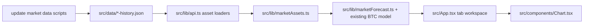
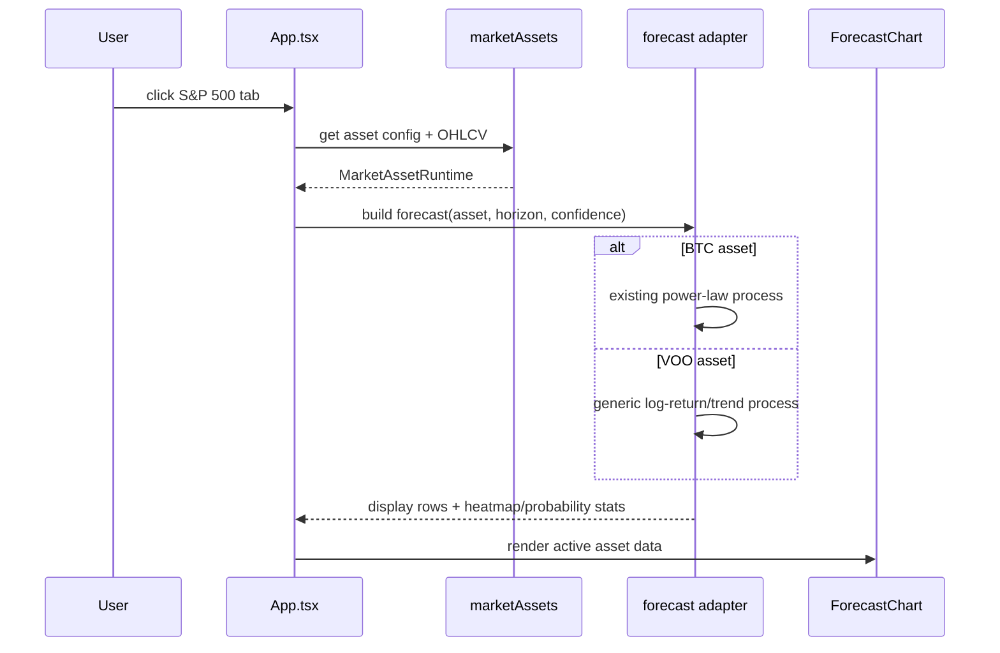

# PRD: S&P 500 Market Tabs And Reusable Forecast Model

Complexity: 6 -> MEDIUM mode

## Context

Problem: The app is BTC-only, but we need an internal tab interface where BTC remains the default and an S&P 500 proxy can be loaded, modeled, and forecasted without duplicating the BTC implementation.

Files analyzed:
- `src/App.tsx`
- `src/components/Chart.tsx`
- `src/lib/api.ts`
- `src/lib/data.ts`
- `src/lib/forecastInterval.ts`
- `src/lib/powerLaw.ts`
- `scripts/update-btc-data.mjs`
- `scripts/check-data-freshness.ts`
- `package.json`
- `.env.example`

Current behavior:
- BTC history is loaded from `src/data/btc-history.json` via `loadBTCData()`.
- Forecast calculations are tightly coupled to BTC power-law, halving-cycle, MVRV, and drawdown assumptions.
- The chart accepts generic OHLCV-like rows, but BTC-specific overlays are always available in the surrounding UI.
- Data update automation exists for BTC, MVRV, and regime data, but not for equities or ETFs.
- There is no asset selector or tabbed market workspace.

## Solution

Approach:
- Add a small market-asset abstraction that separates generic OHLCV behavior from BTC-specific model annotations.
- Use VOO as the initial S&P 500 investable proxy because it maps closely to the S&P 500, has real OHLCV/volume, and avoids index-volume ambiguity. Keep VTI as a later broad-market option, not the first tab.
- Add a reusable statistical forecast model for non-BTC assets: log-return drift plus volatility-scaled intervals, with optional mean reversion to a rolling trend.
- Refactor BTC forecast calls behind the same interface so the UI can switch tabs without duplicating controls, cards, or chart wiring.
- Gate BTC-only panels and overlays by asset capability flags.

Architecture:

Key decisions:
- Initial S&P 500 instrument: `VOO`, labeled "S&P 500" in the UI with source/instrument metadata visible in market stats.
- Reuse `OHLCVData`, chart controls, horizon controls, volatility cards, probability forecast presentation, and existing JSON-cache pattern.
- Keep BTC power-law code intact and wrap it rather than rewriting it.
- Use adjusted daily OHLCV if the selected data source provides adjusted values; otherwise document unadjusted behavior in source metadata.
- Treat equity forecasts as statistical scenarios, not structural power-law forecasts.

Data changes:
- Add `src/data/voo-history.json`.
- Add source metadata for VOO in either `src/data/source-freshness.json` or a market-specific metadata file generated by scripts.

## Integration Points

**How will this feature be reached?**
- [x] Entry point identified: internal tab control at the top of the app, default tab `BTC`.
- [x] Caller file identified: `src/App.tsx` will call shared asset registry/model helpers based on active tab.
- [x] Registration/wiring needed: add VOO to asset registry, add update script to `package.json`, import VOO JSON in `src/lib/api.ts` or `src/lib/marketAssets.ts`.

**Is this user-facing?**
- [x] YES -> UI components required: asset tab control, asset-aware header labels, asset-aware forecast console model text, conditional BTC-only side panels, S&P 500 market stats.

**Full user flow:**
1. User opens the app.
2. App defaults to the `BTC` tab and renders the existing Bitcoin forecast workspace.
3. User selects the `S&P 500` tab.
4. `src/App.tsx` changes the active asset id and recomputes display data through the shared forecast adapter.
5. Chart, metrics, horizon controls, forecast intervals, and volatility update to VOO-backed S&P 500 data.
6. BTC-only panels such as MVRV, halvings, regime context, and cycle drawdown are hidden or replaced by generic market stats.

## Sequence Flow

## Execution Phases

#### Phase 1: VOO Data Cache - S&P 500 proxy history can be regenerated and loaded

**Files (max 5):**
- `scripts/update-market-data.mjs` - fetch and normalize VOO daily OHLCV.
- `src/data/voo-history.json` - cached VOO daily data.
- `src/lib/api.ts` - add reusable `loadMarketData(assetId)` or `loadVOOData()` without removing `loadBTCData()`.
- `package.json` - add `update:market-data` and optionally run it from `predev` after BTC update.
- `.env.example` - add only source-specific optional variables if the chosen source requires them.

**Implementation:**
- [ ] Choose one no-key baseline source for VOO daily candles, or make credentials optional with clear fallback to cached data.
- [ ] Normalize to existing `OHLCVData` shape: `{ date, open, high, low, close, volume }`.
- [ ] Preserve sorted UTC daily rows and avoid writing partial malformed data.
- [ ] Compute `currentPrice`, `priceChange24h`, `marketCap: 0`, `volume24h`, and `fetchedAt` through existing `MarketData`.
- [ ] Add clear console output for row count, latest date, and skipped-update behavior.

**Tests Required:**
| Test File | Test Name | Assertion |
|-----------|-----------|-----------|
| `npm run update:market-data` | VOO update smoke | writes `src/data/voo-history.json` with sorted non-empty rows |
| `npm run lint` | TypeScript compile | no type errors after loader changes |

**User Verification:**
- Action: Run `npm run update:market-data`.
- Expected: Console reports VOO row count and latest available trading date; cached JSON contains valid daily OHLCV rows.

#### Phase 2: Shared Forecast Adapter - BTC and VOO use one app-level forecast contract

**Files (max 5):**
- `src/lib/marketForecast.ts` - define forecast adapter contract and generic equity model.
- `src/lib/data.ts` - expose existing BTC functions through adapter-compatible wrappers if needed.
- `src/lib/api.ts` - export asset ids/types used by forecast helpers.
- `src/App.tsx` - replace direct BTC-only forecast calls with active-asset helper calls.
- `src/components/Chart.tsx` - accept capability flags if BTC-only overlays need to be disabled.

**Implementation:**
- [ ] Define `MarketAssetId = 'btc' | 'sp500'` and `MarketAssetConfig` with label, ticker, quote, model name, data source label, and capability flags.
- [ ] Define a forecast result shape containing display rows, heatmap cells, drawdown stats if available, probability forecast, and model copy.
- [ ] Wrap BTC path with existing `processRealData`, `generateHeatmapData`, `computeProbabilityForecast`, and `computeDrawdownStats`.
- [ ] Add generic model for VOO: rolling log-return drift, 90/252-day blended volatility, lognormal forecast intervals, stochastic traces, and probability-up calculation.
- [ ] Reuse existing confidence levels and horizon options.

**Tests Required:**
| Test File | Test Name | Assertion |
|-----------|-----------|-----------|
| `npm run lint` | TypeScript compile | adapter types compile |
| `npm run build` | production build | Vite bundles BTC and VOO paths |

**User Verification:**
- Action: Switch between BTC and S&P 500 tabs.
- Expected: Both tabs render a chart and metrics; BTC numbers match pre-refactor behavior for the same horizon.

#### Phase 3: Internal Tab UI - BTC remains default and S&P 500 is selectable

**Files (max 5):**
- `src/App.tsx` - add tab state, asset-aware labels, and conditional panels.
- `src/components/Chart.tsx` - hide BTC halving/cycle overlays when active asset lacks those capabilities.
- `src/index.css` - only if tab styling needs a small shared utility.

**Implementation:**
- [ ] Add compact internal tab control in the header or chart toolbar: `BTC` first, `S&P 500` second.
- [ ] Default active asset to `btc`.
- [ ] Update header subtitle, chart title, model label, current price label, data source, and market stats from active asset config.
- [ ] Hide MVRV, halvings, BTC regime context, cycle drawdown, floor, peak, and halving overlays for S&P 500.
- [ ] Keep shared controls: range, playback, SMA, volume, path, scenarios, heatmap, horizon, interval, refresh.

**Tests Required:**
| Test File | Test Name | Assertion |
|-----------|-----------|-----------|
| `npm run lint` | TypeScript compile | no JSX/type errors |
| `npm run build` | production build | UI bundles successfully |

**User Verification:**
- Action: Open app, verify BTC is selected; click `S&P 500`.
- Expected: The main chart changes to S&P 500 data, BTC-only controls disappear, and forecast controls still work.

#### Phase 4: Verification And Documentation - The feature is reproducible

**Files (max 5):**
- `README.md` - document new tab and market data update command.
- `docs/reports/data-sources.md` - document VOO source, cadence, adjustment policy, and limitations.
- `scripts/check-data-freshness.ts` - include VOO if freshness metadata is wired into existing report.
- `package.json` - add combined validation/build command only if it fits existing scripts.

**Implementation:**
- [ ] Document why VOO is used for the S&P 500 tab and why VTI is deferred.
- [ ] Document the generic model formula and limitations.
- [ ] Add freshness reporting if VOO metadata is available.
- [ ] Run data update, TypeScript lint, and production build.

**Tests Required:**
| Test File | Test Name | Assertion |
|-----------|-----------|-----------|
| `npm run update:market-data` | data refresh | VOO cache remains valid |
| `npm run lint` | TypeScript compile | passes |
| `npm run build` | production build | passes |

**User Verification:**
- Action: Read README/data source notes and run the listed commands.
- Expected: A developer can refresh VOO data and understand the model's assumptions without inspecting implementation code.

## Acceptance Criteria

- BTC remains the default tab and preserves current forecast behavior.
- S&P 500 tab uses VOO-backed daily OHLCV data from a reproducible cached JSON file.
- Shared UI controls and metrics are reused across BTC and S&P 500 where they make sense.
- BTC-only panels, overlays, and model text do not appear on the S&P 500 tab.
- VOO forecast uses one documented mathematical model with intervals and probability-up output.
- The data update path is scriptable and does not require committed secrets.
- `npm run lint` and `npm run build` pass after implementation.

## Open Questions

- Should `predev` refresh VOO automatically, or should equity data updates stay manual to avoid slowing local startup?
- Should the tab label say `S&P 500` while the instrument metadata says `VOO`, or should both be visible in the tab?
- If the first no-key source has split/dividend adjustment limitations, should we accept it for v1 or require an API key for adjusted data?
