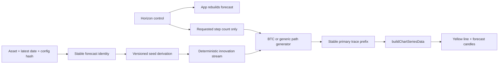
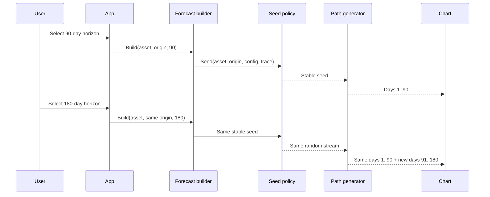

# PRD: Yellow Forecast-Line Horizon Prefix Stability

Complexity: 7 -> HIGH mode

Score: +3 for 10+ files across runtime, tests, evidence, and gated rollout; +2 for a new deterministic forecast-seed utility; +2 for stochastic path state and cross-horizon validation logic.

Status: Proposed — report-only until the invariance and forecast-safety gates pass

Owner: Forecasting / Engineering

## 1. Context

**Problem:** Changing the forecast horizon redraws the already-visible yellow stochastic forecast path, making the forecast appear to contradict itself even though the origin data and model configuration have not changed.

**Files analyzed:**

- `src/lib/data.ts`
- `src/lib/marketForecast.ts`
- `src/lib/random.ts`
- `src/lib/modelConfig.ts`
- `src/components/chart/dataTransforms.ts`
- `src/components/Chart.tsx`
- `src/App.tsx`
- `src/lib/__tests__/engineeringHygiene.test.ts`
- `src/lib/__tests__/forecastInterval.test.ts`
- `src/lib/__tests__/stateSpaceResidual.test.ts`
- `src/components/__tests__/Chart.test.ts`
- `src/components/__tests__/Chart.component.test.tsx`
- `tests/e2e/forecast-workspace.spec.ts`
- `docs/PRDs/v2/12-yellow-line-forecast-capability.md`
- `docs/reports/experiments-backlog.md`

**Current behavior:**

- The prominent yellow path is rendered from `stochasticTraces[0]`, not from the smooth median.
- BTC seeds its block-bootstrap traces with `0xB17C01A + horizon * 131 + anchorIndex`, so every horizon selects a different random stream.
- S&P 500 and gold seed generic traces with `0x5A500 + horizon * 97 + ohlcv.length`, causing the same complete redraw.
- Gold then calls `selectPrimaryTraceIndex()` over the full requested forecast rows. Even with a horizon-independent random stream, extending the horizon could select a different primary trace and rewrite the prefix.
- Forecast-candle and heatmap seeds also include the horizon, but they are separate visual/statistical products. This PRD changes only the yellow primary trace and the forecast candles derived from that trace unless tests prove another dependency must be updated atomically.
- Existing tests protect deterministic output for a fixed horizon, but no test compares the shared prefix between different horizons.
- PRD v2.12 protects the jagged yellow line from smoothing or median replacement. It does not define cross-horizon prefix stability and therefore does not prevent this confusing redraw.

### Root-cause statement

The generators treat `horizon` as part of random-scenario identity instead of only as the number of requested steps. Consequently:

```text
path(origin, 90 days)[1..90] != path(origin, 180 days)[1..90]
```

The desired product contract is:

```text
path(origin, configuration, 180 days)[1..90]
  == path(origin, configuration, 90 days)[1..90]
```

The equality applies to dates and primary-trace values within a documented numeric tolerance. A longer horizon extends the path; it does not reinterpret the earlier forecast.

### Goals

- Make the yellow forecast path prefix-stable across supported horizon changes for BTC, S&P 500, and gold.
- Preserve jaggedness, origin anchoring, empirical block dependence, volatility scale, and the existing yellow visual treatment.
- Derive randomness from stable forecast identity: asset, forecast origin, data/configuration version, generator method, and trace index—not the requested path length.
- Make results independent of UI navigation order, reloads, and whether the user requests a short or long horizon first.
- Prove that changing the seed contract does not degrade path/distribution diagnostics or forecast interval calibration.
- Keep median forecasts, red/blue channels, green intervals, probability summaries, and source data unchanged.

### Non-goals

- Making the yellow line smooth, less volatile, or closer to the median.
- Claiming that one displayed stochastic realization is the point forecast.
- Persisting a user-specific random path in local storage or on the server.
- Stitching newly sampled segments onto a cached short path.
- Changing the red/blue channel behavior covered by `MARKET_FORECAST_CHANNEL_PATHS.md`.
- Reopening rejected YL-1, YL-2, or YL-2P model searches from PRD v2.12.
- Making heatmap cell layouts prefix-stable; heatmap stability requires a separate contract because its sampling grid changes with horizon.

## 2. Integration Points

**How will this feature be reached?**

- [x] Entry point identified: the user changes horizon in `ForecastControls` while viewing BTC, S&P 500, or gold.
- [x] Caller identified: `src/App.tsx` rebuilds the active forecast through `buildMarketForecast()`.
- [x] Registration/wiring needed: BTC `processRealData()` and generic `processGenericData()` must pass a stable forecast identity to the shared seed policy; chart wiring remains unchanged.

**Is this user-facing?**

- [x] YES — the existing yellow forecast line and forecast candles following its primary trace are affected. No new control is required.

**Full user flow:**

1. User opens an asset at a short horizon and observes the yellow path.
2. User selects a longer horizon.
3. The app recomputes the path from the same origin/configuration using the same deterministic random stream.
4. Previously visible dates retain identical yellow values; only later dates are appended.
5. Selecting the shorter horizon again displays the same original prefix.

## 3. Solution

### Approach

- Define and test a cross-horizon prefix-stability contract before changing runtime code.
- Introduce a versioned stable forecast identity and seed derivation that excludes requested horizon length.
- Generate each trace as a deterministic sequence whose first `N` values do not depend on whether more than `N` values were requested.
- For gold, make primary-trace selection independent of the requested terminal horizon. Select using a fixed, pre-registered prefix window available at every supported horizon, or pin a deterministic trace index if validation shows selection adds no accepted value.
- Compare old and candidate seed policies in a report-only experiment. Promote only if path-property and terminal-distribution diagnostics are preserved and all existing forecast backtests remain passing.

### Architecture



### Key decisions

- **Forecast identity:** `{ assetId, originDate, sourceDataHash/configVersion, methodId, traceIndex }`. Horizon is excluded.
- **Generator versioning:** changing the seed derivation or sampling algorithm increments a named configuration version. Old evidence cannot enable an unreviewed version.
- **Stateless recomputation:** the path is regenerated from inputs, not recovered from browser cache. Deep links and refreshes therefore agree.
- **Prefix definition:** for any supported `short < long`, every shared forecast date must have the same primary trace value within `1e-12` relative tolerance, with exact equality preferred.
- **Stable consumption:** loops must consume random numbers per trace/day in an order independent of total trace count and horizon. Adding a future day or auxiliary trace cannot perturb prior `(traceIndex, day)` values.
- **Gold primary selection:** selection cannot score the entire requested horizon. Use a fixed selection window no longer than the minimum supported horizon, frozen in model configuration, or use trace index zero. The chosen rule must pass the same path diagnostics as the baseline.
- **No distribution claim from visual consistency:** prefix stability is a product/invariance property. Promotion also requires statistical non-inferiority because the seed-policy change selects a different realized path.
- **BTC PRD relationship:** this PRD narrowly amends v2.12's deterministic-behavior requirement from “same origin and same horizon” to “same origin/configuration across all requested lengths.” Jaggedness, styling, and model promotion restrictions remain binding.

### Data changes

No source or schema changes. Add report artifacts under `docs/reports/results/` and register the experiment in `docs/reports/experiments-backlog.md`.

### Proposed utility contract

```ts
interface ForecastPathIdentity {
  assetId: 'btc' | 'sp500' | 'gold';
  originDate: string;
  dataVersion: string;
  methodId: string;
  generatorVersion: string;
}

function forecastPathSeed(
  identity: ForecastPathIdentity,
  traceIndex: number
): number;
```

`forecastPathSeed()` must not accept horizon. Callers pass horizon only to control how many deterministic steps are materialized.

## 4. Sequence Flow



## 5. Execution Phases

#### Phase 1: Freeze the cross-horizon contract — The current redraw becomes a reproducible failing test and report

**Files (max 5):**

- `src/lib/__tests__/forecastPathStability.test.ts` — direct BTC/S&P 500/gold prefix comparisons.
- `src/components/__tests__/Chart.test.ts` — prove the plotted yellow series follows the model prefix without transformation drift.
- `scripts/analyze-forecast-path-stability.ts` — report-only baseline diagnostic across origins/assets/horizon pairs.
- `docs/reports/results/forecast-path-prefix-baseline-YYYY-MM-DD.md` — readable baseline.
- `docs/reports/results/forecast-path-prefix-baseline-YYYY-MM-DD.json` — complete evidence and provenance.

**Implementation:**

- [ ] Define supported comparison pairs from existing horizon options, including at least `30→90`, `90→180`, and `180→365` days where available.
- [ ] Serialize primary-trace dates/values from the same asset and origin at each horizon.
- [ ] Measure shared-prefix mismatch count, maximum relative difference, first mismatch date, terminal distribution diagnostics, and gold primary trace index.
- [ ] Add tests that intentionally demonstrate current mismatch without making the default suite permanently red; encode current behavior as a baseline diagnostic and candidate contract as a separately callable assertion.
- [ ] Record asset, origin, data hash, git commit, method/config version, horizon pair, and seeds.

**Tests required:**

| Test file | Test name | Assertion |
|---|---|---|
| `src/lib/__tests__/forecastPathStability.test.ts` | `should detect horizon-dependent BTC trace prefixes in the production baseline` | Baseline diagnostic reports mismatches for at least one shared day. |
| `src/lib/__tests__/forecastPathStability.test.ts` | `should detect horizon-dependent generic trace prefixes in the production baseline` | S&P 500 and gold baseline diagnostics expose the redraw. |
| `src/components/__tests__/Chart.test.ts` | `should map primary trace values to yellow forecast candles without resampling` | Chart series equals `stochasticTraces[0]` for shared dates. |

**Verification plan:**

1. Run `npx vitest run src/lib/__tests__/forecastPathStability.test.ts src/components/__tests__/Chart.test.ts`.
2. Run `npm run analyze:forecast-path-stability -- --baseline`.
3. Confirm baseline artifacts contain mismatches and complete provenance for all three assets.

**User verification:**

- Action: inspect the baseline report and reproduce one horizon change in the app.
- Expected: the report's first mismatch date/value corresponds to the visible redraw.

#### Phase 2: Implement and validate a prefix-stable generator — The candidate extends paths without rewriting shared dates

**Files (max 5):**

- `src/lib/forecastPathSeed.ts` — versioned identity hashing and per-trace seed derivation.
- `src/lib/data.ts` — candidate BTC generator route, still report-only by default.
- `src/lib/marketForecast.ts` — candidate generic generator and horizon-independent gold primary selection.
- `src/lib/__tests__/forecastPathStability.test.ts` — invariance, mutation, order, and distribution tests.
- `scripts/analyze-forecast-path-stability.ts` — baseline/candidate comparison and verdict.

**Implementation:**

- [ ] Derive per-trace seeds from stable identity without horizon.
- [ ] Ensure random consumption for `(traceIndex, day)` is unchanged when the requested horizon or number of materialized days changes.
- [ ] Preserve BTC's backcast reset to the latest known close without allowing the requested future length to affect backcast innovations.
- [ ] Freeze gold primary selection to a fixed selection prefix or fixed trace index before viewing candidate results.
- [ ] Confirm asset switches and generation order cannot influence seeds or paths.
- [ ] Compare baseline and candidate distributions over many rolling origins; a single displayed realization is not sufficient evidence.
- [ ] Produce an asset-specific `promote`, `reject`, or `needs-more-data` verdict.

**Candidate gate:**

- Zero shared-prefix mismatches for every tested asset, origin, horizon pair, and navigation order.
- Exact repeatability for identical identity/configuration.
- Zero non-finite, non-positive, unanchored, missing-date, or discontinuous path values.
- Candidate terminal q10/q50/q90 pinball loss, 80/90/95 coverage, drawdown distribution, realized-volatility distribution, sign-change rate, tail quantiles, and residual/absolute-return autocorrelation remain within the non-inferiority tolerances already established for the production generator in v2.12.
- No more than 2 percentage points of coverage loss at any gated horizon and no material pinball/NLL regression.
- `npm run backtest` and `npm run backtest:market` continue to pass. The seed change must not alter smooth medians or interval values.
- Gold's fixed selection rule must not materially worsen its support-breach and path-distance diagnostics versus the current full-horizon selection rule.

**Tests required:**

| Test file | Test name | Assertion |
|---|---|---|
| `src/lib/__tests__/forecastPathStability.test.ts` | `should preserve the BTC prefix when extending the requested horizon` | Shared dates/values are identical for all supported horizon pairs. |
| `src/lib/__tests__/forecastPathStability.test.ts` | `should preserve S&P 500 and gold prefixes when extending the requested horizon` | Both generic assets satisfy the same contract. |
| `src/lib/__tests__/forecastPathStability.test.ts` | `should generate the same path regardless of horizon navigation order` | Short→long→short and long→short produce identical shared values. |
| `src/lib/__tests__/forecastPathStability.test.ts` | `should not alter prior paths when future OHLCV rows are mutated` | An earlier origin uses no future information. |
| `src/lib/__tests__/forecastPathStability.test.ts` | `should isolate trace streams from trace count and auxiliary simulations` | Changing unrelated trace count does not perturb the primary trace. |
| `src/lib/__tests__/forecastPathStability.test.ts` | `should select the same gold primary trace for all requested horizons` | Selection identity is horizon-independent. |

**Verification plan:**

1. Run the focused unit suite twice to prove repeatability.
2. Run `npm run analyze:forecast-path-stability -- --candidate prefix-stable-v1`.
3. Run `npm run backtest`, `npm run backtest:market`, `npm test -- --run`, `npm run lint`, and `npm run build`.
4. Preserve candidate `.md` and `.json` artifacts and update the backlog regardless of verdict.

**User verification:**

- Action: compare candidate report rows for short and long horizons.
- Expected: the shared prefix has zero mismatches while path/distribution diagnostics remain within the frozen tolerances.

#### Phase 3: Gate and integrate the validated policy — Horizon changes extend the visible yellow path in production

This phase must not start unless Phase 2 records a positive verdict for the exact asset/configuration and all applicable backtest gates pass.

**Files (max 5):**

- `src/lib/modelConfig.ts` — explicit asset-scoped enablement, generator version, evidence hash, and rollback route.
- `src/lib/data.ts` — enable the validated BTC policy only when its config/evidence hashes match.
- `src/lib/marketForecast.ts` — enable validated generic policies only for passing assets.
- `tests/e2e/forecast-workspace.spec.ts` — exercise real horizon changes and shared-prefix assertions.
- `docs/PRDs/v2/12-yellow-line-forecast-capability.md` — add a narrow cross-reference documenting the amended determinism contract; do not rewrite its rejected experiment verdicts.

**Implementation:**

- [ ] Enable policies independently by asset; one asset's pass cannot promote another.
- [ ] Reject unknown generator versions or mismatched evidence/config hashes rather than silently enabling them.
- [ ] Keep chart series type, amber styling, line width, prominence, switches, and median separation unchanged.
- [ ] Keep forecast values stable across short→long→short, long→short, reload, and direct navigation sequences.
- [ ] Document rollback to the production baseline generator.

**Tests required:**

| Test file | Test name | Assertion |
|---|---|---|
| `tests/e2e/forecast-workspace.spec.ts` | `should extend the BTC yellow path when the horizon increases` | Existing shared chart points do not change. |
| `tests/e2e/forecast-workspace.spec.ts` | `should extend S&P 500 and gold yellow paths when the horizon increases` | Passing generic assets retain shared prefixes. |
| `tests/e2e/forecast-workspace.spec.ts` | `should restore the same prefix after reload and horizon navigation` | UI order and reload do not change values. |
| `src/lib/__tests__/engineeringHygiene.test.ts` | `should reject prefix-stable routing without matching evidence and config hashes` | Unverified runtime enablement throws or remains on baseline. |

**Verification plan:**

1. Run `npm run backtest` and `npm run backtest:market`.
2. Run `npm test -- --run`, `npm run lint`, and `npm run build`.
3. Run `npm run test:e2e` at desktop and mobile sizes.
4. Manually switch every supported horizon in both directions for BTC, S&P 500, and gold; compare shared dates and visual continuity.
5. Record exact test output, screenshots, configuration hash, and evidence artifact hash in this PRD and the backlog.

**User verification:**

- Action: select 30d, then 90d, then 180d, then return to 30d for each asset.
- Expected: each longer view preserves the earlier yellow path and appends future dates; returning to 30d restores the identical initial path.

## 6. Checkpoint Protocol

Every phase requires the automated PRD checkpoint review specified by the `prd-creator` workflow. Because this is HIGH complexity and visually user-facing, each phase also requires manual evidence review before continuing.

```text
PHASE N COMPLETE — CHECKPOINT
Files changed: [list]
Focused tests: [pass/fail]
Backtest gates: [pass/fail/not yet applicable]
Build/typecheck: [pass/fail]
Manual evidence: [specific report or horizon-switch procedure]
```

Phase 3 is prohibited without a Phase 2 PASS and explicit evidence/config hashes.

## 7. Acceptance Criteria

- [ ] The baseline report reproduces horizon-dependent redraws for BTC, S&P 500, and gold.
- [ ] The stable forecast identity and generator version are documented and exclude requested horizon length.
- [ ] Every supported short/long horizon pair has zero shared-prefix mismatches for every enabled asset.
- [ ] Gold primary-trace selection is horizon-independent.
- [ ] Paths are deterministic across reloads, direct navigation, and horizon-selection order.
- [ ] The yellow path remains jagged, empirically generated, origin-anchored, and visually unchanged in style/prominence.
- [ ] Smooth medians, green intervals, red/blue channels, heatmaps, and probability summaries remain unchanged unless an unavoidable dependency is separately documented and validated.
- [ ] Statistical path/distribution non-inferiority gates pass for every enabled asset.
- [ ] `npm run backtest`, `npm run backtest:market`, tests, typecheck, build, E2E, and manual visual checks pass.
- [ ] Experiment outcomes and preserved artifacts are recorded even when rejected or report-only.
- [ ] Runtime enablement is asset-scoped, reversible, and bound to exact evidence/configuration hashes.

## 8. Risks and Mitigations

- **Risk: stable but statistically atypical visible path.** Mitigation: evaluate path properties over many origins/seeds and retain distribution non-inferiority gates.
- **Risk: loop refactoring changes random-number consumption.** Mitigation: per-trace stable streams and trace-count isolation tests.
- **Risk: gold selection still leaks terminal horizon into the prefix.** Mitigation: fixed selection prefix or fixed trace identity, explicitly tested across every horizon.
- **Risk: data refresh legitimately changes the path.** Mitigation: identity includes origin/data version; UI copy and tests distinguish a new forecast origin from a horizon-only change.
- **Risk: conflict with v2.12's visual preservation language.** Mitigation: amend only the cross-horizon determinism contract; retain jaggedness and all rejected-model restrictions.
- **Risk: cached stitching hides generator inconsistency.** Mitigation: require stateless direct generation of any horizon to reproduce the same prefix.
- **Risk: changing non-yellow simulations accidentally.** Mitigation: snapshot median, interval, heatmap metadata, and red/blue channel outputs before rollout.

## 9. Verification Evidence

Execution date: 2026-07-10.

- Phase 1 baseline artifacts reproduce horizon-dependent prefix redraws for BTC, S&P 500, and gold across 30→90, 90→180, and 180→365 days.
- Phase 2 candidate artifacts record zero shared-prefix mismatches across all nine asset/horizon-pair comparisons, deterministic navigation order, isolated trace streams, and horizon-independent 14-day gold trace selection.
- Asset verdicts are `needs-more-data` for BTC, S&P 500, and gold because rolling-origin statistical non-inferiority was not established. Phase 3 is therefore not authorized; application calls remain on `production-baseline` unless tests/report tooling explicitly request `prefix-stable-v1`.
- Artifacts:
  - `forecast-path-prefix-baseline-2026-07-10.md` SHA-256 `2bc987f34d75cdef7b6aaa147687d2acef879de1c5ab67cb3c65d86bea04e09d`
  - `forecast-path-prefix-baseline-2026-07-10.json` SHA-256 `4ff4f011f7c184298aeca6a6f686093d8a8bb15b99376f1e18b4ba3eced5011a`
  - `forecast-path-prefix-candidate-2026-07-10.md` SHA-256 `7b4e45b903deb7ecee9cac4bcbddeac0cfdb6c1e998454dcc362efb34067281f`
  - `forecast-path-prefix-candidate-2026-07-10.json` SHA-256 `778df3527ec1acd546ed3f07007e1c894660318387c8196362e2c73c81a8a2fe`
- Focused stability/chart tests passed twice (14/14 each); `npm run backtest`, `npm run backtest:market`, `npm run lint`, and `npm run build` passed.
- E2E/manual rollout verification was not run because Phase 3 was prohibited and no visible production behavior changed.
