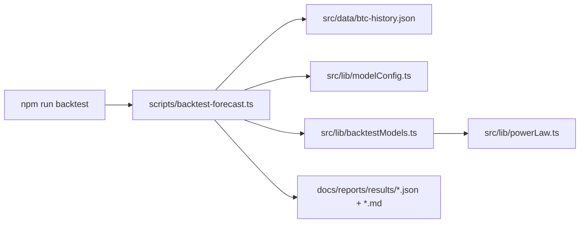
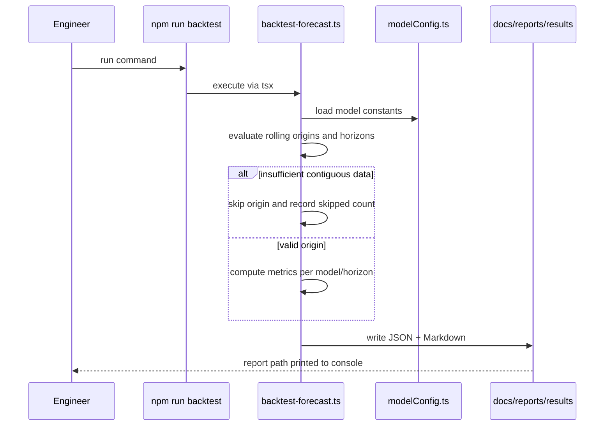

# PRD v2.1: Backtest Quality Lock

Complexity: 6 -> MEDIUM mode

Source documents:
- `ROADMAP-v2.md`
- `docs/reports/model-reliability-assessment.md`

## Context

Problem: Future model changes cannot be trusted until forecast validation is repeatable, persisted, and benchmarked against simple alternatives.

Files analyzed:
- `scripts/analyze-heatmap-model.ts`
- `scripts/analyze-phase-signal.ts`
- `src/lib/data.ts`
- `src/lib/powerLaw.ts`
- `src/lib/api.ts`
- `package.json`

Current behavior:
- `npm run analyze:heatmap-model` prints useful holdout metrics but does not persist results.
- The only formal holdout start in existing scripts is `2022-01-01`.
- Existing metrics emphasize MAE and NLL; quantile loss and interval coverage are not first-class report artifacts.
- Model constants live inside implementation files, making before/after comparisons hard.
- There is no single `npm run backtest` gate for future model work.

## Solution

Approach:
- Add a reusable backtest runner that evaluates rolling-origin forecasts across `7, 14, 30, 60, 90, 180, 365` day horizons.
- Persist machine-readable JSON and human-readable Markdown reports under `docs/reports/results/`.
- Add benchmark models: current-price naive, driftless GBM, recent-drift GBM, 20/50/200-day moving-average trend, and current power-law.
- Add a model config file so constants can be recorded in reports and changed without editing forecast math.
- Wire `npm run backtest` as the canonical command for validation.

Architecture:

Key decisions:
- Use existing TypeScript + `tsx`; do not introduce a test framework in this slice.
- Keep benchmark model implementations deterministic and side-effect free.
- Treat report generation as an append/write artifact, not as app runtime state.
- Include command, git commit hash, dataset last date, input row counts, horizons, rolling-origin spacing, and model config snapshot in every report.

Data changes: None to app data. New report artifacts under `docs/reports/results/`.

## Integration Points

How will this feature be reached?
- Entry point identified: `npm run backtest`.
- Caller file identified: `package.json` invokes `tsx scripts/backtest-forecast.ts`.
- Registration/wiring needed: add `backtest` script to `package.json`.

Is this user-facing?
- No. This is an internal validation and release-quality feature.

Full user flow:
1. Engineer runs `npm run backtest`.
2. `scripts/backtest-forecast.ts` loads cached BTC data and model configs.
3. Runner evaluates all configured models over rolling origins and horizons.
4. Results are written to `docs/reports/results/backtest-YYYY-MM-DDTHH-mm-ssZ.json` and `.md`.
5. Engineer reads the Markdown summary and uses JSON for comparison tooling.

## Sequence Flow

## Execution Phases

#### Phase 1: Report Skeleton - `npm run backtest` writes deterministic report files

Files:
- `package.json` - add `backtest` script.
- `scripts/backtest-forecast.ts` - create CLI, load data, validate horizons, write basic report.
- `docs/reports/results/.gitkeep` - preserve output directory if needed.

Implementation:
- [ ] Create `docs/reports/results/` if missing from the script.
- [ ] Add CLI constants for horizons: `7, 14, 30, 60, 90, 180, 365`.
- [ ] Use UTC timestamps in file names; avoid local timezone-dependent output.
- [ ] Include dataset first date, last date, row count, skipped-window count, command, and git commit hash.
- [ ] Write Markdown and JSON from the same in-memory result object.

Tests required:

| Test File | Test Name | Assertion |
| --- | --- | --- |
| `scripts/backtest-forecast.ts` | `npm run backtest` smoke | command exits `0` and prints both report paths |
| generated JSON | schema smoke | top-level keys include `metadata`, `horizons`, `models`, `metrics` |
| generated Markdown | content smoke | includes dataset last date, command used, and horizons |

User verification:
- Action: Run `npm run backtest`.
- Expected: A new JSON and Markdown report appear under `docs/reports/results/`.

#### Phase 2: Baseline Models - Reports compare power-law against simple benchmarks

Files:
- `src/lib/modelConfig.ts` - move power-law and interval constants into exported config objects.
- `src/lib/backtestModels.ts` - implement benchmark forecast functions.
- `scripts/backtest-forecast.ts` - evaluate all models.
- `src/lib/powerLaw.ts` - import constants from config without changing behavior.

Implementation:
- [ ] Define model ids: `naive-current-price`, `gbm-driftless`, `gbm-recent-drift`, `ma-trend-20-50-200`, `powerlaw-current`.
- [ ] Keep forecasts endpoint-based for the first report: input origin row and target horizon, output median price.
- [ ] Confirm `powerlaw-current` reproduces existing `powerLawForecast` endpoint behavior.
- [ ] Record each model's config in report metadata.
- [ ] Sort report model sections by horizon, then model id.

Tests required:

| Test File | Test Name | Assertion |
| --- | --- | --- |
| `scripts/backtest-forecast.ts` | `powerlaw-current is evaluated` | JSON includes metrics for every configured horizon |
| `scripts/backtest-forecast.ts` | `benchmark models are evaluated` | JSON contains all five model ids |
| `npm run lint` | TypeScript compile | no type errors |

User verification:
- Action: Open the generated Markdown report.
- Expected: Each horizon shows power-law and four benchmark rows.

#### Phase 3: Forecast Metrics - Median, bias, NLL, quantile loss, and coverage are measured

Files:
- `src/lib/backtestMetrics.ts` - metric helpers.
- `scripts/backtest-forecast.ts` - aggregate and render metrics.
- `src/lib/modelConfig.ts` - add interval config snapshot.
- `src/lib/data.ts` - reuse or export interval utilities only if needed.

Implementation:
- [ ] Add median absolute log error and approximate multiplicative error.
- [ ] Add mean signed log error as bias.
- [ ] Add NLL for probabilistic models where interval sigma exists; record `null` for models without distribution.
- [ ] Add pinball loss for `q05`, `q10`, `q50`, `q90`, `q95`.
- [ ] Add empirical coverage for 80%, 90%, and 95% intervals.
- [ ] Include sample count for every metric row.

Tests required:

| Test File | Test Name | Assertion |
| --- | --- | --- |
| `src/lib/backtestMetrics.ts` | `pinball loss handles over and under prediction` | loss is positive and asymmetric by quantile |
| `src/lib/backtestMetrics.ts` | `coverage counts inclusive endpoints` | target equal to interval bound is covered |
| generated JSON | metric completeness | every horizon/model row has `samples`, `medianAbsLogError`, `biasLogError`, `pinballLoss` |

User verification:
- Action: Run `npm run backtest` twice without code/data changes.
- Expected: Metric values are identical except timestamp and report file names.

#### Phase 4: Quality Gate - Current power-law must beat naive at key horizons

Files:
- `scripts/backtest-forecast.ts` - add gate logic and non-zero exit on required failure.
- `docs/reports/results/README.md` - document report fields and pass/fail criteria.
- `package.json` - optionally add `backtest:report-only` if engineers need non-gating exploration.

Implementation:
- [ ] Define required horizons: `14, 30, 60, 90`.
- [ ] Compare `powerlaw-current` against `naive-current-price` using median absolute log error.
- [ ] Fail `npm run backtest` if power-law does not beat naive on at least `14, 30, 60, 90` day horizons.
- [ ] Include pass/fail status and reason in both JSON and Markdown.
- [ ] Print concise console summary with report paths and gate status.

Tests required:

| Test File | Test Name | Assertion |
| --- | --- | --- |
| `npm run backtest` | quality gate pass | exits `0` on current data if power-law beats naive at required horizons |
| `scripts/backtest-forecast.ts` | report records gate result | JSON includes `qualityGate.status` and `checks` |
| `npm run lint` | TypeScript compile | no type errors |

User verification:
- Action: Run `npm run backtest`.
- Expected: Console output says `PASS` and identifies the Markdown report path.

## Acceptance Criteria

- `npm run backtest` produces deterministic JSON and Markdown reports under `docs/reports/results/`.
- Reports include dataset last date, git commit hash, model config, command used, horizons, samples, skipped windows, and metrics.
- Current power-law beats current-price naive at `14, 30, 60, 90` day horizons or the command fails with a clear reason.
- Future model changes can be reviewed by comparing before/after report artifacts.
- `npm run lint` passes after implementation.

## Regression Safety Gate

- Before changing forecast or metric logic, preserve a baseline report path from the current `npm run backtest` output.
- After each phase, rerun `npm run backtest` and compare the new report against the preserved baseline for `14, 30, 60, 90, 180, 365` day median error, bias, NLL where available, pinball loss, and 80/90/95% coverage.
- Required result: the current `powerlaw-current` quality gate remains green and no key result metric degrades beyond documented noise unless the PRD explicitly calls out an intentional metric-definition change.
- Any intentional metric-definition change must include a bridge table that explains old vs new metric semantics so later PRDs do not mistake reporting drift for model drift.

## Risks

- Existing public data may contain gaps; the runner must skip non-contiguous windows and report counts rather than silently using bad targets.
- Adding model config imports can accidentally change runtime forecasts; lock Phase 2 with exact behavior checks.
- Generated reports can create repository churn; use timestamped files for intentional runs and document cleanup expectations.
