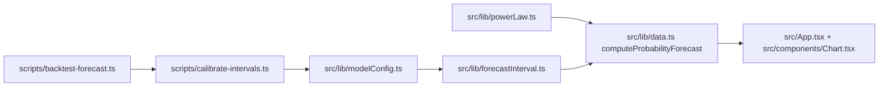
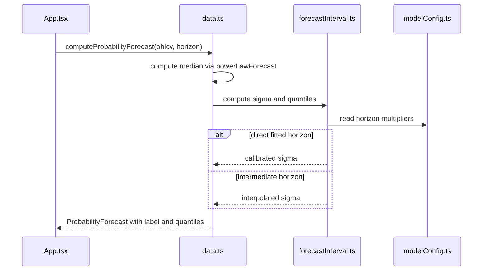

# PRD v2.2: Horizon-Specific Forecast Calibration

Complexity: 6 -> MEDIUM mode

Source documents:
- `ROADMAP-v2.md`
- `docs/reports/model-reliability-assessment.md`

## Context

Problem: Current probability bands are over-conservative beyond 30-60 days, so the UI displays coverage that is safe but not well-calibrated.

Files analyzed:
- `src/lib/data.ts`
- `src/lib/powerLaw.ts`
- `scripts/analyze-heatmap-model.ts`
- `docs/reports/model-reliability-assessment.md`

Current behavior:
- `computeProbabilityForecast` uses one stress multiplier curve: `1 + 1.85 * (1 - exp(-days / 150))`.
- Reported coverage is 98.7-100% for 60+ day horizons across 80/90/95% bands.
- Calibration labels are hardcoded by horizon and not tied to measured coverage.
- The median power-law path and interval model are coupled in the same module.
- Long-horizon labels can imply more precision than the report supports.

## Solution

Approach:
- Fit and store horizon-specific interval multipliers for `14, 30, 60, 90, 180, 365` day horizons.
- Separate median forecast calculation from interval calibration utilities.
- Add quantile backtesting to the backtest report from PRD v2.1 and use it to choose default multipliers.
- Interpolate interval multipliers for UI horizons not directly fitted, such as `7, 730, 1825, 3650`.
- Make UI labels reflect calibration quality: calibrated probability at short horizons, scenario/risk envelope at long horizons.

Architecture:

Key decisions:
- Keep the median path unchanged unless backtest evidence says otherwise.
- Store calibrated multipliers in code/config first; do not require runtime report parsing.
- Use empirical coverage target ranges from the roadmap: 80% within 75-85%, 90% within 85-95%, 95% within 92-98%.
- Treat 180+ day output as scenario ranges even when coverage improves.

Data changes: None.

## Integration Points

How will this feature be reached?
- Entry point identified: `computeProbabilityForecast(marketData.ohlcv, horizon)` in `src/App.tsx`.
- Caller file identified: `src/App.tsx` passes the result to `ForecastChart`.
- Registration/wiring needed: `src/lib/data.ts` should call interval helpers from the new calibration module/config.

Is this user-facing?
- Yes.
- UI components required: forecast console confidence interval selector, probability display inside `ForecastChart`, and any forecast labels in the sidebar/cards.

Full user flow:
1. User selects a horizon and confidence level in the forecast console.
2. `App` recomputes display data and probability forecast.
3. `computeProbabilityForecast` uses the median power-law path plus horizon-specific interval calibration.
4. The chart/sidebar displays calibrated quantiles and labels such as `Median path`, `Scenario range`, or `Directional only`.
5. Long horizons avoid exact-confidence wording when backtests show weak precision.

## Sequence Flow

## Execution Phases

#### Phase 1: Extract Interval Model - Existing behavior is preserved behind a named helper

Files:
- `src/lib/forecastInterval.ts` - new interval utilities.
- `src/lib/modelConfig.ts` - interval and power-law constants.
- `src/lib/data.ts` - delegate sigma/quantile logic to helper.
- `src/lib/powerLaw.ts` - import mean-reversion tau from config.

Implementation:
- [ ] Move stress multiplier, variance, CDF, and quantile helpers out of `data.ts`.
- [ ] Export `computePowerLawInterval({ ohlcv, horizonDays, median, currentPrice })`.
- [ ] Preserve existing multiplier curve for this phase.
- [ ] Ensure `computeProbabilityForecast` returns the same field names.
- [ ] Add comments only where math is non-obvious.

Tests required:

| Test File | Test Name | Assertion |
| --- | --- | --- |
| `npm run lint` | TypeScript compile | no type errors |
| manual fixture check | 30d forecast compatibility | old and new `q05/q95` are equal within rounding before calibration changes |
| manual fixture check | invalid horizon | helper returns no forecast or throws controlled error for horizon `< 1` |

User verification:
- Action: Run the app and switch horizons.
- Expected: Forecast display still renders and interval controls behave as before.

#### Phase 2: Calibration Script - Fit interval multipliers by horizon

Files:
- `scripts/calibrate-intervals.ts` - rolling-origin calibration runner.
- `src/lib/forecastInterval.ts` - expose reusable interval metric helpers if needed.
- `src/lib/modelConfig.ts` - add default fitted multiplier table.
- `package.json` - add `calibrate:intervals` script.

Implementation:
- [ ] Evaluate horizons `14, 30, 60, 90, 180, 365`.
- [ ] For each horizon, search multiplier values that minimize combined absolute coverage error across 80%, 90%, and 95% bands.
- [ ] Use only historical rows available at each origin; no future volatility or MVRV leakage.
- [ ] Print suggested config patch values and coverage table.
- [ ] Include sample count and skipped-window count per horizon.

Tests required:

| Test File | Test Name | Assertion |
| --- | --- | --- |
| `npm run calibrate:intervals` | script smoke | exits `0` and prints multiplier table |
| generated output | target coverage table | includes 80/90/95% coverage for every fitted horizon |
| `npm run lint` | TypeScript compile | no type errors |

User verification:
- Action: Run `npm run calibrate:intervals`.
- Expected: Console output identifies which horizons are over/under target and suggested multipliers.

#### Phase 3: Apply Horizon Calibration - UI uses fitted/interpolated multipliers

Files:
- `src/lib/modelConfig.ts` - update multiplier table.
- `src/lib/forecastInterval.ts` - choose direct or interpolated multiplier.
- `src/lib/data.ts` - set labels from calibration metadata.
- `scripts/backtest-forecast.ts` - include interval coverage after calibration.

Implementation:
- [ ] Use direct multiplier for fitted horizons.
- [ ] Use log-linear interpolation between fitted horizons.
- [ ] Clamp horizons above 365 days to a scenario multiplier policy and label them as scenario ranges.
- [ ] Update `calibrationLabel` to reflect measured status from config: `Calibrated`, `Conservative`, `Directional only`, or `Scenario range`.
- [ ] Include new coverage metrics in `npm run backtest` reports.

Tests required:

| Test File | Test Name | Assertion |
| --- | --- | --- |
| `npm run backtest` | coverage targets | 14-90 day 80/90/95 coverage lands within roadmap target ranges or report explains miss |
| `npm run backtest` | long horizon not trivial | 180-365 day bands are not all 100% coverage unless report marks data-driven exception |
| `npm run lint` | TypeScript compile | no type errors |

User verification:
- Action: Open app, choose 90D, 6M, and 1Y horizons.
- Expected: Forecast labels distinguish calibrated probabilities from scenario ranges.

#### Phase 4: Precision Cleanup - Long-horizon wording stops implying exact confidence

Files:
- `src/App.tsx` - update confidence selector labels and sidebar copy.
- `src/components/Chart.tsx` - update tooltip/legend labels for forecast intervals.
- `src/lib/data.ts` - include display-safe label fields if needed.

Implementation:
- [ ] Rename visible long-horizon interval copy from confidence language to scenario/risk-envelope language where appropriate.
- [ ] Preserve numeric quantiles for users who need ranges.
- [ ] Keep short-horizon labels specific: `80% calibrated band`, `90% calibrated band`, `95% calibrated band`.
- [ ] Avoid adding any trading recommendation language.

Tests required:

| Test File | Test Name | Assertion |
| --- | --- | --- |
| `npm run lint` | TypeScript compile | no type errors |
| manual UI check | 180-365d label | visible label uses scenario/directional wording |
| manual UI check | 14-90d label | visible label uses calibrated band wording only if backtest supports it |

User verification:
- Action: Select `1Y` horizon and inspect chart tooltip/sidebar.
- Expected: UI says scenario/directional range, not precise confidence target.

## Acceptance Criteria

- `computeProbabilityForecast` separates median forecast from interval calibration.
- Horizon-specific multipliers are stored in model config and included in backtest reports.
- 14-90 day interval coverage is within roughly +/- 5 percentage points of target coverage.
- 180-365 day bands are no longer trivially 100% coverage unless the report documents why.
- UI labels clearly distinguish calibrated probability bands from directional/scenario ranges.
- `npm run lint`, `npm run calibrate:intervals`, and `npm run backtest` pass.

## Regression Safety Gate

- Capture a pre-change `npm run backtest` report before applying calibration changes.
- After each phase, rerun `npm run backtest` and compare median path metrics against the baseline; interval work must not change median forecasts unless explicitly documented.
- Required result: 14/30/60/90 day median error and bias do not degrade, and 80/90/95% coverage moves toward target bands rather than only shrinking intervals for cosmetic reasons.
- If any horizon loses coverage or worsens NLL/pinball loss, the Markdown report must identify whether the tradeoff is intentional and why it improves overall calibration.

## Risks

- Tightening intervals may reduce apparent safety; rely on coverage reports rather than subjective chart appearance.
- A single scalar multiplier may not fix all quantiles equally; document misses and avoid overfitting.
- Existing chart code may assume confidence labels are static; update the data contract carefully.
