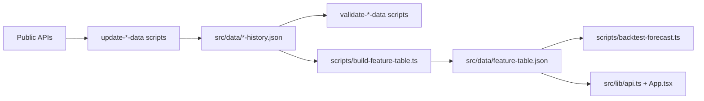
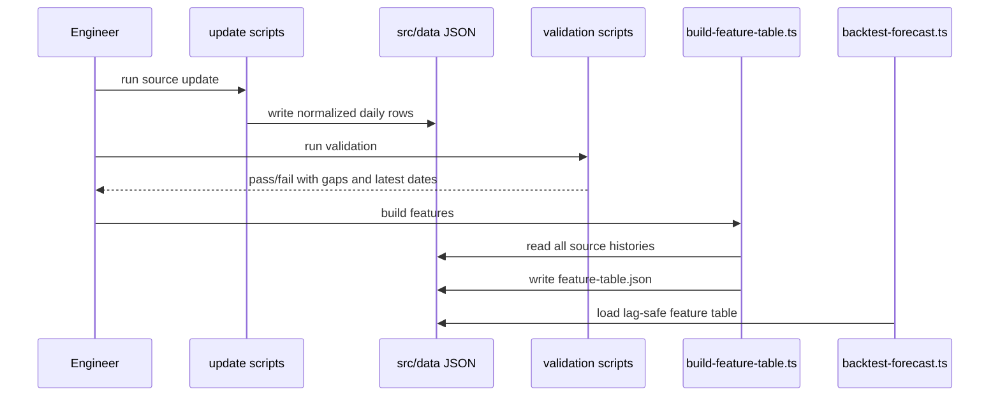

# PRD v2.3: Public Regime Data And Feature Pipeline

Complexity: 8 -> HIGH mode

Source documents:
- `ROADMAP-v2.md`
- `docs/reports/model-reliability-assessment.md`

## Context

Problem: The current forecast is mostly price-only and cannot explain important regime drivers such as on-chain valuation, leverage, ETF demand, and macro liquidity.

Files analyzed:
- `scripts/update-btc-data.mjs`
- `scripts/validate-mvrv-data.mjs`
- `src/data/btc-history.json`
- `src/data/mvrv-history.json`
- `src/lib/api.ts`
- `src/lib/data.ts`
- `.env.example`

Current behavior:
- BTC history is cached in `src/data/btc-history.json`.
- MVRV and market cap are cached in `src/data/mvrv-history.json`.
- MVRV Z-score is computed from full-history values in `src/lib/api.ts`.
- No public on-chain expansion, derivatives, ETF flow, macro, or sentiment history exists.
- No feature table can be regenerated for backtesting or UI context.

## Solution

Approach:
- Add reproducible public data caches in priority order: CoinMetrics on-chain first, then feature table, then derivatives, ETF flow, and macro.
- Normalize all records to UTC daily rows with explicit source lag and missing-date metadata.
- Generate a single lag-safe feature table from cached source data.
- Add validators that fail on malformed dates, duplicate rows, non-monotonic history, impossible numeric values, and excessive gaps.
- Keep new signals as context-only until PRD v2.4 proves out-of-sample value.
- Defer sentiment as a forecast input; it can be added later as context if it is stable and reproducible.

Architecture:

Key decisions:
- Prioritize CoinMetrics on-chain fields first because the app already uses CoinMetrics.
- Treat derivatives/ETF data as optional if no stable public source is selected; validators must make source coverage explicit.
- Use `FRED_API_KEY` from `.env` for macro updates, documented in `.env.example`.
- Align weekly/monthly macro series to daily rows using last-known value and a `publishedDate` or `effectiveDate` field when available.
- Lag every feature by at least one day in the generated feature table unless the source has an explicit publication lag requiring more.
- Do not import large raw source caches directly into the UI bundle; expose summarized/runtime-safe data only when needed.

Data changes:
- Add `src/data/onchain-history.json`.
- Add `src/data/derivatives-history.json`.
- Add `src/data/etf-flow-history.json`.
- Add `src/data/macro-history.json`.
- Add `src/data/feature-table.json`.

## Integration Points

How will this feature be reached?
- Entry point identified: update scripts invoked manually first, later by automation PRD.
- Caller file identified: `package.json` scripts call `node scripts/update-*.mjs` and `tsx scripts/build-feature-table.ts`.
- Registration/wiring needed: add scripts to `package.json`; import generated feature table from `src/lib/api.ts` after validation.

Is this user-facing?
- Partially.
- UI components required in later phases: source freshness indicators and regime context panels. Initial slices expose data to backtests first.

Full user flow:
1. Engineer runs data update scripts.
2. Scripts fetch public source rows and write normalized JSON caches.
3. Validators check shape, gaps, and source lag.
4. Engineer runs `npm run build:features`.
5. Feature table is regenerated with lag-safe daily features.
6. Backtests read feature values by date.
7. UI imports only summarized feature/freshness data after PRD v2.4 needs it.

## Sequence Flow

## Execution Phases

#### Phase 1: On-Chain Expansion - CoinMetrics daily context is cached and validated

Files:
- `scripts/update-onchain-data.mjs` - fetch CoinMetrics daily fields.
- `scripts/validate-onchain-data.mjs` - validate shape, dates, and gaps.
- `src/data/onchain-history.json` - normalized cache.
- `package.json` - add `update:onchain` and `validate:onchain`.
- `src/lib/api.ts` - add TypeScript interfaces only if app/runtime needs them.

Implementation:
- [ ] Fetch daily BTC CoinMetrics fields where available: realized cap, realized price, MVRV raw value, market cap raw value, active addresses, transaction count, transfer value, fees, hash rate, difficulty, miner revenue.
- [ ] Preserve raw source metric names in a `sourceValues` object or documented one-to-one fields.
- [ ] Normalize every row to `{ date, source, fetchedAt, metrics, missingMetrics }`.
- [ ] Track source lag as `latestSourceDate` and `daysLag`.
- [ ] Validator fails on duplicate dates, descending dates, non-UTC dates, negative impossible values, and missing required core fields.

Tests required:

| Test File | Test Name | Assertion |
| --- | --- | --- |
| `npm run update:onchain` | update smoke | writes JSON with at least latest MVRV-equivalent date range |
| `npm run validate:onchain` | validator pass | exits `0` for generated cache |
| `npm run lint` | TypeScript compile | no type errors if interfaces are added |

User verification:
- Action: Run `npm run update:onchain && npm run validate:onchain`.
- Expected: Console prints latest source date, row count, missing-date count, and source lag.

Checkpoint:
- Automated review must verify the new cache can be regenerated and validation catches a deliberately duplicated date in a temporary copy.

#### Phase 2: Feature Table Foundation - On-chain and existing market data become lag-safe features

Files:
- `scripts/build-feature-table.ts` - generate feature rows by date.
- `scripts/validate-feature-table.ts` - validate lagging and feature shape.
- `src/data/feature-table.json` - generated features.
- `src/lib/features.ts` - typed access helpers for app/backtest.
- `package.json` - add `build:features` and `validate:features`.

Implementation:
- [ ] Join BTC, MVRV, and on-chain data by UTC date.
- [ ] Generate first-priority features: price residual, residual momentum `7/30/90`, realized-price distance, MVRV level/percentile/z-score, miner-stress proxy, volatility regime, drawdown from cycle high.
- [ ] Lag every feature so row `2026-06-04` uses only data published before or on `2026-06-03` unless source metadata says otherwise.
- [ ] Include `missingFeatureReasons` per row rather than filling unknowns with zero.
- [ ] Validator checks no feature references future source dates.

Tests required:

| Test File | Test Name | Assertion |
| --- | --- | --- |
| `npm run build:features` | build smoke | writes feature table with same or smaller date range than BTC history |
| `npm run validate:features` | lag validation | exits `0` and reports maximum source date used per feature row |
| `npm run backtest` | feature load smoke | backtest can load feature table without changing baseline model metrics |
| `npm run lint` | TypeScript compile | no type errors |

User verification:
- Action: Inspect the latest feature row.
- Expected: It includes feature values, source dates, and missing reasons for unavailable optional signals.

Checkpoint:
- Automated review must compare a sampled row's `date` against each feature's `sourceDate` and confirm no lookahead bias.

#### Phase 3: Derivatives And ETF Flow - Leverage and ETF-era demand sources are selected and cached

Files:
- `scripts/update-derivatives-data.mjs` - fetch open interest/funding if source is configured.
- `scripts/update-etf-flow-data.mjs` - fetch chosen ETF flow source.
- `src/data/derivatives-history.json` - normalized derivatives cache.
- `src/data/etf-flow-history.json` - normalized ETF flow cache.
- `docs/reports/data-sources.md` - document chosen vendors and methodology.

Implementation:
- [ ] Select one reproducible source for derivatives and one for ETF flows before coding the fetcher.
- [ ] Start derivatives with daily open interest and funding rate; include exchange/source attribution.
- [ ] Start ETF with daily net BTC flow, cumulative net flow, AUM if available, and source attribution.
- [ ] If API key is required, add an `.env.example` placeholder and make script fail clearly without it.
- [ ] Validator flags vendor methodology changes if source metadata changes.
- [ ] Add feature-table columns only after validation works.

Tests required:

| Test File | Test Name | Assertion |
| --- | --- | --- |
| `npm run update:derivatives` | configured-source smoke | writes rows or exits with clear missing-credential/source message |
| `npm run update:etf-flow` | update smoke | writes rows covering post-2024 ETF era |
| `npm run validate:regime-data` | validator coverage | reports latest dates and source attribution for both caches |

User verification:
- Action: Open `docs/reports/data-sources.md`.
- Expected: Every new cache has a source URL, fields list, cadence, known lag, and credential requirement.

Checkpoint:
- Automated review must verify no paid/vendor-locked dependency is required for baseline v2 unless documented as optional.

#### Phase 4: Macro Liquidity - Public risk-context data is cached with source lag

Files:
- `scripts/update-macro-data.mjs` - fetch FRED series.
- `scripts/validate-regime-data.mjs` - shared validator for macro/optional regime data.
- `src/data/macro-history.json` - normalized macro cache.
- `docs/reports/data-sources.md` - document macro fields and publication lag.

Implementation:
- [ ] Add `FRED_API_KEY` to `.env.example`; script reads it with `dotenv`.
- [ ] Fetch target FRED series: `WALCL`, effective federal funds rate, 10-year Treasury yield, high-yield spread, and M2 or available liquidity proxy.
- [ ] Align non-daily series to daily rows using last-known value and record `observedDate` separately from row `date`.
- [ ] Validator reports source-specific expected cadence: daily, weekly, or monthly.
- [ ] Add feature-table macro columns only after publication lag handling is explicit.

Tests required:

| Test File | Test Name | Assertion |
| --- | --- | --- |
| `npm run update:macro` | missing key behavior | exits with clear message if `FRED_API_KEY` is absent |
| `npm run validate:regime-data` | validator pass | exits `0` for macro cache or reports missing optional credentials clearly |
| `npm run build:features` | macro lag smoke | macro-derived features use allowed source dates only |

User verification:
- Action: Run macro update with and without `FRED_API_KEY`.
- Expected: Script either updates or fails with setup instructions and never commits a secret.

Checkpoint:
- Automated review must confirm no API key value is committed and `.env.example` contains only the variable name.

## Acceptance Criteria

- New public data caches can be regenerated by documented package scripts.
- Validators report row count, latest date, expected cadence, source lag, missing dates, and source attribution.
- `src/data/feature-table.json` can be regenerated from cached data.
- Feature rows are lag-safe and include missing-value reasons.
- New regime signals remain context-only until backtest/ablation results prove forecast value.
- Sentiment remains deferred/context-only unless separately proven by ablation.
- `npm run lint`, all new validators, `npm run build:features`, and `npm run backtest` pass.

## Risks

- Public source schemas and free-tier availability may change; document source URLs and methodology in `docs/reports/data-sources.md`.
- ETF and derivatives history may require credentials; scripts must fail clearly and keep the rest of validation usable.
- Feature engineering can accidentally introduce lookahead bias; treat source dates as first-class fields and validate them.
- Large JSON files can increase bundle size if imported directly by the UI; defer UI imports or summarize data when needed.
