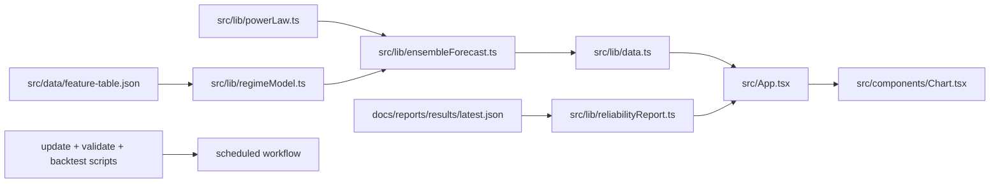
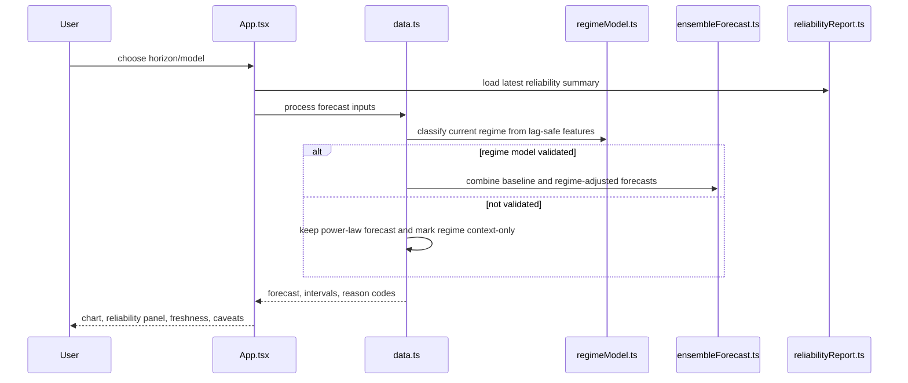

# PRD v2.4: Regime-Aware Forecast, Trust UI, And Automation

Complexity: 9 -> HIGH mode

Source documents:
- `ROADMAP-v2.md`
- `docs/reports/model-reliability-assessment.md`

## Context

Problem: v2 needs validated regime-aware forecasts and clear trust indicators, but the app currently exposes mostly fixed power-law/cycle context with limited reliability metadata.

Priority note:
- P2 scope: regime context, ablation-gated ensemble/tail-risk logic, and trust UI.
- P3 scope: scheduled automation and deploy guardrails.
- Do not start this PRD until `01-backtest-quality-lock.md`, `02-horizon-calibration.md`, and the first validated feature table from `03-regime-data-feature-pipeline.md` exist.

Files analyzed:
- `src/App.tsx`
- `src/components/Chart.tsx`
- `src/lib/data.ts`
- `src/lib/cycle.ts`
- `src/lib/api.ts`
- `scripts/analyze-phase-signal.ts`
- `package.json`

Current behavior:
- Model selector includes placeholder options, but forecast generation is effectively power-law based.
- Cycle phase logic uses hardcoded completed pivots and fixed projected cycle durations.
- The reliability report says phase-state regression underperformed baseline out of sample.
- The UI does not show latest backtest score, source freshness by dataset, or why a forecast moved.
- Data update happens before dev and during deploy, but there is no scheduled backtest/report workflow.

## Solution

Approach:
- Build a transparent probabilistic regime layer from validated feature table signals.
- Add simple ensemble forecasts only after baseline and feature ablation reports prove value.
- Keep phase labels as explanatory overlays unless out-of-sample metrics beat the baseline.
- Add a trust UI panel that shows model reliability, horizon confidence, source freshness, and forecast-change drivers.
- Add automation last to keep data, feature tables, and reports fresh, and fail builds on stale or invalid data.

Architecture:

Key decisions:
- Start with interpretable score/probability logic, not neural-network forecasting.
- Ensemble weights begin as validation-weighted averages from backtest reports.
- Tail-risk flags are separate from the median forecast so crash/squeeze warnings can widen intervals without overclaiming direction.
- UI must distinguish `Median path`, `Scenario range`, `Historical power-law band`, and `Regime context`.
- Automation should fail on invalid/stale required data but warn on optional data sources that are explicitly unavailable.

Data changes:
- Add latest reliability summary artifact, likely `docs/reports/results/latest-backtest.json`.
- Optional: add `src/data/reliability-summary.json` if importing report JSON from `docs/` is not appropriate for the Vite bundle.

## Integration Points

How will this feature be reached?
- Entry point identified: user opens the app and uses existing forecast console controls.
- Caller file identified: `src/App.tsx` calls forecast/data helpers and passes props into `ForecastChart`.
- Registration/wiring needed: add reliability/regime imports to `App`, add any new model option to the model selector only after backtest passes, and add workflow files under `.github/workflows/`.

Is this user-facing?
- Yes.
- UI components required: model reliability panel, data freshness indicators, forecast-movement explanation panel, long-horizon caveat, and updated chart labels/tooltips.

Full user flow:
1. User opens the dashboard.
2. App loads BTC, MVRV, feature table summaries, and latest reliability summary.
3. User selects horizon/model/confidence.
4. Forecast calculation combines power-law median, calibrated interval model, optional regime adjustment, and tail-risk flags.
5. UI shows forecast ranges plus reliability score, source freshness, regime context, and why the forecast moved.
6. Long-horizon outputs are framed as scenarios, not precise price targets.

## Sequence Flow

## Execution Phases

#### Phase 1: Regime Context Model - Current state probabilities are available but not yet forecast alpha

Files:
- `src/lib/regimeModel.ts` - classify regime probabilities from feature table.
- `src/lib/features.ts` - expose current and historical feature access.
- `scripts/backtest-forecast.ts` - record regime state per origin for analysis.
- `docs/reports/regime-model-notes.md` - document state definitions and context-only status.
- `package.json` - add any analysis script if separate from backtest.

Implementation:
- [ ] Define states: `accumulation-value`, `trend-expansion`, `late-cycle-overheating`, `deleveraging-bear`, `sideways-chop`.
- [ ] Use interpretable inputs from the feature table: power-law residual, MVRV/realized-price distance, volatility regime, funding/open-interest state, macro liquidity trend, ETF flow trend.
- [ ] Output probabilities that sum to `1.0`, top state, and reason codes.
- [ ] Mark regime as `contextOnly: true` until backtest ablation proves value.
- [ ] Add backtest report grouping by state to inspect forecast errors.

Tests required:

| Test File | Test Name | Assertion |
| --- | --- | --- |
| `npm run build:features` | feature prerequisite | feature table exists before regime analysis |
| `npm run backtest` | regime grouping | report includes sample counts and errors by top state |
| `npm run lint` | TypeScript compile | no type errors |

User verification:
- Action: Inspect generated regime notes/report.
- Expected: Each state has definition, current probability, reason codes, and sample count.

Checkpoint:
- Automated review must confirm UI does not present regime as an accuracy enhancer in this phase.

#### Phase 2: Ablation And Ensemble - Regime signals can influence forecast only if they beat baselines

Files:
- `src/lib/ensembleForecast.ts` - combine baseline forecasts with validation weights.
- `src/lib/tailRisk.ts` - compute downside/upside risk flags and interval adjustment.
- `scripts/backtest-forecast.ts` - add with/without feature ablation runs.
- `src/lib/modelConfig.ts` - add ensemble weights and enabled flags.
- `docs/reports/results/README.md` - document ablation fields.

Implementation:
- [ ] Add ablation modes: baseline only, plus each feature family, plus all validated features.
- [ ] Require every feature family to beat or improve calibration against baseline out of sample before enabling by default.
- [ ] Start ensemble weighting with validation-weighted average; do not add complex ML.
- [ ] Add tail-risk flags from funding extremes, open-interest growth, realized-volatility jump, liquidation history if available, and macro stress.
- [ ] Keep tail-risk output as `riskFlag`, `direction`, `drivers`, and `intervalMultiplierAdjustment`.
- [ ] If the enablement gate fails, keep the app default on the calibrated power-law model and show regime as context only.

Tests required:

| Test File | Test Name | Assertion |
| --- | --- | --- |
| `npm run backtest` | ablation output | JSON includes baseline, per-feature, and full-model rows |
| `npm run backtest` | enablement gate | default ensemble is disabled if it does not beat baseline at target horizons |
| `npm run lint` | TypeScript compile | no type errors |

User verification:
- Action: Open latest backtest Markdown.
- Expected: It states which signals are enabled, disabled, or context-only and why.

Checkpoint:
- Automated review must verify the app defaults to power-law if ensemble gate fails.

#### Phase 3: Trust UI - Reliability, freshness, and forecast drivers are visible

Files:
- `src/App.tsx` - add panels and pass reliability/regime props.
- `src/components/Chart.tsx` - update labels/tooltips for forecast modes and ranges.
- `src/lib/reliabilityReport.ts` - load latest report summary safely.
- `src/lib/api.ts` - expose source freshness dates.
- `src/index.css` - add only necessary layout styles.

Implementation:
- [ ] Add model reliability panel with latest backtest score, target score, and horizon-specific confidence.
- [ ] Add source freshness indicators for BTC, MVRV, on-chain, macro, derivatives, ETF, and sentiment where available.
- [ ] Add "why this forecast moved" panel using reason codes: price residual, volatility, MVRV, funding/open interest, ETF flow, macro input.
- [ ] Label forecast modes: `Median path`, `Scenario range`, `Historical power-law band`, `Regime context`.
- [ ] Add long-horizon caveat for 180-365 day outputs and any horizons above 365 days.
- [ ] Demote or clearly label unvalidated model-selector options so placeholder models do not imply validated accuracy.
- [ ] Avoid importing full raw history caches into the UI; use latest summaries and feature/freshness slices.

Tests required:

| Test File | Test Name | Assertion |
| --- | --- | --- |
| `npm run lint` | TypeScript compile | no type errors |
| `npm run build` | production build | Vite build succeeds |
| manual UI check | reliability panel | latest score/date/horizon confidence are visible |
| manual UI check | freshness panel | stale or missing optional sources are clearly labeled |

User verification:
- Action: Run `npm run dev`, open the dashboard, switch between `14D`, `90D`, and `1Y`.
- Expected: Reliability/freshness panels update and long-horizon caveat appears for `1Y`.

Checkpoint:
- Automated review must run `npm run build`; manual visual review is required for desktop and mobile because this phase changes layout.

#### Phase 4: P3 Automation - Data, validation, and report generation run on schedule

Files:
- `.github/workflows/update-data-and-backtest.yml` - scheduled and manual workflow.
- `package.json` - add aggregate scripts such as `validate:data` and `reports:refresh`.
- `scripts/check-data-freshness.ts` - fail/warn on stale sources.
- `docs/reports/results/latest-backtest.json` - latest summary artifact if committed.
- `README.md` or `docs/reports/results/README.md` - document workflow behavior.

Implementation:
- [ ] Choose npm or yarn as the canonical package manager before adding workflow commands.
- [ ] Add aggregate command that runs required updates, validators, feature build, backtest, and freshness check.
- [ ] Preserve or intentionally replace the current `predev` behavior where `scripts/update-btc-data.mjs` updates BTC and MVRV together.
- [ ] Fail builds when BTC/MVRV/on-chain required data is invalid or stale beyond configured thresholds.
- [ ] Warn rather than fail for optional derivatives/ETF/macro sources when credentials are absent, unless enabled in config.
- [ ] Store previous reports for trend comparison and update a `latest` summary artifact.
- [ ] Include workflow dispatch for manual refresh before release.

Tests required:

| Test File | Test Name | Assertion |
| --- | --- | --- |
| `npm run validate:data` | aggregate validation | required validators pass |
| `npm run reports:refresh` | full refresh | feature table and backtest report are generated |
| `npm run build` | production build | succeeds after generated artifacts are present |
| GitHub Actions dry run | workflow syntax | action file is valid YAML and references existing scripts |

User verification:
- Action: Run `npm run reports:refresh` locally.
- Expected: Console prints freshness status, generated feature path, and latest backtest report path.

Checkpoint:
- Automated review must confirm stale required data causes a non-zero exit in a controlled fixture or script flag.

## Acceptance Criteria

- Regime probabilities are generated from lag-safe public features and shown as context unless ablation proves forecast value.
- Backtest reports include ablation results and default-enable only signals that beat baseline out of sample.
- Tail-risk flags can widen intervals without pretending to know exact direction.
- UI displays latest reliability score, horizon confidence, source freshness, forecast-driver reasons, and long-horizon caveats.
- Scheduled/manual automation can update data, validate caches, build features, run backtests, and expose current report status.
- `npm run lint`, `npm run build`, `npm run backtest`, data validators, and refresh commands pass.

## Risks

- Regime model complexity can outpace available data; keep the first model interpretable and gated by ablation.
- UI can become cluttered; prioritize compact, scannable reliability and freshness panels over explanatory copy.
- Optional paid/API-key sources can make CI brittle; default workflows should support clear warnings unless those sources are explicitly required.
- Automation can commit noisy report churn; define which artifacts are committed versus generated in CI before enabling scheduled commits.
