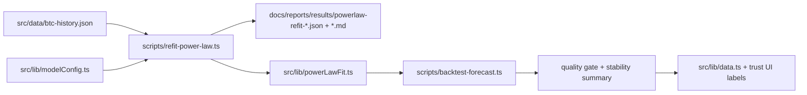
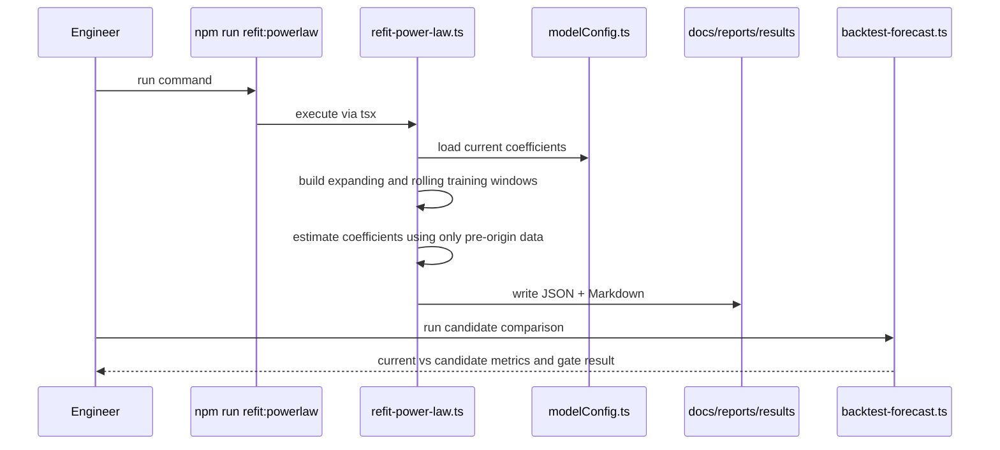

# PRD v2.5: Power-Law Coefficient Refit And Stability Stress Test

Complexity: 6 -> MEDIUM mode

Source documents:
- `ROADMAP-v2.md`
- `docs/reports/model-reliability-assessment.md`
- `docs/PRDs/v2/01-backtest-quality-lock.md`
- `docs/PRDs/v2/02-horizon-calibration.md`

## Context

Problem: The app depends on fixed Bitcoin power-law coefficients, but v2 needs evidence that those coefficients are stable enough to keep for long-horizon forecasts.

Priority note:
- Do not start this PRD until `01-backtest-quality-lock.md`, `02-horizon-calibration.md`, and the first validated feature table from `03-regime-data-feature-pipeline.md` exist.
- This PRD audits and optionally updates the structural power-law model only after reproducible backtests can prove whether changes help.
- This PRD must not enable a new long-horizon precision claim unless coefficient uncertainty supports it.

Files analyzed:
- `ROADMAP-v2.md`
- `docs/PRDs/v2/01-backtest-quality-lock.md`
- `docs/PRDs/v2/02-horizon-calibration.md`
- `docs/PRDs/v2/03-regime-data-feature-pipeline.md`
- `docs/PRDs/v2/04-regime-model-ui-automation.md`
- `src/lib/modelConfig.ts`
- `src/lib/powerLaw.ts`
- `src/lib/data.ts`
- `scripts/backtest-forecast.ts`
- `scripts/calibrate-intervals.ts`
- `package.json`

Current behavior:
- Power-law coefficients live in `POWER_LAW_CONFIG` and drive base, floor, and peak curves.
- `powerLawForecast` uses the base curve plus residual mean reversion with `meanReversionTauDays`.
- Backtests compare `powerlaw-current` against simple baselines and persist model config snapshots.
- Interval calibration is horizon-specific, but coefficient uncertainty is not measured.
- Long-horizon UI language is scenario-oriented, but not explicitly tied to coefficient stability.

## Solution

Approach:
- Add a deterministic refit script that estimates candidate power-law coefficients using only data available before each rolling-origin date.
- Measure coefficient stability across expanding and rolling training windows.
- Report parameter uncertainty, forecast dispersion from coefficient uncertainty, and out-of-sample metric impact.
- Keep the existing coefficients by default unless refit evidence improves backtest quality without degrading calibration.
- Feed coefficient uncertainty into long-horizon reliability labels before any UI wording becomes more precise.

Architecture:

Key decisions:
- Fit in log space: `log(price) = log(a) + b * log(daysSinceGenesis)` with optional cyclic terms matching the existing base model.
- Treat floor and peak curves as secondary channel diagnostics, not the first refit target.
- Use expanding-window refits as the primary stability check and rolling-window refits as a stress test.
- Use robust statistics around coefficients: median, interquartile range, standard deviation, confidence interval, and maximum drift.
- Do not mutate `POWER_LAW_CONFIG` automatically. The script prints suggested config values and writes reports.

Data changes: None to app runtime data. New generated report artifacts under `docs/reports/results/`.

## Integration Points

How will this feature be reached?
- Entry point identified: `npm run refit:powerlaw`.
- Caller file identified: `package.json` invokes `tsx scripts/refit-power-law.ts`.
- Registration/wiring needed: add the package script and optionally import fit helpers into `scripts/backtest-forecast.ts` for candidate-model evaluation.

Is this user-facing?
- Partially. Initial phases are internal/report-only. UI changes are required only if coefficient uncertainty affects trust labels.

Full user flow:
1. Engineer runs `npm run refit:powerlaw`.
2. Script loads BTC history and current `POWER_LAW_CONFIG`.
3. Script refits coefficients across lag-safe rolling origins.
4. Script writes JSON and Markdown reports with coefficient distributions and forecast impact.
5. Engineer runs `npm run backtest` to compare `powerlaw-current` and any candidate refit model.
6. If uncertainty is large, long-horizon UI copy remains or becomes more explicitly scenario-based.

## Sequence Flow

## Execution Phases

#### Phase 1: Refit Report Skeleton - A deterministic script reports current coefficient stability

Files:
- `package.json` - add `refit:powerlaw`.
- `scripts/refit-power-law.ts` - create CLI, load BTC data/config, generate reports.
- `src/lib/powerLawFit.ts` - pure helpers for fitting and coefficient summaries.
- `docs/reports/results/README.md` - document refit report fields if not already covered.

Implementation:
- [ ] Add `npm run refit:powerlaw`.
- [ ] Use BTC daily close history from `src/data/btc-history.json`.
- [ ] Require a minimum training window of at least `1460` days before a fit is eligible.
- [ ] Build expanding-origin windows with the same holdout start as `BACKTEST_CONFIG.holdoutStartDate`.
- [ ] Fit base power-law coefficients in log space, including optional cyclic `sin` and `cos` terms using current `cycleDays`.
- [ ] Record current config coefficients beside fitted candidates.
- [ ] Write timestamped JSON and Markdown reports under `docs/reports/results/`.

Tests required:

| Test File | Test Name | Assertion |
| --- | --- | --- |
| `npm run refit:powerlaw` | script smoke | exits `0` and prints JSON/Markdown report paths |
| generated JSON | schema smoke | includes `metadata`, `currentConfig`, `fitWindows`, `coefficientSummary`, and `stabilityVerdict` |
| `npm run lint` | TypeScript compile | no type errors |

User verification:
- Action: Run `npm run refit:powerlaw`.
- Expected: Report shows current coefficients, fitted coefficient medians, sample counts, and skipped windows.

#### Phase 2: Coefficient Uncertainty - Reports quantify stability over time

Files:
- `src/lib/powerLawFit.ts` - add uncertainty and window-drift calculations.
- `scripts/refit-power-law.ts` - render stability tables.
- `docs/reports/results/README.md` - document stability metrics.

Implementation:
- [ ] Calculate coefficient summary statistics for each fitted term: median, mean, standard deviation, p05, p25, p75, p95.
- [ ] Calculate relative drift from the current config for base coefficient and exponent.
- [ ] Calculate window-to-window coefficient drift and flag large jumps.
- [ ] Include residual error distribution for each fit window.
- [ ] Add stability verdicts: `stable`, `watch`, and `unstable`.
- [ ] Keep verdict thresholds explicit in report metadata.

Tests required:

| Test File | Test Name | Assertion |
| --- | --- | --- |
| `src/lib/powerLawFit.ts` | `should summarize coefficient distribution when fits are valid` | p05 <= median <= p95 for every coefficient |
| `src/lib/powerLawFit.ts` | `should flag unstable coefficients when drift exceeds threshold` | verdict is `unstable` for synthetic high-drift fixtures |
| `npm run refit:powerlaw` | report completeness | Markdown includes coefficient summary and stability verdict |

User verification:
- Action: Open the generated Markdown report.
- Expected: It states whether fixed coefficients are stable enough to keep and explains the verdict numerically.

#### Phase 3: Candidate Backtest - Refit candidates are compared without changing defaults

Files:
- `src/lib/powerLawFit.ts` - expose candidate config construction.
- `src/lib/backtestModels.ts` - add optional candidate model registration.
- `scripts/backtest-forecast.ts` - include candidate metrics when a refit report/candidate flag is supplied.
- `scripts/refit-power-law.ts` - print suggested candidate config.
- `src/lib/modelConfig.ts` - add disabled candidate metadata only if needed for report reproducibility.

Implementation:
- [ ] Add a candidate model id such as `powerlaw-refit-candidate`.
- [ ] Keep `powerlaw-current` as the default and quality-gate baseline.
- [ ] Allow `scripts/backtest-forecast.ts` to evaluate a candidate from the latest refit report or an explicit JSON path.
- [ ] Compare candidate against current power-law at `14, 30, 60, 90, 180, 365`.
- [ ] Require candidate to improve or preserve median error, bias, interval coverage, and quality gate status.
- [ ] Report candidate enablement as `disabled`, `watch`, or `eligible-for-manual-config-update`.

Tests required:

| Test File | Test Name | Assertion |
| --- | --- | --- |
| `npm run backtest -- --candidate-powerlaw latest` | candidate smoke | report contains both `powerlaw-current` and `powerlaw-refit-candidate` |
| `npm run backtest` | default behavior | report still uses current coefficients when no candidate flag is supplied |
| generated JSON | candidate gate | includes candidate comparison status and reasons |
| `npm run lint` | TypeScript compile | no type errors |

User verification:
- Action: Run `npm run refit:powerlaw`, then run the candidate backtest command.
- Expected: Markdown report states whether the refit candidate is better, worse, or indistinguishable from current coefficients.

#### Phase 4: Long-Horizon Trust Wiring - UI wording reflects coefficient uncertainty

Files:
- `src/lib/data.ts` - expose coefficient stability status in forecast labels if available.
- `src/lib/reliabilityReport.ts` - read latest coefficient-stability summary if this helper exists from PRD v2.4.
- `src/App.tsx` - pass stability status into forecast/trust UI.
- `src/components/Chart.tsx` - update tooltip/legend copy for long horizons.
- `docs/reports/results/README.md` - document how UI consumes the stability verdict.

Implementation:
- [ ] Do not import full refit reports into the UI bundle.
- [ ] Use a compact latest summary artifact if PRD v2.4 already created reliability-summary plumbing.
- [ ] For `stable`, keep current long-horizon scenario labels.
- [ ] For `watch`, add wording that fixed structural coefficients are under review at `180-365` day horizons.
- [ ] For `unstable`, force `180+` day labels to `Scenario range` or `Directional only` and suppress exact-confidence phrasing.
- [ ] Avoid trading recommendation language.

Tests required:

| Test File | Test Name | Assertion |
| --- | --- | --- |
| `npm run lint` | TypeScript compile | no type errors |
| `npm run build` | production build | Vite build succeeds |
| manual UI check | `365d unstable label` | visible copy uses scenario/directional wording |
| manual UI check | `90d calibrated label` | short-horizon calibrated labels remain unchanged |

User verification:
- Action: Run the app, select `90D`, `6M`, and `1Y`.
- Expected: Short horizons keep calibrated labels, while long horizons reflect coefficient-stability status.

## Acceptance Criteria

- `npm run refit:powerlaw` produces deterministic JSON and Markdown coefficient-stability reports.
- Refit windows use only data available before each rolling-origin date.
- Reports quantify coefficient median, spread, drift, and forecast impact at `180` and `365` days.
- Reports state whether fixed coefficients are stable enough to keep.
- Candidate coefficients are never enabled by default without `npm run backtest` evidence.
- Backtest output can compare `powerlaw-current` against `powerlaw-refit-candidate`.
- Long-horizon UI language is adjusted if coefficient uncertainty is `watch` or `unstable`.
- `npm run lint`, `npm run refit:powerlaw`, `npm run backtest`, and `npm run build` pass after implementation.

## Risks

- Bitcoin early-history data can dominate fitted coefficients; report sensitivity with and without early years rather than silently choosing one.
- A better in-sample fit can worsen out-of-sample forecasts; candidate coefficients must pass the existing backtest gate.
- Cyclic terms can overfit halving-era history; keep cycle-day assumptions explicit and report coefficient uncertainty.
- Updating coefficients without recalibrating intervals can invalidate coverage; rerun `npm run calibrate:intervals` after any manual config change.
- UI precision can outpace evidence; long-horizon labels must remain scenario-oriented unless both coefficient stability and calibration reports support stronger wording.
