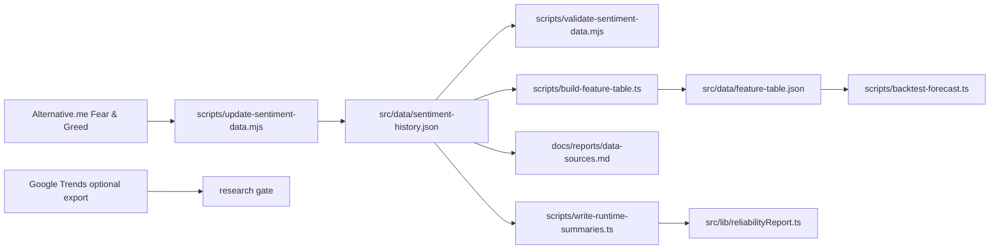
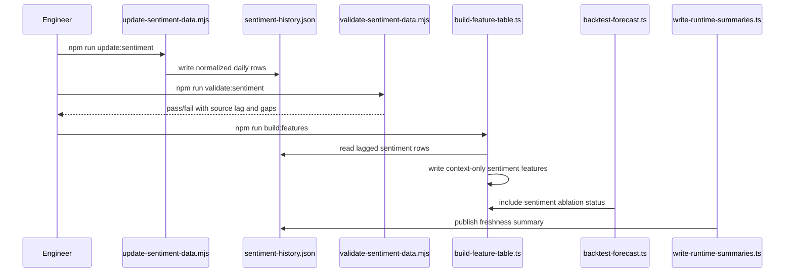

# PRD v2.6: Sentiment Data Context

Complexity: 6 -> MEDIUM mode

Source documents:
- `ROADMAP-v2.md`
- `docs/PRDs/v2/03-regime-data-feature-pipeline.md`
- `docs/PRDs/v2/04-regime-model-ui-automation.md`

## Context

Problem: v2 needs source-attributed sentiment context, but sentiment should not influence forecasts unless later ablation proves out-of-sample value.

Priority note:
- This is P3 work. Do not prioritize it ahead of on-chain, derivatives, ETF, macro, calibration, or trust UI work.
- Sentiment is context-only by default and optional for automation/release gates.

Files analyzed:
- `ROADMAP-v2.md`
- `docs/PRDs/v2/03-regime-data-feature-pipeline.md`
- `docs/PRDs/v2/04-regime-model-ui-automation.md`
- `docs/PRDs/v2/README.md`
- `docs/reports/data-sources.md`
- `package.json`
- `scripts/build-feature-table.ts`
- `scripts/validate-regime-data.mjs`
- `scripts/write-runtime-summaries.ts`
- `scripts/backtest-forecast.ts`
- `scripts/check-data-freshness.ts`
- `src/lib/features.ts`
- `src/lib/regimeModel.ts`
- `src/lib/reliabilityReport.ts`
- `src/lib/api.ts`

Current behavior:
- Runtime freshness summaries already reserve `sentiment` as `deferred`.
- Feature rows support generic `features`, `sourceDates`, and `missingFeatureReasons`.
- Regime classification is explicitly `contextOnly: true`.
- Backtest ablation reports keep unproven feature families context-only.
- No sentiment cache, updater, validator, feature columns, or source documentation exists.

## Solution

Approach:
- Add sentiment as an optional, source-attributed daily context dataset.
- Start with Alternative.me Fear & Greed Index because it has a simple public historical API.
- Treat Google Trends as optional research only until history, export path, and reproducibility are stable.
- Add lag-safe sentiment features to the feature table, but keep them disabled as forecast inputs.
- Surface sentiment freshness/context through existing runtime summaries and trust UI only after cache validation passes.

Architecture:

Key decisions:
- Sentiment is context-only by default.
- Forecast logic must not read sentiment features unless a future ablation gate explicitly enables them.
- Missing sentiment data must not fail core v2 validation, builds, or reports.
- Alternative.me is optional but reproducible; Google Trends is deferred unless a stable machine-readable workflow is documented.
- All sentiment feature rows must use source dates at least one day before the forecast origin to prevent lookahead bias.

Data changes:
- Add `src/data/sentiment-history.json`.
- Add optional sentiment fields to `src/data/feature-table.json`.
- Update `src/data/source-freshness.json` generation to use real sentiment status instead of `deferred`.

## Integration Points

How will this feature be reached?
- Entry point identified: manual package scripts first, later included in `reports:refresh` after validation.
- Caller file identified: `package.json` invokes `scripts/update-sentiment-data.mjs` and `scripts/validate-sentiment-data.mjs`.
- Registration/wiring needed: add sentiment to `scripts/validate-regime-data.mjs`, `scripts/build-feature-table.ts`, `scripts/write-runtime-summaries.ts`, and `docs/reports/data-sources.md`.

Is this user-facing?
- Partially. UI exposure is freshness/context only through the existing trust UI path. It is not a forecast model selector or enabled alpha signal.

Full user flow:
1. Engineer runs `npm run update:sentiment`.
2. Script fetches public sentiment rows and writes a normalized cache.
3. Engineer runs `npm run validate:sentiment`.
4. Feature table builder adds lag-safe sentiment context columns where available.
5. Backtest report records sentiment as context-only unless a later ablation proves value.
6. User sees sentiment freshness/context in trust UI after runtime summaries are regenerated.

## Sequence Flow

## Execution Phases

#### Phase 1: Alternative.me Cache - Fear & Greed history is reproducible and validated

Files:
- `scripts/update-sentiment-data.mjs` - fetch and normalize sentiment rows.
- `scripts/validate-sentiment-data.mjs` - validate dates, values, attribution, and source lag.
- `src/data/sentiment-history.json` - normalized optional cache.
- `package.json` - add `update:sentiment` and `validate:sentiment`.
- `docs/reports/data-sources.md` - document source, fields, cadence, lag, and limitations.

Implementation:
- [ ] Fetch Alternative.me Fear & Greed history from the public API.
- [ ] Normalize rows to `{ date, source, fetchedAt, metrics, classification, sourceUrl }`.
- [ ] Store numeric index as `metrics.fearGreedIndex` in the `0-100` range.
- [ ] Preserve source classification text as context, not a model label.
- [ ] Track latest source date, row count, gaps, and source lag.
- [ ] Do not add Google Trends in this phase.

Tests required:

| Test File | Test Name | Assertion |
| --- | --- | --- |
| `npm run update:sentiment` | update smoke | writes `src/data/sentiment-history.json` with source attribution |
| `npm run validate:sentiment` | validator pass | exits `0` for generated cache |
| `npm run validate:sentiment` | rejects invalid value | fixture or temp copy fails when index is outside `0-100` |
| `npm run lint` | TypeScript compile | no type errors if shared types are added |

User verification:
- Action: Run `npm run update:sentiment && npm run validate:sentiment`.
- Expected: Console prints row count, first date, latest source date, source lag, and gap count.

Checkpoint:
- Automated review must confirm sentiment remains optional and no forecast function imports `sentiment-history.json`.

#### Phase 2: Lag-Safe Feature Context - Sentiment is available in the feature table without affecting forecasts

Files:
- `scripts/build-feature-table.ts` - add sentiment context columns.
- `scripts/validate-feature-table.ts` - verify sentiment source dates are lag-safe.
- `src/data/feature-table.json` - generated feature rows.
- `scripts/backtest-forecast.ts` - list sentiment as context-only ablation mode.
- `src/lib/modelConfig.ts` - include sentiment in disabled/context-only feature families if needed.

Implementation:
- [ ] Join sentiment rows by UTC date using the same lag convention as other feature groups.
- [ ] Add feature names such as `fearGreedIndex`, `fearGreedIndex7dChange`, and `fearGreedRegime`.
- [ ] Set every sentiment feature `sourceDate` to a date before the feature row date.
- [ ] Use `missingFeatureReasons` rather than zero-filling unavailable sentiment rows.
- [ ] Ensure forecast models and ensemble defaults do not consume sentiment features.
- [ ] Backtest output must state sentiment is context-only unless future ablation proves forecast value.

Tests required:

| Test File | Test Name | Assertion |
| --- | --- | --- |
| `npm run build:features` | sentiment feature smoke | latest rows include sentiment features when source rows exist |
| `npm run validate:features` | lag validation | sentiment feature source dates are earlier than feature row dates |
| `npm run backtest:report-only` | ablation status | report lists sentiment as `context-only` and disabled |
| `npm run lint` | TypeScript compile | no type errors |

User verification:
- Action: Inspect the latest feature row after `npm run build:features`.
- Expected: Sentiment values appear with source dates or explicit missing reasons, and no model enablement changes.

Checkpoint:
- Automated review must confirm `ENSEMBLE_CONFIG.defaultEnabled` and forecast output are unchanged by sentiment data.

#### Phase 3: Freshness And Trust UI Wiring - Sentiment context is visible but not overclaimed

Files:
- `scripts/write-runtime-summaries.ts` - replace deferred sentiment freshness with cache-derived status.
- `scripts/check-data-freshness.ts` - warn, not fail, when sentiment is missing or stale.
- `src/lib/reliabilityReport.ts` - keep sentiment source typing compatible with freshness UI.
- `src/App.tsx` - display sentiment source freshness only if the existing trust UI supports source rows.
- `src/components/Chart.tsx` - no forecast chart change unless existing labels need a context tooltip.

Implementation:
- [ ] Add sentiment to runtime source freshness from `src/data/sentiment-history.json`.
- [ ] Mark sentiment as `required: false`.
- [ ] Missing or stale sentiment should produce a warning in freshness checks, never a release-blocking failure.
- [ ] UI copy must identify sentiment as context, not a forecast driver.
- [ ] Avoid importing full sentiment history into the UI bundle; use freshness summary and latest context only.

Tests required:

| Test File | Test Name | Assertion |
| --- | --- | --- |
| `npm run write:runtime-summaries` | sentiment freshness | `source-freshness.json` includes real sentiment status |
| `npm run check:freshness` | optional source warning | stale/missing sentiment does not exit non-zero |
| `npm run build` | production build | Vite build succeeds |
| manual UI check | trust UI | sentiment is labeled as optional/context-only |

User verification:
- Action: Run `npm run reports:refresh`, open the dashboard, and inspect source freshness.
- Expected: Sentiment appears as optional/context-only with latest date or unavailable status.

Checkpoint:
- Automated review must verify stale required sources still fail while stale sentiment only warns.

#### Phase 4: Google Trends Research Gate - Trends remain deferred unless reproducible

Files:
- `docs/reports/data-sources.md` - add research note and decision.
- Optional `scripts/update-google-trends-data.mjs` - only if a reproducible source/export is selected.
- Optional `src/data/google-trends-history.json` - only if reproducible history exists.
- Optional `scripts/validate-sentiment-data.mjs` - validate trends rows if added.
- Optional `README.md` or PRD note - document manual setup if required.

Implementation:
- [ ] Evaluate whether Google Trends history can be fetched reproducibly without manual browser export.
- [ ] Document geography, search terms, normalization behavior, and re-scaling caveats.
- [ ] Do not add trends to default refresh if the source is unstable or manual-only.
- [ ] If added, keep trends optional and context-only.
- [ ] If not added, document the deferral clearly.

Tests required:

| Test File | Test Name | Assertion |
| --- | --- | --- |
| documentation review | source decision | `data-sources.md` explains whether Google Trends is included or deferred |
| optional update smoke | trends update | script writes rows only when source is configured |
| optional validation | trends validation | rows include date, query, geo, source, and normalized value |

User verification:
- Action: Read `docs/reports/data-sources.md`.
- Expected: Google Trends status is explicit, with no hidden manual dependency.

Checkpoint:
- Automated review must confirm no unstable Google Trends dependency is required for `reports:refresh`.

## Verification Strategy

- Unit-style validator checks for date format, duplicate dates, descending dates, value range, source attribution, and metadata.
- Integration checks prove `update`, `validate`, `build:features`, `backtest:report-only`, `write:runtime-summaries`, and `check:freshness` can run with sentiment present.
- Build verification proves optional sentiment wiring does not break the Vite app.
- Manual UI verification is required only if the trust UI renders a new sentiment row.

Evidence required:
- [ ] `npm run update:sentiment` succeeds or fails with a clear source error.
- [ ] `npm run validate:sentiment` passes for generated cache.
- [ ] `npm run build:features` preserves lag safety.
- [ ] `npm run backtest:report-only` keeps sentiment context-only.
- [ ] `npm run check:freshness` treats sentiment as optional.
- [ ] `npm run build` passes.

## Acceptance Criteria

- `src/data/sentiment-history.json` is reproducible, source-attributed, and validated.
- Alternative.me Fear & Greed is available as optional context.
- Google Trends is either reproducibly integrated or explicitly deferred.
- Sentiment-derived feature-table columns are lag-safe and include source dates.
- Sentiment is context-only by default and cannot affect forecasts unless later ablation proves value.
- Runtime freshness reports sentiment as optional.
- Missing or stale sentiment never blocks release gates.
- Documentation explains source, cadence, limitations, and forecast enablement status.

## Regression Safety Gate

- Capture a baseline `npm run backtest` report before adding sentiment data or feature columns.
- After each phase, rerun `npm run backtest` or `npm run backtest:report-only` and verify sentiment remains disabled/context-only in forecast logic.
- Required result: sentiment freshness and context wiring must not change `powerlaw-current` median, intervals, quality gate, or ensemble enablement.
- Any future sentiment promotion requires a separate ablation report with lag-safe source dates, longer holdout where available, and no degradation in baseline forecast metrics.
- `npm run build` must confirm sentiment wiring does not import full raw sentiment or feature history into the UI bundle.

## Risks

- Sentiment can be noisy and reflexive; defaulting it into forecast logic may worsen calibration.
- Alternative.me methodology can change without warning; preserve source attribution and metadata.
- Google Trends normalization can shift across downloads, making historical comparisons unstable.
- Sentiment publication timestamps may not align cleanly with UTC daily close; enforce conservative one-day lag.
- Importing full sentiment history into the UI can increase bundle size; use summaries unless full history is necessary.
- Users may overinterpret sentiment labels; UI must say context-only unless ablation later proves forecast value.
