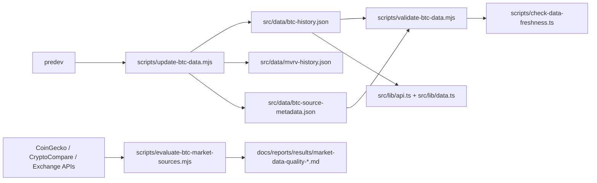
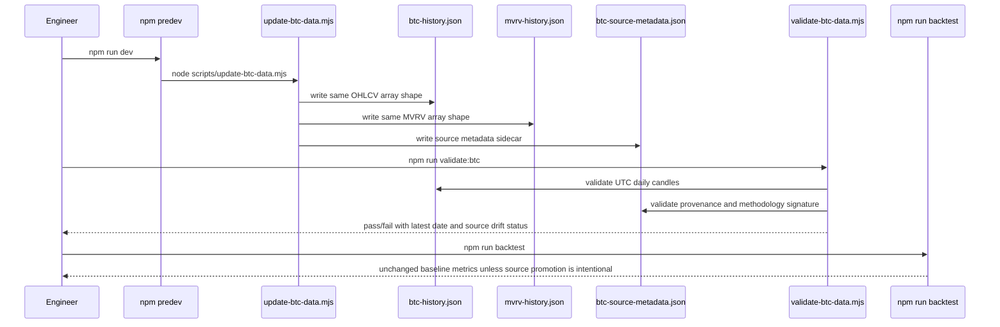

# PRD v2.7: Market Data Quality Upgrade

Complexity: 6 -> MEDIUM mode

Source documents:
- `ROADMAP-v2.md`
- `docs/PRDs/v2/01-backtest-quality-lock.md`
- `docs/PRDs/v2/03-regime-data-feature-pipeline.md`

## Context

Problem: BTC OHLCV is good enough for current visualization, but v2 needs auditable market data provenance, UTC daily-close consistency, and vendor-methodology drift detection before market data quality becomes a hidden source of forecast changes.

Files analyzed:
- `ROADMAP-v2.md`
- `docs/PRDs/v2/01-backtest-quality-lock.md`
- `docs/PRDs/v2/03-regime-data-feature-pipeline.md`
- `docs/PRDs/v2/04-regime-model-ui-automation.md`
- `docs/PRDs/v2/README.md`
- `scripts/update-btc-data.mjs`
- `scripts/update-market-data.mjs`
- `scripts/validate-mvrv-data.mjs`
- `scripts/reports-refresh.mjs`
- `scripts/check-data-freshness.ts`
- `docs/reports/data-sources.md`
- `src/lib/api.ts`
- `src/lib/data.ts`
- `package.json`

Current behavior:
- `predev` runs `node scripts/update-btc-data.mjs`, which updates both `src/data/btc-history.json` and `src/data/mvrv-history.json`.
- BTC candles are rebuilt for a 180-day tail from CoinGecko hourly price data, with daily volume from CryptoCompare.
- MVRV is patched from CoinMetrics Community API in the same script.
- Runtime code imports `src/data/btc-history.json` and `src/data/mvrv-history.json` directly as arrays.
- `docs/reports/data-sources.md` documents BTC as CoinGecko hourly market chart plus CryptoCompare daily volume.
- There is no BTC OHLCV validator equivalent to the MVRV parity validator.
- There is no sidecar metadata or snapshot artifact that can distinguish true market changes from source/vendor methodology changes.

## Solution

Approach:
- Preserve the existing BTC and MVRV cache file shapes so current UI, backtests, deploy, and `predev` behavior keep working.
- Add BTC market-data validation and sidecar provenance metadata before changing any source selection logic.
- Define the canonical BTC daily candle convention as UTC calendar-day OHLC with close equal to the last included source price before the next `00:00:00Z`.
- Evaluate Coinbase, Kraken, Binance, and aggregate-volume options through a report-only comparison script before promoting a source.
- Store compact raw-source snapshots or schema/source metadata sufficient to detect vendor methodology shifts without committing large raw payloads.
- Promote any new BTC OHLCV source only behind parity, backtest, and non-breaking runtime checks.

Architecture:

Key decisions:
- Keep `src/data/btc-history.json` as an array of `{ date, open, high, low, close, volume }`.
- Keep `src/data/mvrv-history.json` and the MVRV update path unchanged unless a later PRD deliberately splits `predev`.
- Use sidecar metadata for provenance rather than embedding metadata into every candle row.
- Treat exchange-specific candles as candidates until validation proves they do not degrade forecast/backtest reproducibility.
- Prefer no-key public sources for baseline v2; credentialed or paid vendors may be optional but must not be required for `predev`.
- Do not import raw snapshots into the UI bundle.

Data changes:
- Add `src/data/btc-source-metadata.json`.
- Optional compact snapshots under `docs/reports/results/market-data-snapshots/` or equivalent report-only location.
- No change to the runtime shape of `src/data/btc-history.json`.
- No change to the runtime shape of `src/data/mvrv-history.json`.

## Integration Points

How will this feature be reached?
- Entry point identified: `npm run validate:data`, `npm run reports:refresh`, and existing `predev`.
- Caller file identified: `package.json` invokes scripts; `predev` continues to call `scripts/update-btc-data.mjs`.
- Registration/wiring needed: add `validate:btc`; add BTC validation to `validate:data`; optionally add market-source evaluation/report script.

Is this user-facing?
- No direct UI change required in this PRD. It is indirectly user-facing because BTC candles feed forecasts, charts, freshness checks, and backtests.

Full user flow:
1. Engineer runs `npm run dev`.
2. Existing `predev` still updates BTC and MVRV through `scripts/update-btc-data.mjs`.
3. BTC data remains available through the same `src/data/btc-history.json` array.
4. Engineer or automation runs `npm run validate:data`.
5. BTC validator checks UTC dates, OHLC sanity, gaps, freshness, metadata, and source-methodology drift.
6. If evaluating upgraded sources, engineer runs a report-only comparison command.
7. Source promotion happens only after generated reports show parity or improvement without breaking existing BTC/MVRV behavior.

## Sequence Flow

## Execution Phases

#### Phase 1: BTC Validation And UTC Convention - Existing BTC data has a hard quality gate

Files:
- `scripts/validate-btc-data.mjs` - new BTC OHLCV validator.
- `package.json` - add `validate:btc` and include it in `validate:data`.
- `docs/reports/data-sources.md` - document canonical BTC candle convention.
- `scripts/check-data-freshness.ts` - include BTC freshness if not already covered by generated summaries.

Implementation:
- [ ] Add validation for strict `YYYY-MM-DD` UTC date keys.
- [ ] Require rows to be strictly sorted with no duplicate dates.
- [ ] Require daily continuity for BTC history, except explicitly documented historical source gaps if any exist.
- [ ] Validate OHLC relationships: `high >= open`, `high >= close`, `low <= open`, `low <= close`, `high >= low`.
- [ ] Validate positive open/high/low/close and non-negative volume.
- [ ] Define the canonical close as the final source price assigned to a UTC calendar day before the next UTC midnight.
- [ ] Report first date, latest date, row count, missing-date count, and latest close.
- [ ] Do not modify `src/data/btc-history.json` shape.

Tests required:

| Test File | Test Name | Assertion |
| --- | --- | --- |
| `npm run validate:btc` | validator pass | exits `0` on current `src/data/btc-history.json` |
| temporary fixture | `should reject duplicate BTC dates when duplicate date exists` | validator exits non-zero |
| temporary fixture | `should reject malformed OHLC when high is below close` | validator exits non-zero |
| `npm run validate:data` | aggregate validation includes BTC | BTC validation runs with MVRV/on-chain/feature validators |

User verification:
- Action: Run `npm run validate:btc && npm run validate:data`.
- Expected: Console prints BTC row count, first date, latest date, source lag, and no runtime data shape changes.

#### Phase 2: Source Metadata And Snapshot Trail - Vendor changes become detectable

Files:
- `scripts/update-btc-data.mjs` - write compact metadata sidecar while preserving BTC/MVRV updates.
- `src/data/btc-source-metadata.json` - source and methodology metadata.
- `scripts/validate-btc-data.mjs` - verify metadata is present and compatible.
- `docs/reports/data-sources.md` - document metadata fields and drift policy.
- `package.json` - no new command unless Phase 1 did not add validation.

Implementation:
- [ ] Add a sidecar metadata file with `generatedAt`, `historyFirstDate`, `historyLastDate`, `rowCount`, and `canonicalTimezone: UTC`.
- [ ] Record price source metadata: vendor, endpoint, source cadence, query style, lookback days, and methodology version.
- [ ] Record volume source metadata separately because current price and volume vendors differ.
- [ ] Store compact response signatures such as top-level response keys, expected data path, timestamp granularity, first/last source timestamps, and source row count.
- [ ] Store enough metadata to detect vendor methodology shifts without committing full raw API responses.
- [ ] Validator fails if metadata is missing, stale relative to BTC history, changes vendor without an explicit methodology-version bump, or claims a non-UTC convention.
- [ ] Keep MVRV update behavior in `scripts/update-btc-data.mjs` unchanged.

Tests required:

| Test File | Test Name | Assertion |
| --- | --- | --- |
| `npm run predev` | non-breaking update | updates or skips BTC/MVRV as before and writes metadata when BTC update succeeds |
| `npm run validate:btc` | metadata pass | metadata latest date matches BTC latest date after successful update |
| temporary fixture | `should reject metadata with non UTC convention` | validator exits non-zero |
| temporary fixture | `should reject vendor change without methodology version bump` | validator exits non-zero |

User verification:
- Action: Run `npm run dev` or `npm run predev`.
- Expected: BTC and MVRV caches still update through the existing predev path; BTC metadata is present as a sidecar artifact.

#### Phase 3: Candidate Source Evaluation - Exchange and aggregate sources are compared report-only

Files:
- `scripts/evaluate-btc-market-sources.mjs` - compare candidate OHLCV sources without changing runtime data.
- `docs/reports/results/market-data-quality-*.md` - generated comparison report.
- `docs/reports/results/market-data-quality-*.json` - machine-readable comparison report.
- `docs/reports/data-sources.md` - document candidate source findings.
- `.env.example` - add optional API key placeholders only if a selected candidate requires them.

Implementation:
- [ ] Evaluate exchange-specific BTC/USD or BTC/USDT daily candles from Coinbase, Kraken, or Binance where public terms and availability are acceptable.
- [ ] Evaluate aggregate spot volume from a consistent vendor.
- [ ] Compare candidate rows against current cached BTC candles over overlapping dates.
- [ ] Report close-price relative difference, open/high/low sanity, volume coverage, missing dates, source lag, and UTC alignment.
- [ ] Detect whether vendor candles close at UTC midnight or another exchange/session boundary.
- [ ] Do not write candidate data into `src/data/btc-history.json` in this phase.
- [ ] If credentials are needed, fail clearly when absent and keep baseline no-key workflow usable.

Tests required:

| Test File | Test Name | Assertion |
| --- | --- | --- |
| `npm run evaluate:btc-market-sources` | report-only run | writes JSON/Markdown report and leaves `src/data/btc-history.json` unchanged |
| generated JSON | source comparison completeness | includes current source and every configured candidate source |
| generated Markdown | methodology section | states UTC close convention and candidate source cadence |
| `npm run backtest` | baseline unchanged | current backtest metrics do not change after report-only evaluation |

User verification:
- Action: Run the candidate evaluation command.
- Expected: A report identifies whether any candidate source is suitable for promotion and why.

#### Phase 4: Optional Source Promotion Gate - Better market data can replace the current source safely

Files:
- `scripts/update-btc-data.mjs` - optionally support selected source behind explicit configuration.
- `scripts/validate-btc-data.mjs` - enforce promoted-source metadata.
- `scripts/backtest-forecast.ts` - include BTC source metadata in report metadata if not already included.
- `docs/reports/data-sources.md` - update canonical BTC source if promoted.
- `package.json` - add explicit report/refresh command only if needed.

Implementation:
- [ ] Promote a new BTC OHLCV source only if Phase 3 shows superior or equivalent coverage, UTC alignment, and stability.
- [ ] Keep the default no-key path working unless a deliberate roadmap decision changes it.
- [ ] Preserve the output shape of `src/data/btc-history.json`.
- [ ] Preserve `predev` behavior: one existing command still updates BTC and MVRV, or the split is explicitly documented and wired.
- [ ] Include BTC source metadata and methodology version in backtest reports.
- [ ] Require `npm run backtest` comparison before and after promotion.
- [ ] If promoted-source metrics materially change, document whether the change is source methodology, volume methodology, or forecast behavior.

Tests required:

| Test File | Test Name | Assertion |
| --- | --- | --- |
| `npm run predev` | predev compatibility | still updates BTC and MVRV or clearly preserves both through delegated scripts |
| `npm run validate:btc` | promoted source pass | validator accepts promoted metadata and UTC convention |
| `npm run validate:mvrv` | MVRV behavior preserved | existing CoinMetrics parity validation still passes |
| `npm run backtest` | source metadata recorded | report includes BTC source vendor, methodology version, and dataset latest date |
| `npm run build` | runtime compatibility | Vite build succeeds with unchanged BTC/MVRV import shapes |

User verification:
- Action: Compare the latest backtest report before and after source promotion.
- Expected: Report clearly separates forecast metric changes from data-source changes and includes BTC source metadata.

## Acceptance Criteria

- `src/data/btc-history.json` remains a plain OHLCV array compatible with existing `src/lib/api.ts` and `src/lib/data.ts`.
- `src/data/mvrv-history.json` and CoinMetrics MVRV predev update behavior are not broken.
- `predev` continues to update both BTC and MVRV, or any split is deliberate, documented, and wired into the same user flow.
- BTC daily candles have a documented UTC close convention.
- BTC validation catches gaps, duplicate dates, malformed OHLC values, stale data, and metadata/source convention mismatches.
- BTC source metadata records vendor, endpoint/query style, cadence, generated time, latest source date, methodology version, and compact response/schema signatures.
- Candidate exchange and aggregate-volume sources are evaluated in report-only mode before any runtime source promotion.
- Vendor methodology shifts are detectable through metadata/signature validation and backtest report provenance.
- Backtest reports include BTC source metadata after implementation.
- `npm run validate:btc`, `npm run validate:data`, `npm run validate:mvrv`, `npm run backtest`, and `npm run build` pass.

## Risks

- Exchange-specific candles may use different session boundaries, quote currencies, or outage handling; require UTC alignment and overlap reports before promotion.
- Aggregate volume vendors can revise methodology without obvious API changes; compact response signatures and methodology versions must be treated as release-relevant metadata.
- Writing metadata into the BTC history rows would break runtime assumptions; use sidecar files instead.
- Changing `scripts/update-btc-data.mjs` can accidentally break MVRV predev updates; preserve behavior with explicit tests.
- Public no-key APIs can rate-limit or change schemas; update scripts should continue using cached data when safe and fail only when no valid cache exists.
- Additional raw snapshots can create repository bloat; store compact metadata by default and keep full raw payloads out of committed runtime data unless explicitly justified.
