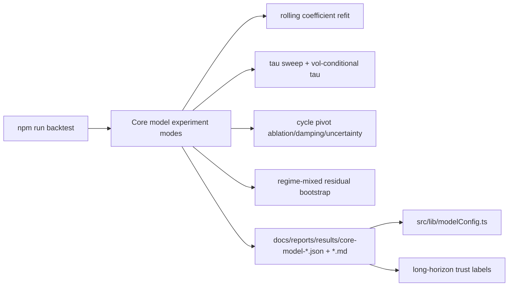

# PRD v2.8: Core Model Assumption Hardening

Complexity: 8 -> HIGH mode

Source documents:
- `docs/reports/next-level-forecasting-assessment.md`
- `docs/PRDs/v2/01-backtest-quality-lock.md`
- `docs/PRDs/v2/02-horizon-calibration.md`
- `docs/PRDs/v2/05-power-law-coefficient-stability.md`

## Context

Problem: The current calibrated power-law baseline is strong at 14-90 days, but its long-horizon behavior still depends on fragile structural assumptions: fixed coefficients, fixed mean-reversion tau, deterministic future cycle pivots, recent-only residual bootstraps, and uncertainty bands that do not yet reflect coefficient or cycle-timing risk.

Files analyzed:
- `docs/reports/next-level-forecasting-assessment.md`
- `docs/PRDs/v2/01-backtest-quality-lock.md`
- `docs/PRDs/v2/02-horizon-calibration.md`
- `docs/PRDs/v2/05-power-law-coefficient-stability.md`
- `src/lib/powerLaw.ts`
- `src/lib/cycle.ts`
- `src/lib/data.ts`
- `src/lib/modelConfig.ts`
- `src/lib/forecastInterval.ts`
- `src/lib/backtestModels.ts`
- `scripts/backtest-forecast.ts`
- `scripts/refit-power-law.ts`

Current behavior:
- `powerlaw-current` beats naive and GBM baselines at gated horizons in the latest backtests.
- `meanReversionTauDays` is fixed at `210` and has not been sensitivity-tested.
- Future cycle pivots are projected from hardcoded cadence assumptions and can receive dominant weight beyond roughly T+100d.
- Monte Carlo residual behavior depends heavily on recent history, including a 730-day residual lookback.
- PRD v2.5 scopes rolling coefficient refits, but the July assessment requires coefficient uncertainty to be evaluated alongside tau, cycle, and bootstrap assumptions as one core-model hardening program.

## Solution

Approach:
- Treat this PRD as the Tier 1 implementation slice from the July assessment.
- Extend the existing backtest harness with explicit experiment modes for coefficient refit, tau sensitivity, cycle-pivot ablation, and residual-bootstrap variants.
- Promote no core-model change unless it improves or preserves median error, bias, NLL or CRPS/pinball loss, and empirical coverage out of sample.
- Feed coefficient, tau, cycle, and residual-bootstrap uncertainty into long-horizon labels and interval policies before strengthening any UI claims.
- Keep the current calibrated power-law as the default until the full hardening suite produces stronger evidence.

Architecture:

Key decisions:
- Use report-only experiment modes first. Config changes require explicit evidence and a separate manual patch.
- Use the same rolling-origin semantics and deterministic seeds as `npm run backtest`.
- Evaluate 14, 30, 60, 90, 180, and 365 day horizons, with 90-365 day metrics deciding cycle and coefficient-risk changes.
- Treat 180+ day forecasts as scenario ranges unless the hardened model proves calibration and stability.

Data changes: None to runtime data. New report artifacts under `docs/reports/results/`.

## Integration Points

How will this feature be reached?
- Entry point identified: `npm run backtest -- --core-assumption-suite` plus focused scripts where useful, such as `npm run sweep:tau` or `npm run refit:powerlaw`.
- Caller file identified: `package.json` invokes `scripts/backtest-forecast.ts`, `scripts/refit-power-law.ts`, and any new focused experiment scripts.
- Registration/wiring needed: add package scripts, model-config experiment flags, backtest report rendering, and compact latest-summary fields for UI trust labels only after reports exist.

Is this user-facing?
- Partially. Experiments are internal, but long-horizon label changes are user-facing if instability is detected.

Full user flow:
1. Engineer runs the core-assumption suite.
2. Scripts evaluate current baseline against refit, tau, cycle, and residual-bootstrap variants.
3. Reports identify which assumptions are stable, under watch, or rejected.
4. Engineer applies only evidence-backed config changes.
5. UI continues to label long horizons as scenario/directional when uncertainty remains high.

## Execution Phases

#### Phase 1: Rolling Refit Uncertainty - Coefficient drift is measured before any coefficient change

Files:
- `scripts/refit-power-law.ts` - extend or verify rolling-origin coefficient reports.
- `src/lib/powerLawFit.ts` - coefficient summary, uncertainty, and candidate helpers.
- `src/lib/backtestModels.ts` - candidate model registration.
- `scripts/backtest-forecast.ts` - candidate comparison output.
- `docs/reports/results/README.md` - report-field documentation.

Implementation:
- [ ] Refit `(a, b, c1, c2)` using only data before each rolling origin.
- [ ] Record coefficient medians, p05/p95 intervals, drift, and residual error by fit window.
- [ ] Propagate coefficient uncertainty into 180/365 day interval-width diagnostics.
- [ ] Compare `powerlaw-refit-candidate` against `powerlaw-current` at 14-365 days.
- [ ] Keep current coefficients unless the candidate improves or preserves error, bias, and coverage.

Tests required:

| Test File | Test Name | Assertion |
| --- | --- | --- |
| `npm run refit:powerlaw` | report smoke | writes JSON/Markdown with coefficient summaries and stability verdict |
| `npm run backtest -- --candidate-powerlaw latest` | candidate comparison | report includes current and refit candidate rows |
| `src/lib/powerLawFit.ts` | `should not use post-origin data when fitting` | synthetic fixture proves training rows end before origin |

User verification:
- Action: Open the latest refit Markdown report.
- Expected: It states whether fixed coefficients are stable enough and quantifies long-horizon uncertainty.

#### Phase 2: Tau Sensitivity Sweep - Mean-reversion speed becomes evidence-backed

Files:
- `scripts/sweep-tau.ts` - run fixed and volatility-conditional tau variants.
- `src/lib/modelConfig.ts` - expose tau candidates and disabled candidate metadata.
- `src/lib/backtestModels.ts` - evaluate tau variants without changing default behavior.
- `scripts/backtest-forecast.ts` - include tau experiment section.

Implementation:
- [ ] Backtest tau values `{60, 90, 120, 150, 210, 300, 420}` at 14, 30, 60, and 90 days.
- [ ] Add one volatility-conditional tau candidate: faster reversion in high-volatility regimes and slower in low-volatility regimes.
- [ ] Compare median error, bias, NLL, CRPS/pinball loss, and coverage.
- [ ] Promote a tau only if it beats or matches `210` without degrading calibration.
- [ ] If no candidate wins, record `210` as validated by sensitivity evidence rather than inherited as a constant.

Tests required:

| Test File | Test Name | Assertion |
| --- | --- | --- |
| `npm run sweep:tau` | sweep smoke | exits `0` and prints ranked tau table |
| generated JSON | completeness | includes every tau candidate and gated horizon |
| `npm run backtest` | default unchanged | default remains `210` unless config is deliberately changed |

User verification:
- Action: Read the tau sweep Markdown report.
- Expected: It identifies the selected or retained tau and explains the gate numerically.

#### Phase 3: Cycle-Pivot Ablation - Future cycle assumptions are removed, damped, or made uncertain

Files:
- `src/lib/cycle.ts` - expose cycle forecast strategies.
- `src/lib/modelConfig.ts` - add disabled cycle strategy metadata.
- `src/lib/backtestModels.ts` - register cycle ablation candidates.
- `scripts/backtest-forecast.ts` - report cycle strategy metrics.
- `src/lib/data.ts` - consume selected cycle strategy for forecast generation.

Implementation:
- [ ] Add report-only cycle strategies: current deterministic pivots, no future pivot interpolation beyond sinusoidal term, damped amplitude by cycle number, and widened intervals from pivot-timing uncertainty.
- [ ] Gate primarily on 90, 180, and 365 day median error and coverage.
- [ ] Record whether 2021-style cycle violations would be less overfit under each strategy.
- [ ] Default to the least assumption-heavy strategy that preserves or improves metrics.
- [ ] If deterministic pivots remain, document their validated scope and prevent exact long-horizon wording.

Tests required:

| Test File | Test Name | Assertion |
| --- | --- | --- |
| `npm run backtest -- --cycle-suite` | cycle suite | report includes all cycle strategies |
| `src/lib/cycle.ts` | `should decay future cycle amplitude when configured` | later cycle amplitude is lower than current-cycle amplitude |
| `npm run backtest` | quality gate | chosen default preserves 14-90 day quality gate |

User verification:
- Action: Compare current and selected cycle strategy sections in the Markdown report.
- Expected: Report states whether deterministic future pivots are retained, damped, widened, or removed.

#### Phase 4: Regime-Mixed Residual Bootstrap - Tail shocks are represented beyond the last 730 days

Files:
- `src/lib/forecastInterval.ts` - residual sampling policy helpers.
- `src/lib/data.ts` - Monte Carlo and heatmap residual policy wiring.
- `scripts/backtest-forecast.ts` - high-volatility subperiod coverage metrics.
- `src/lib/modelConfig.ts` - residual-bootstrap policy config.

Implementation:
- [ ] Add residual-bootstrap policies: recent-730d, full-history, and volatility-regime-stratified block sampling.
- [ ] Ensure stochastic paths use deterministic seeds for every report run.
- [ ] Compare 80/90/95% coverage overall and in high-volatility subperiods.
- [ ] Prefer the smallest interval policy that restores 95% coverage in high-volatility windows without making normal-period coverage uselessly wide.
- [ ] Report how 2020-style shock windows are represented.

Tests required:

| Test File | Test Name | Assertion |
| --- | --- | --- |
| `src/lib/forecastInterval.ts` | `should sample residual blocks deterministically with seed` | repeated seeded runs are identical |
| `npm run backtest -- --residual-bootstrap-suite` | suite smoke | report includes recent, full-history, and regime-mixed policies |
| generated Markdown | high-vol coverage | includes coverage-in-flagged-periods table |

User verification:
- Action: Open the residual-bootstrap report.
- Expected: It identifies whether recent-only residuals understate high-volatility tail risk.

#### Phase 5: Long-Horizon Trust Wiring - Core-assumption verdicts affect user-facing precision

Files:
- `src/lib/reliabilityReport.ts` - read compact core-assumption verdicts.
- `src/lib/data.ts` - attach long-horizon trust metadata.
- `src/App.tsx` - display scenario/directional labels from verdicts.
- `src/components/Chart.tsx` - chart labels and tooltips.
- `src/data/reliability-summary.json` - compact generated summary if already used by runtime.

Implementation:
- [ ] Publish compact verdicts for coefficient stability, tau selection, cycle strategy, and residual-bootstrap policy.
- [ ] For any `watch` or `unstable` verdict, force 180+ day labels to `Scenario range` or `Directional only`.
- [ ] Preserve calibrated-band wording only for horizons with demonstrated coverage.
- [ ] Avoid importing full experiment reports into the UI bundle.
- [ ] Keep trading recommendation language out of the UI.

Tests required:

| Test File | Test Name | Assertion |
| --- | --- | --- |
| `npm run build` | production build | succeeds with compact summary only |
| manual UI check | long horizon labels | 180/365 day labels reflect core-assumption verdicts |
| `npm run backtest` | report consistency | latest report verdict and UI summary agree |

User verification:
- Action: Run the app and inspect 90D, 6M, and 1Y views.
- Expected: Short horizons retain calibrated wording where supported; long horizons remain scenario/directional when core assumptions are under watch.

## Acceptance Criteria

- Rolling coefficient refits use only pre-origin data and produce stability/uncertainty reports.
- Tau values `{60, 90, 120, 150, 210, 300, 420}` and a volatility-conditional tau are backtested before any tau change.
- Deterministic future cycle pivots are explicitly ablated against no-pivot, damped-cycle, and pivot-uncertainty alternatives.
- Residual bootstrapping is tested against full-history and volatility-regime-stratified policies, not only recent 730-day history.
- Reports include median error, bias, NLL where applicable, CRPS or pinball loss, and 80/90/95% coverage.
- The current baseline remains default unless a candidate improves or preserves the full gate.
- Long-horizon UI language reflects core-assumption verdicts.
- `npm run backtest`, core-assumption experiment commands, `npm run build`, and relevant unit tests pass.

## Regression Safety Gate

- Capture a baseline `npm run backtest` report before each assumption suite is implemented or run for promotion.
- Every candidate must be reported beside the unchanged current baseline, with deltas for median error, bias, NLL where available, CRPS/pinball loss, 80/90/95% coverage, and interval width.
- Required result: no coefficient, tau, cycle, or residual-bootstrap candidate can become default unless it improves or preserves the full gate at 14-365 days and does not hide degradation in a single averaged score.
- If a candidate improves 180/365 day behavior but worsens 14/30/60/90 day results, it must remain report-only or horizon-scoped with explicit runtime gating.
- Any intentional long-horizon tradeoff must make UI wording more conservative unless evidence proves stronger calibration.

## Risks

- The strongest-looking candidate may be overfit to the current holdout; require walk-forward and report-only staging before config promotion.
- Cycle strategy changes can move long-horizon medians materially; separate median changes from interval-widening changes in reports.
- Regime-mixed residuals can over-widen intervals; gate on both flagged-window coverage and normal-period usefulness.
- UI wording can imply precision faster than evidence supports; long-horizon labels must remain conservative unless all core-assumption verdicts support stronger claims.
