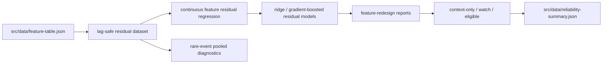

# PRD v2.9: Feature Experiment Redesign

Complexity: 8 -> HIGH mode

Source documents:
- `docs/reports/next-level-forecasting-assessment.md`
- `docs/PRDs/v2/03-regime-data-feature-pipeline.md`
- `docs/PRDs/v2/04-regime-model-ui-automation.md`
- `docs/PRDs/v2/06-sentiment-data-context.md`
- `docs/reports/experiments-backlog.md`

## Context

Problem: The June 2026 P1 signal ablations rejected on-chain, derivatives, ETF flows, macro, sentiment, stablecoins, and COT as forecast alpha, but the July assessment found the design was sample-starved: rare event gates, 2025-only holdouts, and small per-state sample counts made the tests statistically unable to pass even if weak real signals exist.

Files analyzed:
- `docs/reports/next-level-forecasting-assessment.md`
- `docs/reports/results/btc-liquidity-derivatives-ablation-2026-06-26T04-02-52-655Z.md`
- `docs/reports/results/btc-onchain-interactions-2026-06-26T04-53-26-666Z.md`
- `docs/reports/results/btc-sentiment-extremes-2026-06-26T05-08-19-361Z.md`
- `docs/reports/results/btc-cme-cot-2026-06-26T05-16-53-701Z.md`
- `docs/reports/results/btc-macro-liquidity-2026-06-26T05-23-29-014Z.md`
- `docs/reports/results/btc-etf-demand-2026-06-26T05-31-26-579Z.md`
- `scripts/backtest-liquidity-derivatives.ts`
- `scripts/backtest-onchain-interactions.ts`
- `scripts/backtest-sentiment-extremes.ts`
- `scripts/backtest-cme-cot.ts`
- `scripts/backtest-macro-liquidity.ts`
- `scripts/backtest-etf-demand.ts`
- `scripts/backtest-buy-zones.ts`
- `src/data/feature-table.json`
- `src/lib/features.ts`

Current behavior:
- Feature-family scripts mostly test event-gated or state-gated hypotheses, producing very small thinned sample counts.
- Several data families have enough daily rows to support continuous-feature evaluation, but the experiments reduce them to sparse events.
- The main backtest uses a longer holdout than many feature ablations.
- Buy-zone scoring and stablecoin liquidity showed signs of life but remain correctly unpromoted due to small or inconsistent evidence.
- Feature data is already lag-safe in the feature table, but experiment gates need stronger statistical power and better loss metrics.

## Solution

Approach:
- Treat this PRD as the Tier 2 implementation slice from the July assessment.
- Replace sparse event/state promotion tests with continuous residual-model experiments that use all lag-safe daily rows.
- Extend holdouts back to `2022-01-01` where data exists, while keeping point-in-time source lag rules intact.
- Add CRPS or pinball-loss gates alongside NLL, median error, and coverage.
- Build one kitchen-sink residual model experiment; if it cannot beat pure `exp(-h/tau)` reversion, stop promoting new data sources as alpha until new evidence appears.

Architecture:

Key decisions:
- The target is h-day-ahead power-law residual, not raw BTC price.
- Use regularized models first: ridge regression as the default and gradient boosting only if already available or added with clear justification.
- Keep every feature family disabled by default unless walk-forward residual modeling beats the current decay model out of sample.
- Preserve event-gated scripts as diagnostics only; they cannot be the only promotion gate for rare-event signals.

Data changes: None to source caches. New experiment reports under `docs/reports/results/`.

## Integration Points

How will this feature be reached?
- Entry point identified: `npm run backtest:features-continuous`, `npm run backtest:residual-model`, and updated report-only feature-family scripts.
- Caller file identified: `package.json` invokes new or revised scripts.
- Registration/wiring needed: add shared residual-dataset utilities, report schemas, and feature-family gate summaries consumed by backtest/UI only as context.

Is this user-facing?
- Indirectly. The user-facing app must continue to show unproven signals as context-only until gates pass.

Full user flow:
1. Engineer refreshes data and feature table.
2. Engineer runs continuous-feature residual experiments.
3. Reports show whether each feature family improves residual forecasts across all available lag-safe days.
4. Any passing family becomes `eligible-for-manual-review`, not automatically enabled.
5. UI continues to explain disabled/context-only state unless a later ensemble PRD promotes it.

## Execution Phases

#### Phase 1: Shared Residual Dataset - Feature experiments use one lag-safe target builder

Files:
- `src/lib/featureExperimentDataset.ts` - build residual targets and feature matrices.
- `src/lib/features.ts` - expose typed historical feature access without UI-bundle assumptions.
- `scripts/backtest-feature-family.ts` - shared CLI for feature-family experiments.
- `package.json` - add `backtest:features-continuous`.
- `docs/reports/results/README.md` - document feature experiment schemas.

Implementation:
- [ ] Build h-day-ahead residual targets for `7, 14, 30, 60, 90, 180` day horizons.
- [ ] Use only feature values with `sourceDate < originDate`.
- [ ] Emit sample counts before and after missing-value filtering for each feature family.
- [ ] Support holdout starts of `2022-01-01` and `2025-01-01` for comparability.
- [ ] Fail clearly when a feature family lacks enough rows for a meaningful continuous test.

Tests required:

| Test File | Test Name | Assertion |
| --- | --- | --- |
| `src/lib/featureExperimentDataset.ts` | `should reject future source dates` | fixture with `sourceDate >= originDate` fails |
| `npm run backtest:features-continuous -- --family stablecoins` | smoke | writes JSON/Markdown with sample counts and horizons |
| generated JSON | metadata completeness | includes holdout start, source families, horizons, and filtered sample counts |

User verification:
- Action: Run one family experiment and inspect sample counts.
- Expected: Report makes sample starvation visible before metrics are interpreted.

#### Phase 2: Continuous Feature Gates - Event states stop being the primary promotion test

Files:
- `scripts/backtest-feature-family.ts` - continuous z-score and quantile-feature gates.
- `src/lib/backtestMetrics.ts` - CRPS or pinball-loss utilities if missing.
- `docs/reports/results/README.md` - metric definitions.
- Existing feature-family scripts - mark sparse event outputs as diagnostics.

Implementation:
- [ ] Convert on-chain, derivatives, ETF, macro, sentiment, stablecoin, and COT features into normalized continuous predictors.
- [ ] Evaluate simple one-family residual models against pure decay residual reversion.
- [ ] Report CRPS or pinball loss, NLL where applicable, median error, bias, and coverage.
- [ ] Use block bootstrap confidence intervals for improvement claims.
- [ ] Keep event-gated outputs as secondary diagnostics with explicit `not-a-promotion-gate` labeling.

Tests required:

| Test File | Test Name | Assertion |
| --- | --- | --- |
| `npm run backtest:features-continuous -- --family all` | all-family smoke | report includes every feature family |
| generated Markdown | sparse-gate warning | rare-event/state diagnostics are labeled non-promotional |
| `src/lib/backtestMetrics.ts` | `should compute pinball loss for multiple quantiles` | expected asymmetric loss values |

User verification:
- Action: Open the all-family Markdown report.
- Expected: It distinguishes continuous-feature gates from sparse diagnostic event tables.

#### Phase 3: Longer Holdout And Pooling - Tests use all eligible history instead of 2025-only slices

Files:
- `scripts/backtest-feature-family.ts` - holdout-window controls.
- `scripts/backtest-buy-zones.ts` - pooled diagnostics for buy-zone candidates.
- `scripts/backtest-liquidity-derivatives.ts` - stablecoin continuous comparison or delegation to shared CLI.
- `docs/reports/results/README.md` - holdout-window documentation.

Implementation:
- [ ] Extend feature holdout to `2022-01-01` for on-chain, sentiment, and stablecoin data where source history supports it.
- [ ] Preserve `2025-01-01` reports as comparable short-holdout diagnostics, not the main promotion gate.
- [ ] Pool related rare states where the hypothesis is meaningfully shared and document pooling choices.
- [ ] Treat buy-zone scoring as `candidate/watch` until sample counts exceed a documented threshold or a pooled residual test passes.
- [ ] Treat stablecoin liquidity as `watch` unless continuous 30-90 day improvements survive longer holdout and bootstrap checks.

Tests required:

| Test File | Test Name | Assertion |
| --- | --- | --- |
| `npm run backtest:features-continuous -- --holdout 2022-01-01` | extended holdout | report uses eligible rows from 2022 onward |
| buy-zone report | candidate status | report keeps buy-zone unpromoted when sample count is below threshold |
| stablecoin report | watch gate | stablecoin status includes longer-holdout evidence and bootstrap interval |

User verification:
- Action: Compare 2022 and 2025 holdout sections.
- Expected: Report states whether a feature passed broadly or only looked promising in a short recent sample.

#### Phase 4: Kitchen-Sink Residual Model - A real alpha attempt decides whether new data is worth pursuing

Files:
- `scripts/backtest-residual-model.ts` - walk-forward residual model CLI.
- `src/lib/residualModel.ts` - ridge and optional gradient-boosting wrapper.
- `src/lib/modelConfig.ts` - disabled residual-model metadata.
- `scripts/backtest-forecast.ts` - optional residual-model comparison rows.
- `package.json` - add `backtest:residual-model`.

Implementation:
- [ ] Train a lag-safe residual model using all eligible feature families.
- [ ] Use walk-forward training only; no random train/test split.
- [ ] Compare against the current pure residual-decay model at each horizon.
- [ ] Require improvement in CRPS or pinball loss and no degradation in coverage.
- [ ] If the kitchen-sink model fails, write a negative-result report that explicitly deprioritizes adding more data sources.

Tests required:

| Test File | Test Name | Assertion |
| --- | --- | --- |
| `npm run backtest:residual-model` | residual model smoke | writes report with baseline and model rows |
| generated JSON | walk-forward proof | includes training end date before every evaluation origin |
| `npm run backtest` | default unchanged | runtime forecast defaults remain unchanged unless a later PRD promotes the model |

User verification:
- Action: Read the residual-model report.
- Expected: It states whether the feature table can beat pure decay; if not, it documents a defensible negative result.

#### Phase 5: Feature Status Summary - Runtime and reports agree on context-only, watch, and eligible states

Files:
- `scripts/write-runtime-summaries.ts` - publish compact feature-family gate statuses.
- `src/data/reliability-summary.json` - include feature experiment status if already generated.
- `src/lib/reliabilityReport.ts` - typed access to feature statuses.
- `src/App.tsx` - display only existing trust/context rows, not alpha claims.

Implementation:
- [ ] Publish statuses: `context-only`, `watch`, `eligible-for-manual-review`, `disabled-negative-result`.
- [ ] Include family, latest report path, holdout window, primary metric, and promotion reason.
- [ ] Ensure the UI never presents `watch` as enabled alpha.
- [ ] Keep source freshness separate from alpha evidence.

Tests required:

| Test File | Test Name | Assertion |
| --- | --- | --- |
| `npm run write:runtime-summaries` | status summary | writes feature-family statuses from latest reports or explicit defaults |
| `npm run build` | UI build | succeeds without importing full feature table into runtime UI |
| manual UI check | trust panel | unpromoted families are labeled context-only/watch |

User verification:
- Action: Open the dashboard after report refresh.
- Expected: Feature families are visible as context/freshness/status, not as enabled forecast drivers unless gates passed.

## Acceptance Criteria

- Every P1 family from the July assessment has a continuous-feature residual experiment: on-chain, derivatives, ETF flows, macro, sentiment, stablecoins, and COT.
- Feature experiments report sample counts before metrics and cannot hide sample starvation.
- Eligible families use the longest lag-safe holdout available, including `2022-01-01` where data supports it.
- CRPS or pinball loss is reported alongside NLL, median error, bias, and coverage.
- Rare event/state tests are retained only as diagnostics unless pooled sample counts and continuous tests support promotion.
- Buy-zone scoring remains candidate/watch unless sample thresholds or residual-model gates pass.
- Stablecoin liquidity is retested with continuous 30-90 day gates before any promotion.
- Kitchen-sink residual modeling produces either a gated candidate or a clear negative-result report.
- Runtime summaries and UI labels keep unproven signals context-only.

## Regression Safety Gate

- Capture baseline `npm run backtest` and current feature-family ablation reports before redesigning experiments.
- Continuous-feature and kitchen-sink residual models must be evaluated side-by-side against pure power-law residual decay, not just against weaker sparse-event baselines.
- Required result: feature-family status can move to `eligible-for-manual-review` only if it improves CRPS/pinball loss or NLL without degrading median error, bias, and 80/90/95% coverage on the relevant holdout.
- Any feature that improves one horizon but worsens another must remain horizon-scoped or `watch`; it cannot become global alpha.
- Runtime summaries must prove unpromoted families remain context-only, so experiment code cannot silently affect production forecasts.

## Risks

- Continuous residual models can overfit many correlated features; use regularization, walk-forward evaluation, and bootstrap intervals.
- Longer holdouts are not available for every source; reports must separate ineligible history from missing implementation.
- A passing kitchen-sink model can still be hard to explain; keep feature-family attribution and disable automatic promotion.
- UI source freshness can be mistaken for forecast alpha; keep status labels explicit.
