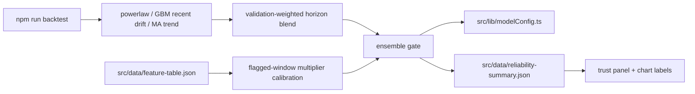

# PRD v2.10: Ensemble And Tail-Risk Promotion Gates

Complexity: 7 -> HIGH mode

Source documents:
- `docs/reports/next-level-forecasting-assessment.md`
- `docs/PRDs/v2/04-regime-model-ui-automation.md`
- `docs/PRDs/v2/08-core-model-assumption-hardening.md`
- `docs/PRDs/v2/09-feature-experiment-redesign.md`

## Context

Problem: Ensemble and tail-risk scaffolding exists, but the July assessment says they should be Tier 3 work: only after core-model hardening and feature-experiment redesign produce evidence. `ensembleForecast.ts` currently defaults to power-law-only behavior, and `tailRisk.ts` computes a multiplier range but does not have a calibrated, coverage-gated application path.

Files analyzed:
- `docs/reports/next-level-forecasting-assessment.md`
- `docs/PRDs/v2/04-regime-model-ui-automation.md`
- `src/lib/ensembleForecast.ts`
- `src/lib/tailRisk.ts`
- `src/lib/modelConfig.ts`
- `src/lib/reliabilityReport.ts`
- `scripts/backtest-forecast.ts`
- `scripts/write-runtime-summaries.ts`
- `src/data/reliability-summary.json`
- `src/data/current-regime-summary.json`
- `src/App.tsx`

Current behavior:
- Ensemble configuration is conservative and keeps the app on power-law unless validation enables more.
- Tail-risk flags and drivers are visible as context, but the interval multiplier is not proven as a calibrated coverage adjustment.
- Existing PRD v2.4 mentions ensemble and tail risk, but the July assessment narrows the proper sequence: run after Tier 1 and Tier 2 evidence.
- The desired ensemble is validation-weighted per horizon across power-law, GBM-recent-drift, and MA-trend, not a broad unvalidated feature model.

## Solution

Approach:
- Implement ensemble and tail-risk promotion as gated Tier 3 work.
- Build a per-horizon validation-weighted blend of `powerlaw-current`, `gbm-recent-drift`, and `ma-trend-20-50-200`.
- Calibrate tail-risk interval multipliers only as conditional width adjustments, not directional median overrides.
- Default to current power-law intervals unless the ensemble or tail-risk gate improves or preserves out-of-sample metrics.
- Publish compact enablement reasons to runtime so the UI can explain power-law-only, ensemble-enabled, and tail-risk-calibrated states.

Architecture:

Key decisions:
- Ensemble weights are learned only from validation reports and stored as explicit config snapshots.
- Tail-risk adjustment can widen intervals but cannot move the median unless a separate residual-model gate passes.
- Coverage-in-flagged-periods is the primary tail-risk metric; normal-period overcoverage is a required guardrail.
- No feature-family alpha from PRD v2.9 may enter the default ensemble unless it reaches `eligible-for-manual-review` and is manually promoted in a later slice.

Data changes: None to source caches. New ensemble/tail-risk reports under `docs/reports/results/`.

## Integration Points

How will this feature be reached?
- Entry point identified: `npm run backtest -- --ensemble-suite` and `npm run backtest -- --tail-risk-suite`.
- Caller file identified: `package.json` invokes `scripts/backtest-forecast.ts` or focused suite scripts.
- Registration/wiring needed: add model-config weights, enablement flags, report summaries, and UI labels only after gates are computed.

Is this user-facing?
- Yes, if enabled. The chart/trust UI must identify whether the displayed forecast is power-law-only, ensemble blend, or power-law with calibrated tail-risk width adjustment.

Full user flow:
1. Engineer completes Tier 1 and Tier 2 reports.
2. Engineer runs ensemble and tail-risk suites.
3. Reports either keep runtime defaults disabled or mark candidates eligible.
4. Engineer applies an explicit config update if a gate passes.
5. User sees the enabled mode and reason in the trust UI.

## Execution Phases

#### Phase 1: Ensemble Candidate Report - Per-horizon weights are learned report-only

Files:
- `src/lib/ensembleForecast.ts` - support validation-weighted member blending.
- `src/lib/modelConfig.ts` - explicit disabled ensemble candidate weights.
- `scripts/backtest-forecast.ts` - ensemble suite output.
- `src/lib/backtestModels.ts` - ensure benchmark member forecasts are available.
- `docs/reports/results/README.md` - ensemble report fields.

Implementation:
- [ ] Candidate members are `powerlaw-current`, `gbm-recent-drift`, and `ma-trend-20-50-200`.
- [ ] Learn weights per horizon from rolling-origin validation metrics.
- [ ] Compare ensemble against the best single model, not only against naive.
- [ ] Require improvement in at least one target horizon without degrading calibration or other gated horizons.
- [ ] Keep `ENSEMBLE_CONFIG.defaultEnabled` false unless a report-backed manual config update is applied.

Tests required:

| Test File | Test Name | Assertion |
| --- | --- | --- |
| `npm run backtest -- --ensemble-suite` | suite smoke | report includes members, weights, and ensemble rows |
| generated JSON | best-single comparison | ensemble gate compares against best single model per horizon |
| `npm run backtest` | default state | default forecast remains power-law when ensemble disabled |

User verification:
- Action: Open the ensemble suite Markdown.
- Expected: It states whether the ensemble is disabled, watch, or eligible and lists per-horizon weights.

#### Phase 2: Tail-Risk Calibration - Multiplier is gated on flagged-window coverage

Files:
- `src/lib/tailRisk.ts` - separate flag computation from interval adjustment policy.
- `src/lib/forecastInterval.ts` - apply optional tail-risk width adjustment.
- `scripts/backtest-forecast.ts` - flagged-window coverage metrics.
- `src/lib/modelConfig.ts` - disabled tail-risk calibration metadata.
- `docs/reports/results/README.md` - tail-risk report fields.

Implementation:
- [ ] Evaluate the current 1.0-1.35 multiplier range as a conditional interval-width adjustment.
- [ ] Define flagged windows from tail-risk drivers: funding extremes, open-interest growth, realized-volatility jumps, macro stress, and liquidation context if available.
- [ ] Compare coverage in flagged windows before and after adjustment at 80/90/95% bands.
- [ ] Guard against normal-period overcoverage and excessive average interval width.
- [ ] Keep tail risk as context-only if flagged sample counts are insufficient.

Tests required:

| Test File | Test Name | Assertion |
| --- | --- | --- |
| `npm run backtest -- --tail-risk-suite` | suite smoke | report includes flagged and unflagged coverage |
| `src/lib/tailRisk.ts` | `should not apply width adjustment when multiplier is disabled` | interval adjustment remains `1.0` |
| generated Markdown | sample warning | insufficient flagged windows prevent promotion |

User verification:
- Action: Open the tail-risk suite report.
- Expected: It states whether calibrated tail-risk width improves coverage in flagged periods and whether it is enabled.

#### Phase 3: Runtime Wiring - Enabled modes are reachable and explainable

Files:
- `src/lib/data.ts` - apply ensemble median and tail-risk interval policy when enabled.
- `src/lib/reliabilityReport.ts` - expose enablement reason and report paths.
- `scripts/write-runtime-summaries.ts` - publish compact ensemble/tail-risk status.
- `src/App.tsx` - trust UI mode and driver labels.
- `src/components/Chart.tsx` - chart labels/tooltips for enabled mode.

Implementation:
- [ ] Runtime default remains power-law-only unless config enablement is true.
- [ ] When ensemble is enabled, expose member weights and horizon-specific reason codes.
- [ ] When tail-risk is enabled, show interval-widening context without claiming directional certainty.
- [ ] Use compact summaries; do not import full report artifacts into the UI bundle.
- [ ] Add clear fallback behavior when summaries are missing.

Tests required:

| Test File | Test Name | Assertion |
| --- | --- | --- |
| `npm run build` | production build | succeeds with runtime summaries |
| `npm run backtest` | enabled config consistency | report metadata matches runtime config |
| manual UI check | forecast mode | trust UI shows power-law-only, ensemble, or tail-risk status accurately |

User verification:
- Action: Open the dashboard after report refresh.
- Expected: The trust panel explains whether ensemble and tail-risk adjustments are disabled, context-only, or active.

#### Phase 4: Regression Gate - Enabled candidates cannot silently degrade the baseline

Files:
- `scripts/backtest-forecast.ts` - non-zero gate for enabled ensemble/tail-risk modes.
- `package.json` - add suite scripts to refresh/check commands if applicable.
- `.github/workflows/update-data-and-backtest.yml` - include gated checks only after local scripts exist.
- `docs/reports/results/README.md` - release-gate documentation.

Implementation:
- [ ] If ensemble is enabled, `npm run backtest` fails when it no longer beats or matches the configured baseline gates.
- [ ] If tail-risk adjustment is enabled, `npm run backtest` fails when flagged-window coverage or normal-period width guardrails degrade beyond thresholds.
- [ ] Report disabled/context-only states without failing release gates.
- [ ] Include previous report comparison when available.

Tests required:

| Test File | Test Name | Assertion |
| --- | --- | --- |
| `npm run backtest` | enabled mode gate | exits non-zero when enabled candidate violates configured gate |
| `npm run reports:refresh` | refresh compatibility | suite summaries are generated or explicitly skipped |
| workflow syntax | CI compatibility | workflow references existing commands only |

User verification:
- Action: Run `npm run backtest` after enabling a candidate.
- Expected: The command either passes with evidence or fails with a specific degraded metric.

## Acceptance Criteria

- Ensemble candidate uses validation-weighted per-horizon blending of power-law, GBM-recent-drift, and MA-trend.
- Ensemble is compared against the best single model and is not enabled by default without evidence.
- Tail-risk multiplier is calibrated as a conditional interval-width adjustment and evaluated on coverage-in-flagged-periods.
- Tail risk does not move the median or imply directional certainty.
- Runtime UI explains disabled, context-only, and active states.
- Enabled ensemble or tail-risk modes become part of the backtest quality gate.
- Tier 3 work does not proceed until Tier 1 core-model reports and Tier 2 feature-redesign reports exist.

## Regression Safety Gate

- Capture a baseline `npm run backtest` report with ensemble and tail-risk disabled before enabling any Tier 3 candidate.
- Ensemble candidates must beat or match the best single model per horizon and must not degrade the existing power-law quality gate.
- Tail-risk candidates must improve flagged-window coverage without causing unacceptable normal-period overcoverage or interval-width inflation.
- Required result: enabled ensemble/tail-risk modes become part of `npm run backtest`; if later data causes the gate to fail, the runtime must fall back to power-law-only or fail release.
- UI activation requires a report path and config snapshot proving the enabled mode did not fuck up current results.

## Risks

- Ensembling weak members can dilute the strong baseline; require best-single comparison.
- Tail-risk flags may be sparse; insufficient flagged samples should block promotion.
- Wider intervals can make coverage look better while reducing usefulness; guard on average width and normal-period overcoverage.
- UI can overclaim active modes; show enablement reason and keep disabled states explicit.
