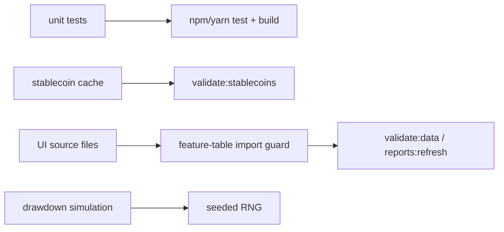

# PRD v2.11: Engineering Hygiene And Guardrails

Complexity: 6 -> MEDIUM mode

Source documents:
- `docs/reports/next-level-forecasting-assessment.md`
- `docs/PRDs/v2/03-regime-data-feature-pipeline.md`
- `docs/PRDs/v2/04-regime-model-ui-automation.md`
- `docs/PRDs/v2/07-market-data-quality-upgrade.md`

## Context

Problem: The July assessment found the forecast harness is strong, but several cheap engineering fixes would reduce silent regressions: core model test coverage is thin, drawdown Monte Carlo uses unseeded randomness, dead code and placeholder UI options remain, both lockfiles may exist, stablecoin validation is missing compared with other pipelines, large `feature-table.json` imports need a UI-bundle guard, and API keys should move out of plaintext local workflows.

Files analyzed:
- `docs/reports/next-level-forecasting-assessment.md`
- `package.json`
- `.env.example`
- `README.md`
- `src/lib/powerLaw.ts`
- `src/lib/forecastInterval.ts`
- `src/lib/regimeModel.ts`
- `src/lib/buyZone.ts`
- `src/lib/tailRisk.ts`
- `src/lib/features.ts`
- `src/lib/data.ts`
- `scripts/build-feature-table.ts`
- `scripts/update-stablecoin-data.mjs`
- `scripts/check-data-freshness.ts`
- `src/App.tsx`
- `src/lib/ensembleForecast.ts`

Current behavior:
- App and API tests exist, but the core model math and feature joins need focused unit coverage.
- `computeDrawdownStats` uses `Math.random()` while other backtest paths are deterministic.
- `legacyStressMultiplierForHorizon` and some placeholder model-selection paths can outlive their usefulness.
- Workflow scripts use yarn, and the roadmap already noted lockfile consistency risk.
- Stablecoin updates exist, but a `validate:stablecoins` command needs to match the other pipelines.
- `feature-table.json` is not currently in the Vite bundle, but `src/lib/features.ts` and `src/lib/buyZone.ts` import it directly, so a future UI import could accidentally bloat the bundle.
- `.env` was not committed, but local plaintext API-key workflow can be improved.

## Solution

Approach:
- Treat this PRD as the Tier 4 opportunistic hardening batch from the July assessment.
- Add focused unit tests around the core forecast math, interval model, regime classification, buy-zone scoring, tail-risk flags, and feature-table lag joins.
- Make stochastic drawdown logic seedable and deterministic in tests and reports.
- Remove dead code and unvalidated UI options after confirming no active path uses them.
- Standardize the package manager and add validation/import guards that fail before bundle bloat or stale source data reaches release.
- Move local API-key guidance to `.env.local` or secret-manager-friendly workflow without committing any secret values.

Architecture:

Key decisions:
- Keep tests narrow and deterministic; do not rewrite the model as part of test work.
- Remove placeholder UI options only if they are unvalidated or unreachable; keep context labels that are useful to users.
- Use yarn as canonical if current workflows already rely on it, unless a separate decision says otherwise.
- Guard against importing large generated JSON into user-facing bundles by checking import paths, not by assuming current bundle contents.

Data changes:
- Add validator/report outputs as needed.
- No runtime data-shape changes.

## Integration Points

How will this feature be reached?
- Entry point identified: `npm run test`, `npm run validate:stablecoins`, `npm run guard:ui-imports`, `npm run validate:data`, `npm run build`, and `npm run reports:refresh`.
- Caller file identified: `package.json` registers scripts and CI/workflow commands invoke them.
- Registration/wiring needed: aggregate validation scripts should include stablecoin validation and UI import guard once implemented.

Is this user-facing?
- Mostly no. The only direct user-facing change is removal or relabeling of unused placeholder model options.

Full user flow:
1. Engineer runs the standard validation/build commands.
2. Unit tests catch forecast-math regressions.
3. Stablecoin data validation catches malformed or stale liquidity context.
4. UI import guard fails if a user-facing component imports `feature-table.json` directly.
5. Build and report refresh remain deterministic.

## Execution Phases

#### Phase 1: Core Model Unit Coverage - Forecast math gets focused regression tests

Files:
- `src/lib/powerLaw.ts` - testable exports only if needed.
- `src/lib/forecastInterval.ts` - interval helper tests.
- `src/lib/regimeModel.ts` - regime classification tests.
- `src/lib/buyZone.ts` - buy-zone scoring tests.
- `src/lib/tailRisk.ts` - tail-risk flag tests.

Implementation:
- [ ] Add tests for power-law monotonicity and coefficient/config usage.
- [ ] Add tests for interval quantile ordering and calibrated multiplier selection.
- [ ] Add tests for feature-table join/lag behavior where helpers exist, or extract pure helpers first.
- [ ] Add tests for regime probability normalization and reason-code output.
- [ ] Add tests for buy-zone threshold behavior and tail-risk driver aggregation.

Tests required:

| Test File | Test Name | Assertion |
| --- | --- | --- |
| model test files | `should keep forecast quantiles ordered` | q05 < q50 < q95 for representative inputs |
| feature join tests | `should not use same-day unpublished source values` | source date must be before feature row date |
| regime/tail tests | `should output normalized probabilities and explicit drivers` | sums and reason codes are valid |

User verification:
- Action: Run `npm run test`.
- Expected: Core model logic is covered by deterministic unit tests.

#### Phase 2: Deterministic Randomness - Drawdown stats stop using global Math.random

Files:
- `src/lib/data.ts` - inject or derive seeded RNG for drawdown simulation.
- `src/lib/random.ts` - shared seeded RNG helper if one does not already exist.
- `src/lib/modelConfig.ts` - seed metadata if needed.
- Relevant tests - deterministic simulation fixtures.

Implementation:
- [ ] Replace `Math.random()` in `computeDrawdownStats` with a seeded RNG.
- [ ] Ensure existing synthetic/fallback data generation is either seeded or clearly excluded from report determinism.
- [ ] Record seed in report metadata when drawdown simulation affects reports.
- [ ] Repeated runs with the same inputs must produce identical drawdown stats.

Tests required:

| Test File | Test Name | Assertion |
| --- | --- | --- |
| drawdown tests | `should produce identical drawdown stats with same seed` | two runs deep-equal |
| drawdown tests | `should produce different paths with different seeds` | seed changes stochastic sequence |
| `npm run backtest` | deterministic report | metrics unchanged across repeated runs except timestamp/path |

User verification:
- Action: Run the relevant report command twice.
- Expected: Drawdown-derived values are identical for the same seed.

#### Phase 3: Dead Code And Placeholder Cleanup - UI and model surface stop advertising unvalidated paths

Files:
- `src/lib/forecastInterval.ts` - remove or quarantine `legacyStressMultiplierForHorizon` if unused.
- `src/App.tsx` - remove or relabel unused placeholder model options.
- `src/lib/ensembleForecast.ts` - ensure disabled candidates are clearly disabled.
- `src/lib/modelConfig.ts` - keep unvalidated candidates as metadata, not selectable defaults.

Implementation:
- [ ] Use `rg` and TypeScript build to confirm dead code is unused before removal.
- [ ] Remove `legacyStressMultiplierForHorizon` if no active/report path uses it.
- [ ] Remove model selector options that cannot affect forecast output, or label them context-only/disabled with a real reason.
- [ ] Ensure the UI cannot imply neural-network, regime, or ensemble accuracy before gates pass.

Tests required:

| Test File | Test Name | Assertion |
| --- | --- | --- |
| `npm run build` | compile after cleanup | succeeds |
| manual UI check | selector integrity | selectable models correspond to real enabled behavior |
| `rg legacyStressMultiplierForHorizon src scripts` | dead-code check | no active references remain after removal |

User verification:
- Action: Open the forecast controls.
- Expected: The model surface lists only real enabled modes or explicitly disabled/context-only statuses.

#### Phase 4: Data And Bundle Guards - Stablecoins and feature-table imports get release checks

Files:
- `scripts/validate-stablecoin-data.mjs` - stablecoin cache validator.
- `scripts/guard-ui-imports.mjs` - prevent direct UI imports of large generated data.
- `package.json` - add `validate:stablecoins` and `guard:ui-imports`.
- `scripts/check-data-freshness.ts` - include stablecoin freshness if not already covered.
- `docs/reports/data-sources.md` - stablecoin validation fields and cadence.

Implementation:
- [ ] Add `validate:stablecoins` for `src/data/stablecoin-history.json`.
- [ ] Validate row shape, source attribution, UTC dates, monotonic order, non-negative supply, source lag, and revision notes.
- [ ] Add guard that fails if `src/App.tsx`, `src/components/**`, or other browser entry files import `src/data/feature-table.json` directly.
- [ ] Allow server/scripts/lib analysis imports only when they are excluded from the browser bundle or explicitly justified.
- [ ] Include both checks in aggregate validation or refresh scripts.

Tests required:

| Test File | Test Name | Assertion |
| --- | --- | --- |
| `npm run validate:stablecoins` | validator pass | exits `0` for current cache |
| temporary fixture | `should reject negative stablecoin supply` | validator exits non-zero |
| `npm run guard:ui-imports` | import guard | exits `0` currently and fails on a temporary direct UI import fixture |
| `npm run build` | bundle guard confidence | production build succeeds |

User verification:
- Action: Run `npm run validate:stablecoins && npm run guard:ui-imports`.
- Expected: Stablecoin data validates and the UI bundle guard passes.

#### Phase 5: Package Manager And Secrets Hygiene - Release workflow has one lockfile and no plaintext-key guidance

Files:
- `package.json` - align scripts with canonical package manager.
- `yarn.lock` or `package-lock.json` - keep exactly one based on selected manager.
- `.github/workflows/update-data-and-backtest.yml` - use canonical commands.
- `.env.example` - placeholders only.
- `README.md` - local secret setup guidance.

Implementation:
- [ ] Choose one lockfile; because existing workflow language uses yarn, default to retaining `yarn.lock` and dropping `package-lock.json` unless current repo evidence says otherwise.
- [ ] Ensure workflow and docs use the selected package manager consistently.
- [ ] Keep `.env.example` as placeholders only.
- [ ] Update README guidance to prefer `.env.local` for local development and CI secret storage for deployed workflows.
- [ ] Do not commit, print, or transform actual API key values.

Tests required:

| Test File | Test Name | Assertion |
| --- | --- | --- |
| lockfile check | package manager consistency | only selected lockfile exists |
| `npm run build` or canonical equivalent | build | succeeds with selected manager |
| documentation review | secrets guidance | README and `.env.example` contain placeholders, not real keys |

User verification:
- Action: Read setup docs and inspect lockfiles.
- Expected: There is one package-manager path and no plaintext-key recommendation beyond local ignored env files.

## Acceptance Criteria

- Core model logic has targeted unit coverage for power-law, interval, regime, buy-zone, tail-risk, and feature lag behavior.
- `computeDrawdownStats` and any report-affecting stochastic paths are deterministic under a seed.
- Dead code and misleading placeholder model options are removed or clearly disabled.
- `validate:stablecoins` exists and is included in aggregate data validation.
- A UI import guard prevents accidental browser-bundle imports of full `feature-table.json`.
- The repo uses one canonical lockfile/package-manager path.
- Secret setup docs use placeholders and ignored local env files or CI secrets; no real keys are committed.
- Standard validation, build, and report-refresh commands pass after cleanup.

## Regression Safety Gate

- Capture baseline `npm run backtest`, `npm run build`, and current validation outputs before cleanup work begins.
- Test additions, seeded randomness, dead-code cleanup, import guards, lockfile cleanup, and docs changes must not alter forecast outputs unless a phase explicitly changes stochastic drawdown calculations.
- Required result: `npm run backtest` preserves the same model metrics after hygiene-only phases; seeded drawdown changes must include before/after values and explain the deterministic replacement.
- `guard:ui-imports` and `validate:stablecoins` must be added to aggregate validation without bypassing existing BTC/MVRV/on-chain checks.
- Any cleanup that changes user-facing model options must include a manual UI check proving enabled forecast behavior is unchanged.

## Risks

- Removing placeholder UI options can surprise users who noticed them; prefer disabled labels only if the option conveys useful context.
- Import guards can be too broad; scope them to browser entry/component paths and document allowed script/server imports.
- Lockfile cleanup can affect installs; run the selected package-manager install/build path before merging.
- Tests around stochastic output can become brittle; assert deterministic invariants and broad ranges rather than exact financial claims where appropriate.
