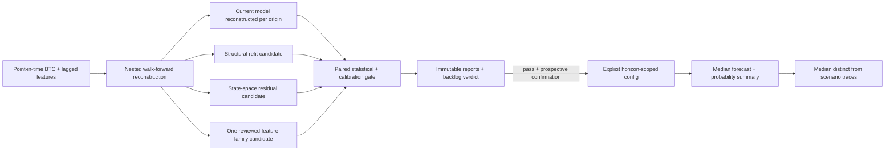
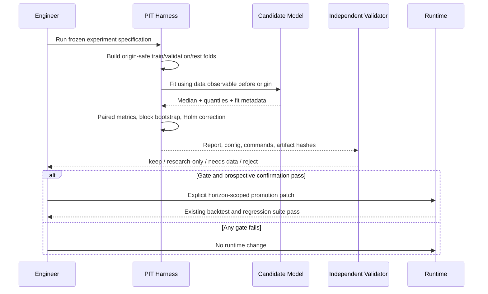

# PRD v2.12: BTC Forecast-Line Capability Research Program

Complexity: 7 -> HIGH mode

Complexity basis: +3 for 10+ implementation files across phases, +2 for new point-in-time/prospective modules, and +2 for nested time-series state and immutable-ledger logic.

Status: Planning only. Every candidate in this PRD is report-only until it passes the evidence and backtest gates.

Source documents:

- `docs/reports/next-level-forecasting-assessment.md`
- `docs/reports/experiments-backlog.md`
- `docs/PRDs/v2/08-core-model-assumption-hardening.md`
- `docs/PRDs/v2/09-feature-experiment-redesign.md`
- `docs/reports/results/tau-120-replication-2026-07-09T19-49-42-622Z.md`
- `docs/reports/results/adaptive-ar1-tau-diagnostic-2026-07-09.md`

## Context

**Problem:** Improve the BTC forecast's directional and endpoint accuracy without overfitting already-inspected history or leaking future information, while preserving the existing jagged yellow forecast visualization exactly as the primary chart treatment.

**Files analyzed:**

- `src/lib/data.ts`
- `src/lib/powerLaw.ts`
- `src/lib/cycle.ts`
- `src/lib/powerLawFit.ts`
- `src/lib/forecastInterval.ts`
- `src/lib/modelConfig.ts`
- `src/lib/backtestModels.ts`
- `src/lib/backtestMetrics.ts`
- `src/lib/featureExperimentDataset.ts`
- `src/lib/residualModel.ts`
- `src/components/Chart.tsx`
- `src/components/chart/dataTransforms.ts`
- `scripts/backtest-forecast.ts`
- `scripts/refit-power-law.ts`
- `scripts/backtest-feature-family.ts`
- `scripts/backtest-residual-model.ts`

**Current behavior:**

- `generateChartData()` anchors the forecast at the latest close and generates the median with `cycleAdjustedPowerLawForecast()`; the current base curve uses fixed coefficients and fixed `tau=210`.
- The prominent jagged yellow path is built from the first deterministic-seed stochastic trace (`stochasticTraces[0]`). Its current shape, styling, prominence, and rendering behavior are product requirements and must not be replaced by a smooth median line.
- The current power-law baseline is strong at 14-60 days, while 90-day error remains a known weak spot. Existing added-data families have not earned production alpha.
- Fixed `tau=120` replication and an expanding AR(1) diagnostic were rejected. Neighboring tau searches on the same history are prohibited by the recorded rerun criteria.
- Existing backtests have a material provenance limitation: the static power-law coefficients can include data later than historical forecast origins.
- The residual-model experiment trains on rows selected by `originDate`; training must instead purge any row whose `targetDate` was not observable at the evaluation origin. Feature-family pre-holdout training needs the equivalent target-boundary purge.
- The repeatedly inspected 2022+ and 2025+ periods are development evidence, not a clean final holdout.

## Product Outcome And Metric Contract

The capability to improve is the forecast distribution, not a single simulated trace:

- Primary point forecast: q50/median BTC close at 14, 30, 60, and 90 days.
- Primary accuracy metric: mean absolute log error (MALE), paired against the current production baseline.
- Secondary point metrics: median absolute log error, log-error bias, direction hit rate, and maximum horizon-specific regression.
- Distribution metrics: q10/q50/q90 pinball loss, NLL, and 80/90/95% empirical coverage and width.
- User-visible mapping: improved forecast-distribution capability may feed the existing jagged yellow rendering and terminal probability summary, but the yellow line's current visual character remains unchanged. Offline accuracy is scored against explicit statistical targets rather than inferred from line smoothness.
- Path-quality metrics: daily innovation mean/variance, residual autocorrelation, absolute-return autocorrelation, drawdown depth/duration, tail quantiles, sign-change rate, realized-volatility distribution, and terminal quantile calibration by horizon.

The yellow path must retain noise, but that noise must be statistically relevant:

- Innovations are sampled or generated from residuals available at the forecast origin, never arbitrary chart jitter.
- The process should preserve empirically relevant volatility clustering, serial dependence, asymmetric/tail behavior, and drawdown persistence where the data supports them.
- The path remains deterministic for the same origin/config seed so it is reproducible, while representing one statistically valid realization from the calibrated forecast distribution.
- A visually pleasing path is not sufficient. The generator must pass distributional and path-property checks against origin-safe historical residual windows.

Minimum promotion effect unless the pre-registration justifies a stricter threshold:

- At least 2% relative MALE improvement at one of 30/60/90d.
- No worse than 0.5% relative MALE regression at any other gated horizon.
- Positive 95% moving-block-bootstrap lower bound for the promoted horizon after Holm correction across horizons and candidates.
- No coverage loss greater than 2 percentage points at 80/90/95%, no material pinball/NLL degradation, and at least 30 nominal non-overlapping final-holdout outcomes per promoted horizon.

## Solution

**Approach:**

- Establish a leak-free, point-in-time nested walk-forward benchmark before testing new alpha.
- Decouple offline scoring from rendering while preserving the existing jagged yellow line exactly; this PRD does not authorize smoothing, replacing, or visually demoting it.
- Calibrate the jagged component as a point-in-time stochastic residual process so its noise magnitude, persistence, reversals, tails, and endpoint distribution are empirically defensible.
- Test a small sequence of mechanistically distinct median candidates: point-in-time structural refit, state-space residual dynamics, and a tightly scoped manually reviewed feature residual.
- Use development windows only for specification and tuning, then freeze the full pipeline for a prospective confirmation period.
- Promote only horizon-scoped candidates; keep the production baseline unchanged when evidence is mixed, underpowered, or selection-contaminated.

**Key decisions:**

- No new external data source is required for Phases 1-3. A new source requires its own backlog entry and point-in-time availability audit.
- Fit structural coefficients only from rows available before each origin; fit interval calibration only from prior, fully realized forecast errors.
- Purge training examples when `trainingRow.targetDate >= evaluationOriginDate`; apply an embargo of at least the evaluated horizon where dependence could otherwise leak across folds.
- Freeze candidate count, formulas, hyperparameter grids, random seeds, and metrics before examining confirmation outcomes.
- Do not revive fixed-tau grid search, expanding AR(1), kitchen-sink ridge, generic ETF flow, or generic funding/premium median adjustments without satisfying their recorded rerun criteria.
- Explicit errors and failed gates produce reports and backlog verdicts; they never silently fall back into production enablement.

**Data changes:** None initially. Experiments consume checked-in BTC history and existing lag-safe feature caches. Reports are written under `docs/reports/results/`; compact runtime config changes are permitted only after promotion.

## Integration Points

**How will this feature be reached?**

- [x] Entry point identified: `npm run backtest:pit-core`, focused candidate commands, and finally the existing `npm run backtest` release gate.
- [x] Caller identified: package scripts call research scripts; a passed candidate is explicitly wired through `src/lib/modelConfig.ts` into `src/lib/data.ts`.
- [x] Registration/wiring identified: every run updates `docs/reports/experiments-backlog.md`; reports live in `docs/reports/results/`; runtime remains unchanged until a later promotion slice.

**Is this user-facing?**

- Yes, eventually. Research phases are internal. A passing candidate changes the median line/terminal summary only through an explicit gated promotion phase.
- Chart presentation is user-facing: the current jagged yellow forecast remains the primary visual. Any internal q50/distribution metadata must not redraw it as a smooth median.

**Full user flow:**

1. An engineer pre-registers and runs a candidate through the point-in-time harness.
2. The run writes reproducible metrics, uncertainty, leak checks, and a verdict.
3. A skeptical independent review attempts to falsify the result.
4. The candidate is frozen and observed on a prospective confirmation period.
5. Only a passed candidate is explicitly enabled for its validated horizon(s).
6. The user sees the same jagged yellow forecast treatment, now driven only by any evidence-backed capability change; its shape is not replaced with a smooth median.

## Pre-Registered Experiment Portfolio

| ID | Candidate | Hypothesis | Development test | Promotion dependency |
| --- | --- | --- | --- | --- |
| YL-0 | Point-in-time benchmark repair | Removing retrospective coefficient and label leakage gives an honest baseline and may change prior rankings | Reconstruct every origin using only then-known structural fits, residuals, interval errors, and features | Mandatory foundation; cannot itself change the runtime forecast |
| YL-1 | Nested structural refit with shrinkage | Slowly updating the power-law base toward causally fitted coefficients reduces 60/90d bias relative to a static retrospective curve | Compare expanding and fixed-length fits with shrinkage to the last accepted fit; candidate form/grid frozen before evaluation | YL-0 pass; coefficient stability and convergence checks |
| YL-2 | Local-level/state-space residual model | A causal level-plus-mean-reverting residual state captures regime drift better than fixed exponential decay without chasing adjacent tau values | Kalman/local-linear specification with a small pre-registered parameter grid selected inside each training fold | YL-0 pass; distinct mechanism from rejected AR(1), no tuning on final holdout |
| YL-2P | Statistically calibrated jagged path | Point-in-time block/residual innovations can preserve the current noisy yellow shape while making its fluctuations representative of observed BTC residual dynamics | Compare current generator with moving-block, volatility-regime-conditioned, and state-space-innovation generators using path diagnostics and terminal calibration | YL-0 pass; cannot move the median unless YL-1/YL-2 separately passes |
| YL-3 | Horizon-scoped COT residual | The previously `eligible-for-manual-review` COT family contains one interpretable, lag-safe residual signal at a specific horizon | Manually select one formula/horizon from existing development evidence, freeze it, and test only on fresh forward outcomes | COT source availability audit and prospective sample sufficiency |
| YL-4 | Regime mixture-of-experts | A simple, causal regime gate can choose between the accepted structural baseline and one accepted residual candidate | Gate uses only price-derived state known at origin; compare against best component and constant blend | Run only if YL-1 or YL-2 first shows credible development evidence |

Experiment order is binding. Stop adding median-model complexity if YL-1 and YL-2 fail the leak-free development gate. YL-2P may still improve the statistical validity of the noisy visualization, but it cannot claim point-forecast improvement or move q50 without a separate median gate. YL-3 waits for adequate prospective COT outcomes. YL-4 is conditional and must not become a fishing expedition.

## Sequence Flow

## Execution Phases

#### Phase 1: Rendering Preservation Contract - Forecast research cannot smooth or replace the jagged yellow line

**Files (max 5):**

- `src/components/Chart.tsx` - preserve current yellow-series styling, prominence, and ownership.
- `src/components/chart/dataTransforms.ts` - preserve the existing trace-based yellow forecast transformation.
- `src/components/__tests__/Chart.component.test.tsx` - rendering-preservation assertions.
- `src/components/__tests__/Chart.test.ts` - data-shape regression assertions.
- `docs/reports/results/README.md` - document which series is scored.

**Implementation:**

- [ ] Freeze the current jagged yellow line's transformation, series type, color, width, prominence, and deterministic behavior as visual regression requirements.
- [ ] Do not replace, smooth, visually demote, or hide the yellow line in favor of q50/median.
- [ ] Keep statistical scoring targets explicit in reports without forcing the chart to render those targets as a smooth line.
- [ ] Record the current yellow path's innovation and path-property baseline so later statistical calibration preserves its visible character within documented tolerances.
- [ ] Preserve chart behavior and model output; this phase adds regression protection only.

**Tests required:**

| Test File | Test Name | Assertion |
| --- | --- | --- |
| `src/components/__tests__/Chart.component.test.tsx` | `should preserve the jagged yellow forecast as the primary visual` | current series styling and visibility remain unchanged |
| `src/components/__tests__/Chart.test.ts` | `should preserve trace-based yellow forecast candles` | rendered forecast values continue to follow the existing deterministic trace transformation |
| `npm run build` | production build | chart bundle succeeds |

**Verification plan:** Run focused component tests and build; compare before/after screenshots and serialized series data to confirm the jagged yellow line is unchanged. This is a manual HIGH-complexity checkpoint in addition to automated review.

#### Phase 2: Point-In-Time Benchmark - Every historical forecast is reconstructed without future knowledge

**Files (max 5):**

- `scripts/backtest-point-in-time-core.ts` - nested walk-forward CLI and report writer.
- `src/lib/pointInTimeForecast.ts` - origin-safe fit/calibration orchestration.
- `src/lib/featureExperimentDataset.ts` - target-date purge and embargo helpers.
- `src/lib/__tests__/pointInTimeForecast.test.ts` - synthetic leakage and reconstruction tests.
- `package.json` - add `backtest:pit-core`.

**Implementation:**

- [ ] At every evaluation origin, fit structural coefficients using prices strictly before or through that origin according to a documented close-availability convention.
- [ ] Calibrate residual/interval behavior only from forecast errors whose target dates are already known.
- [ ] Exclude every supervised training row with `targetDate >= evaluationOriginDate`; apply horizon-aware embargo rules.
- [ ] Report training start/end, last known target date, coefficient snapshot, interval snapshot, data hash, git commit, seed, and skip reasons for every origin.
- [ ] Compare the reconstructed current policy against naive-current-price, GBM driftless/recent drift, and MA trend baselines.
- [ ] Treat differences from legacy backtests as methodology findings, not regressions to hide.

**Tests required:**

| Test File | Test Name | Assertion |
| --- | --- | --- |
| `src/lib/__tests__/pointInTimeForecast.test.ts` | `should exclude labels unresolved at evaluation origin` | maximum training target date is before origin |
| `src/lib/__tests__/pointInTimeForecast.test.ts` | `should ignore a future price mutation` | forecasts before the mutation date are byte-identical |
| `npm run backtest:pit-core` | report smoke | report contains per-origin provenance and benchmark rows |

**Verification plan:** Re-run with future BTC rows perturbed and prove earlier outputs do not change. Save Markdown/JSON artifacts and obtain automated independent checkpoint review.

#### Phase 3: Structural, Residual, And Path Candidates - Median capability and statistically meaningful jaggedness are evaluated separately

**Files (max 5):**

- `src/lib/pointInTimeForecast.ts` - candidate interface and nested selection.
- `src/lib/stateSpaceResidual.ts` - local-level/state-space candidate.
- `src/lib/powerLawFit.ts` - shrinkage refit candidate using origin-safe fits.
- `scripts/backtest-point-in-time-core.ts` - YL-1/YL-2 flags, reports, and gates.
- `src/lib/__tests__/stateSpaceResidual.test.ts` - causality, numerical, and innovation tests.

**Implementation:**

- [ ] Freeze YL-1 fit windows, shrinkage grid, minimum training length, and failure behavior before reading candidate results.
- [ ] Freeze YL-2 equations, process/observation-noise grid, initialization, and missing-data handling before reading candidate results.
- [ ] Evaluate YL-2P generators using origin-safe residuals: current recent-window generator, moving-block bootstrap, volatility-regime-conditioned blocks, and accepted state-space innovations.
- [ ] Preserve temporal blocks or fitted dependence; do not independently shuffle daily residuals or add white-noise jitter merely to make the line look active.
- [ ] Calibrate innovation scale by horizon so terminal simulated quantiles match empirical q10/q50/q90 and 80/90/95 coverage without forcing the displayed realization toward a smooth centerline.
- [ ] Compare path-property distributions with historical origin-safe residual paths using pre-registered tolerances and two-sample/bootstrap diagnostics; no single path is expected to match history exactly.
- [ ] Select hyperparameters only in inner walk-forward folds; outer development folds remain untouched by selection.
- [ ] Compare each candidate against the reconstructed current policy and best naive baseline per horizon.
- [ ] Report full-period, 2017-2021, 2022-2024, and 2025+ diagnostics as robustness evidence, while explicitly labeling previously inspected periods non-confirmatory.
- [ ] Reject candidates with sign reversals, fragile neighboring parameters, fit failures, or calibration regressions.

**Tests required:**

| Test File | Test Name | Assertion |
| --- | --- | --- |
| `src/lib/__tests__/stateSpaceResidual.test.ts` | `should update state using observations available through origin only` | future residual changes cannot alter prior state |
| `src/lib/__tests__/stateSpaceResidual.test.ts` | `should preserve block dependence in generated innovations` | generated paths retain configured residual autocorrelation and volatility clustering within tolerance |
| `npm run backtest:pit-core -- --candidate structural-shrinkage` | YL-1 report | nested folds and paired gates are present |
| `npm run backtest:pit-core -- --candidate state-space-residual` | YL-2 report | grid selection occurs inside each outer fold |
| `npm run backtest:pit-core -- --candidate calibrated-jagged-path` | YL-2P report | path diagnostics and terminal calibration are compared against the current generator |

**Verification plan:** Require deterministic reruns, parameter-neighborhood sensitivity, moving-block-bootstrap intervals, Holm-adjusted p-values, path-distribution diagnostics, and an independent skeptic review. Manually confirm that statistically accepted YL-2P examples retain the established jagged visual character. No runtime files change in this phase.

#### Phase 4: Prospective Confirmation - A genuinely untouched forward period decides promotion

**Files (max 5):**

- `docs/reports/results/yellow-line-prospective-protocol.md` - immutable protocol, candidate hash, start date, and stopping rule.
- `scripts/evaluate-prospective-forecast.ts` - append-only evaluator for matured targets.
- `src/data/prospective-forecast-ledger.json` - origin-stamped frozen predictions and config hashes.
- `src/lib/__tests__/prospectiveLedger.test.ts` - immutability and maturity checks.
- `package.json` - add `evaluate:prospective-forecast`.

**Implementation:**

- [ ] Select at most one YL-1/YL-2 candidate per horizon before the first prospective origin.
- [ ] Record baseline and candidate forecasts before targets occur; make ledger rows append-only by origin/config hash.
- [ ] Do not inspect or change the candidate based on interim target outcomes except at pre-registered review dates.
- [ ] Wait for at least 30 nominal non-overlapping outcomes at the longest proposed promotion horizon; shorter-horizon evidence cannot authorize a longer-horizon change.
- [ ] Apply the pre-registered effect, multiplicity, calibration, and robustness gates without threshold changes after observation.

**Tests required:**

| Test File | Test Name | Assertion |
| --- | --- | --- |
| `src/lib/__tests__/prospectiveLedger.test.ts` | `should reject mutation of a frozen origin and config hash` | existing prediction cannot be overwritten |
| `src/lib/__tests__/prospectiveLedger.test.ts` | `should score only matured targets` | target date must be at or before latest observed candle |
| `npm run evaluate:prospective-forecast` | prospective status | reports pending sample count or final verdict without tuning |

**Verification plan:** Automated checkpoint plus manual audit of ledger timestamps/config hashes. Phase remains incomplete until the stopping rule is met; `needs more data` is the expected interim status.

#### Phase 5: Explicit Promotion Or Rejection - Only validated horizons can alter the median

**Files (max 5):**

- `src/lib/modelConfig.ts` - horizon-scoped candidate enablement and evidence path.
- `src/lib/data.ts` - runtime median routing with safe fallback.
- `scripts/backtest-forecast.ts` - enabled-mode release regression gate.
- `src/lib/__tests__/engineeringHygiene.test.ts` - config/report consistency checks.
- `docs/reports/experiments-backlog.md` - final verdict, artifacts, rerun criteria, and next experiment.

**Implementation:**

- [ ] If the prospective gate passes, enable only the validated candidate and horizons with an exact report/config hash.
- [ ] If any gate fails, record `rejected`, `research-only`, or `needs more data` and leave runtime defaults unchanged.
- [ ] Make `npm run backtest` fail when an enabled candidate loses its registered release thresholds.
- [ ] Fall back explicitly to the accepted production baseline when candidate inputs or config evidence are unavailable.
- [ ] Update runtime claims only after the same median is used by chart, API, and terminal probability summary.

**Tests required:**

| Test File | Test Name | Assertion |
| --- | --- | --- |
| `src/lib/__tests__/engineeringHygiene.test.ts` | `should require evidence artifact for enabled forecast candidate` | missing or mismatched report blocks enablement |
| `npm run backtest` | enabled candidate gate | exits non-zero on accuracy/calibration regression |
| `npm test -- --run` | full regression | existing forecast, API, and chart tests pass |
| `npm run lint` | type check | no TypeScript errors |

**Verification plan:** Automated reviewer must report PASS. Because runtime output and chart semantics are user-facing and performance-sensitive, manually compare baseline/candidate forecasts and verify UI/API agreement before release.

## Checkpoint Protocol

After each implemented phase:

1. Run the phase's focused tests and artifact reproduction commands.
2. Run an independent `prd-work-reviewer`-style checkpoint against this PRD; if that named agent is unavailable, use an independent reviewer with the same no-edit, falsification-first remit.
3. For Phases 1, 4, and 5, also complete the manual checks described above.
4. Continue only on PASS. Corrections require a repeated checkpoint.
5. Register phase experiments and all outcomes in `docs/reports/experiments-backlog.md`, including failures and report-only results.

## Experiment Report Requirements

Every non-trivial run must follow the forecasting experiment report schema and include:

- Claim: asset, target, horizon, candidate, production baseline, naive baseline, and user-visible benefit.
- Data: sources, date range, frequency, count, missingness, timezone, availability lag, exclusions, and leakage checks.
- Pre-registration: train/validation/final holdout, nested walk-forward schedule, metrics, minimum effect, confidence, multiplicity, and failure criteria.
- Results: exact commands, artifact paths/hashes, paired metrics, effect sizes, intervals, p-values, regime robustness, sensitivity, and runtime cost.
- Regression controls: tests, backtests, protected behavior, and API/UI compatibility.
- Independent validation: reviewer, reproduction commands, attempted falsification, and math/proof review.
- Decision: `implementation-ready`, `research-only`, `needs more data`, or `rejected` with rerun criteria and next better experiment.

## Math And Leakage Proof Obligations

- Point error at origin \(o\), horizon \(h\): \(e_{o,h}=|\log(\hat P_{o,h}/P_{o+h})|\).
- Paired improvement: \(d_{o,h}=e^{baseline}_{o,h}-e^{candidate}_{o,h}\); positive values favor the candidate.
- Relative MALE improvement: \((\overline e_b-\overline e_c)/\overline e_b\).
- Use moving-block bootstrap with block length at least \(h\) days to respect overlapping forecast dependence.
- For a forecast at origin \(o\), every structural-fit row, feature timestamp, publication timestamp, calibration error, and supervised target must be observable by \(o\). A training example ending after \(o\) is future information even when its origin precedes \(o\).
- Model and threshold selection occur only inside inner folds. The outer fold estimates development performance; the prospective ledger provides confirmation.

## Acceptance Criteria

- [ ] The existing jagged yellow forecast remains the primary chart visual and is not replaced, smoothed, hidden, or visually demoted by a median series.
- [ ] A point-in-time benchmark proves future price mutations cannot change earlier forecasts.
- [ ] Supervised training purges unresolved targets and applies documented embargo rules.
- [ ] Current, naive, YL-1, and YL-2 models are compared using identical origin schedules and metrics.
- [ ] YL-2P noise comes from origin-safe calibrated innovations, preserves meaningful dependence/tails, passes path diagnostics, and retains the jagged yellow visual character.
- [ ] Every candidate has effect size, 95% dependence-aware interval, corrected significance, regime robustness, and parameter sensitivity.
- [ ] Previously inspected history is not presented as a clean final holdout.
- [ ] A frozen prospective ledger reaches the pre-registered sample threshold before promotion.
- [ ] Every run and outcome is registered in the experiments backlog with preserved artifacts.
- [ ] No runtime/UI/forecast change occurs without a positive validated signal and a passing `npm run backtest` gate.
- [ ] Any enabled candidate is horizon-scoped, reversible, evidence-linked, and consistent across chart, API, and terminal summary.

## Regression Safety Gate

- Preserve the current runtime forecast, API shape, deterministic seeds, and interval semantics throughout report-only phases.
- Before any promotion, capture a baseline `npm run backtest` artifact using the exact candidate data cutoff.
- Promotion requires the prospective gate plus `npm run backtest`, `npm test -- --run`, `npm run lint`, and `npm run build` to pass.
- A candidate that improves direction hit rate but worsens MALE or calibrated distribution metrics does not pass.
- A path generator can pass the path-validity gate without passing the median-accuracy gate; it may improve noise realism but cannot be advertised as improved directional prediction.
- A candidate that wins only one inspected regime or one fragile parameter remains research-only.
- The yellow line's visual shape must not be changed to make an experiment appear more accurate; evidence comes from registered out-of-sample metrics.

## Risks

- A nested point-in-time refit is computationally expensive; cache fit snapshots by origin and record cache keys without relaxing causality.
- Thirty non-overlapping 90-day outcomes require years of prospective confirmation. That is intentional; a shorter study may promote only shorter horizons.
- Structural refits can become unstable early in Bitcoin history. Specify minimum training length, coefficient bounds, and explicit fit-failure fallback before testing.
- State-space models can disguise parameter search as adaptivity. Keep the candidate family and grid small and multiplicity-adjusted.
- Research plumbing can accidentally leak into presentation. Visual regression checks must protect the current jagged yellow treatment from smooth-median replacement.
- Repeated experimentation consumes the same historical evidence. Maintain a candidate ledger and stop when the pre-registered portfolio is exhausted.
