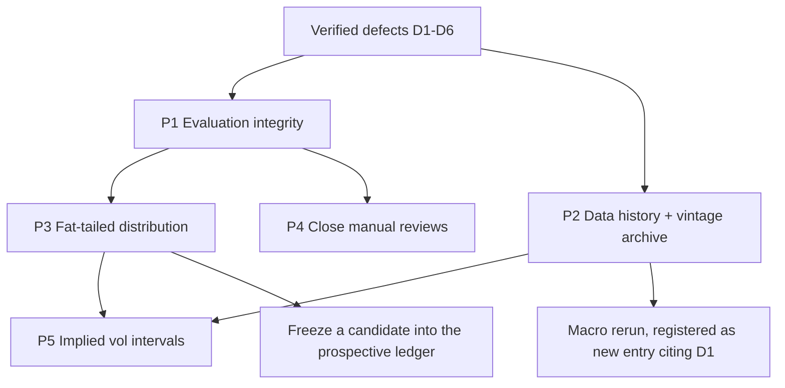

# Forecast Model Improvement Proposals — 2026-08-02

Codebase inspection of the BTC forecasting stack: live model, backtest harness,
experiment ledger (24 registered experiments), and data pipeline.

**Headline finding:** the reported quality gate (`PASS` vs naive at 14/30/60/90d)
is produced by a model whose structural coefficients were fitted on history that
includes the evaluation window, and whose interval multipliers were grid-searched
on the same 2022+ window they are scored on. The repo's own strict point-in-time
benchmark (`point-in-time-core-2026-07-10T19-52-43-293Z.md`, 458 origins) shows
the reconstructed policy **loses to naive-current-price at every gated horizon**.
Nothing should be added to this model until that provenance gap is closed or
explicitly disclosed.

---

## 1. What actually ships

The live BTC forecast (`src/lib/data.ts:331`, `src/lib/powerLaw.ts:36-44`) is:

```text
median(t_fut) = B(t_fut) · exp( r_T · exp(-h/210) )
B(t)          = a·t^b · (1 + c1·sin(ωt) + c2·cos(ωt)),   ω = 2π/1460
r_T           = log(P_now) - log(B(t_now))
```

with `a, b, c1, c2` frozen literals in `src/lib/modelConfig.ts:16-22`. There is
**no drift term**; all growth is the deterministic `t^3.6702` trend plus a fixed
4-year sinusoid. Intervals are log-normal:

```text
σ_d      = sqrt(0.55·σ_90² + 0.45·σ_365²)
σ_base(H)= σ_d · sqrt( Σ_{k<H} exp(-2k/210) )      → saturates at 10.3·σ_d
σ(H)     = m(H) · σ_base(H)                        → m from a frozen 6-point table
q_p      = median · exp( σ · Φ⁻¹(p) )
```

Everything else in the repo — regime classification, tail risk, ensemble, ridge
residual model, state-space residual, structural refit, cycle pivots, dynamic
volatility — is implemented, tested, and **switched off**. Of 72 features built
by `scripts/build-feature-table.ts`, **zero** reach the forecast; 14 reach
build-time context panels.

That is not a criticism. Per the ledger, `no-future-pivots` (deleting an
assumption) produced the single largest improvement ever recorded here — 365d
median error 0.19576 → 0.12978, 365d 90% coverage 68.5% → 91.9%. Twenty-four
experiments have never promoted an *additive* signal. The proposals below are
ordered by that prior.

---

## 2. Verified defects (fix directly — no experiment required)

Each was confirmed by reading the code, not inferred.

| # | Defect | Location | Impact |
|---|--------|----------|--------|
| D1 | FRED CSV request omits `cosd`; `START_DATE` is applied only as a post-filter, and `main()` overwrites the whole file | `scripts/update-macro-data.mjs:45`, `:41`, `:152` | `macro-history.json` holds **1,093 rows from 2023-07-07** instead of 16 years. Zero coverage of 2018, 2020 or 2022. The macro experiment could only ever have failed. |
| D2 | Open interest capped at a 30-row lookback and written wholesale | `scripts/update-derivatives-data.mjs:13,131,243` | `futuresOpenInterestUSD` exists on **28 of 5,836** feature rows. `regimeModel.ts:53` gates `elevated-futures-leverage` on it, so that reason code is unreachable for 99.5% of history. |
| D3 | Pinball loss divided by the realized value: `pinballLoss(...) / actual` | `src/lib/backtestMetrics.ts:97` | Destroys propriety of the scoring rule and makes it price-level dependent — 2022 lows are weighted several times more heavily than 2025 highs. **Every pinball number in every report artifact is mis-weighted.** |
| D4 | Embargo is computed, recorded in `supervisedPolicy`, then discarded — `intervalSnapshot(matured)` uses the un-embargoed set | `src/lib/pointInTimeForecast.ts:93-96` | The one genuinely point-in-time harness in the repo still leaks horizon-overlapping rows into its interval quantiles. `purgeAndEmbargoResidualRows` exists (`featureExperimentDataset.ts:64-108`) and is called from no production script. |
| D5 | MVRV/on-chain joined on an exact `sourceDate = rowDate − 1` key with no forward-fill or staleness flag | `scripts/build-feature-table.ts:50-53` | CoinMetrics runs ~4 days behind BTC. The latest feature row carries 57/72 features, `networkContext` is `null`, and `classifyRegime` evaluates `undefined > 1.8` → the `valuation-stretched` branch fails silently instead of reporting missing data. `check-data-freshness.ts` passes it at `lagDays: 5`. |
| D6 | Truthiness guards instead of finiteness: `predicted ? …`, `low && high` | `backtestMetrics.ts:96-97,137` | Legitimate `0` values silently dropped from pinball and coverage. Low impact on prices, but the same idiom will bite on returns/flows. |

**D1 and D3 are the two that change conclusions already recorded in the backlog.**
D1 means the macro rejection (2026-06-26) is void — it was run on one easing
regime. D3 means every pinball-based promotion decision was made on a
mis-weighted statistic.

---

## 3. Ranked proposals

Ordered by (evidence something is wrong) × (cost to find out) — highest first.

### P1 — Evaluation integrity and proper scoring · **PRD: [`docs/PRDs/2026-08-02/EVALUATION_INTEGRITY_AND_PROPER_SCORING.md`](../PRDs/2026-08-02/EVALUATION_INTEGRITY_AND_PROPER_SCORING.md)**

The measurement layer is the load-bearing asset here, and it is broken in three
independent ways.

1. **Improper pinball (D3)** and **unapplied embargo (D4)**.
2. **Interval multipliers are in-sample by construction.** `scripts/calibrate-intervals.ts:69-90`
   grid-searches 381 multipliers per horizon to minimise `|coverage − target|`
   over origins from `holdoutStartDate = 2022-01-01`. Those values land in
   `INTERVAL_CONFIG.fittedMultipliers` and are then scored on the same window.
   The 80/90/95% coverage table in every backtest report is a fitted quantity
   reported as a validation result.
3. **No distributional calibration diagnostic exists.** Coverage at three nominal
   levels is all there is. No CRPS, no PIT histogram, no Winkler score, no
   squared-error metric anywhere in the repo. A model can pass coverage while
   being badly mis-shaped, which is exactly the failure mode a log-normal
   assumption on BTC produces.

Also: `BACKTEST_CONFIG.rollingOriginSpacingDays = 1` with horizons to 365 means
the headline `samples` column (1,286–1,644) overstates independent evidence by
~90×. Only `evaluateRobustness` adjusts for it, at 400 bootstrap iterations —
the 5% bound is the 20th order statistic.

**Cost:** ~2 days. **Payoff:** every subsequent decision becomes interpretable.

### P2 — Data history recovery and vintage archive · **PRD: [`docs/PRDs/2026-08-02/DATA_HISTORY_RECOVERY_AND_VINTAGE_ARCHIVE.md`](../PRDs/2026-08-02/DATA_HISTORY_RECOVERY_AND_VINTAGE_ARCHIVE.md)**

D1, D2 and D5 are all the same root cause: **every updater does a wholesale
`writeFileSync` over its cache and keeps no vintages.** Consequences:

- Three years of macro instead of sixteen; 29 days of OI instead of seven years.
- `availableAfter` protects against *timing* leakage but not *revision* leakage.
  Yahoo re-adjusts VOO/GLD for every dividend, `update-btc-data.mjs:15` rewrites
  the trailing 365 days each run, DeFiLlama restates supply, CFTC revises prior
  reports. Every backtest in this repo runs on restated data and the reports say
  so ("latest-revised rather than vintage data").
- The `FRED_API_KEY` declared in `.env.example:11` as "required for
  `update:macro`" is never read. The ALFRED vintage path documented in
  `docs/reports/data-sources.md:20` as the promotion prerequisite is unimplemented.

An append-only `(series, as_of_date, observed_at, value)` store is a larger
accuracy win than any new series, because it is what makes the promotion gates
mean something. It also unblocks the macro rerun that D1 invalidated.

**Cost:** ~3-4 days. **Payoff:** the macro/COT/ETF families become testable for
the first time; backtests stop being retrospective.

### P3 — Fat-tailed predictive distribution · **PRD: [`docs/PRDs/2026-08-02/FAT_TAIL_INTERVAL_DISTRIBUTION.md`](../PRDs/2026-08-02/FAT_TAIL_INTERVAL_DISTRIBUTION.md)**

This is the largest untried lever in the model.

Every one of the 24 experiments targeted either the **median** (features, tau,
ensembles, state-space, indicators — all rejected) or the **scale** of the
interval (dynamic vol, EWMA/HAR, scalar rescaling — all rejected). **The shape
has never been touched.** `quantilePrice` (`src/lib/forecastInterval.ts:51`) is
log-normal by construction, on an asset whose daily log-return kurtosis is far
above 3.

The evidence that shape is the binding constraint is already in the current
report (`backtest-2026-07-13T18-10-43-134Z.md`): 90% coverage is near nominal
(89.7–93.1%) while 80% runs 3–4 points light at 30–90d (76.9–79.4%) and 95% is
over-covered at 60d (97.9%). Too thin in the middle and too fat at the edges is
the signature of fitting a Gaussian to a leptokurtic law — a single scale
multiplier cannot fix it, which is precisely why every scale experiment failed.

Two secondary defects in the same code path:

- **Long-horizon variance saturates.** `σ_base` asymptotes at `10.3·σ_d`, and
  `intervalMultiplierForHorizon` freezes at 0.59 above 365d
  (`forecastInterval.ts:139`). The 10-year band is the same width as the 1-year
  band. That is a displayed product surface, not a research artifact.
- **The median and the heatmap disagree.** The yellow line has no drift; the
  Monte Carlo uses `powerLawShockDrift = -0.3σ²` (`data.ts:387`), which is
  neither the Itô correction (0.5) nor zero. Two different processes are drawn
  on the same chart, the modal MC path sitting ~5.7% below the median in log
  terms.

The bootstrap machinery to supply an empirical shape already exists
(`computeResidualBootstrapSigmaMultiplier`, `forecastInterval.ts:69-102`) — but
it collapses the resampled distribution to **one scalar sd ratio** clipped to
`[0.7, 1.8]` (line 94-99), throwing away the shape it just measured.

**Cost:** ~2-3 days. **Payoff:** the only structural hypothesis with supporting
evidence in the current numbers.

### P4 — Close the two dangling `eligible-for-manual-review` items

Both have been sitting open since 2026-07-06 with the evidence already produced.
No new code, only the review and a promotion decision.

- **Tail-risk 1.10× multiplier.** 655 flagged / 957 normal windows at 30d; 1.10×
  lifts flagged 95% coverage 95.9% → 97.7% (30d) and 93.8% → 97.2% (90d).
  `TAIL_RISK_CONFIG.defaultEnabled` is still `false` and `tailRiskWidthAdjustment`
  has zero callers in `src/`. Note this should be re-scored *after* P1 and P3 —
  a fat-tailed base may absorb the same effect.
- **COT continuous residual family.** Status `eligible-for-manual-review` since
  2026-07-06; the manual review and pre-registered promotion candidate were never
  produced. COT is the best-behaved source in the pipeline
  (`update-cot-data.mjs:28` uses a conservative `reportDate + 4d` availability).

**Cost:** ~half a day each.

### P5 — Implied volatility as an interval input (Deribit DVOL)

The one input class never ingested, targeting the one quantity that can still
improve. The interval model calibrates purely from realized returns; implied
vol is a forward-looking measure of exactly the thing `σ_d` estimates
backward-looking. Deribit's public API supplies DVOL, ATM IV term structure and
25-delta risk reversal with history to 2021.

**Register as an interval-only experiment.** Median adjustment is blocked by the
backlog's rerun criteria and would be re-rejected. Run it after P1 and P3 so it
is scored with CRPS/PIT against a fat-tailed baseline rather than against a
mis-specified Gaussian.

**Cost:** ~2 days ingest + one pre-registered ablation.

---

## 4. Explicitly not proposed

These carry rerun-criteria blocks in `docs/reports/experiments-backlog.md`.
Re-proposing them would be a regression:

- Any `median × exp(coef × feature)` adjustment from ETF flow, funding/premium,
  stablecoin supply, Fear & Greed, on-chain interaction states, or latest-vintage
  FRED macro regimes.
- Any neighbouring fixed-tau value (60/90/120/150/300/420 all searched; tau=120
  explicitly failed 2017+ replication at Holm p=1.0), volatility-conditional tau,
  or expanding-window AR(1) adaptive tau (implied effective tau 742–750 days).
- The kitchen-sink ridge residual model, YL-1 structural shrinkage, YL-2
  state-space residual, or their parameter neighbourhoods.
- Validation-weighted ensembles (90d coverage collapsed 76.7% → 61.7%).
- Any additional technical indicator. Eleven rules across two families were
  pre-registered and search-history-Holm-corrected to p=1.0; OBV, CCI, ATR,
  divergences and candlesticks were excluded *before* outcomes were seen.
- Exchange-specific volume as an aggregate proxy (correlation 0.41–0.51).

Note that P2 **voids** the macro rejection specifically, because D1 shows the
data that experiment ran on was three years of a single regime, not the sixteen
years the script claims to fetch. That rerun should be registered as a new entry
citing D1, not as an appeal of the old verdict.

---

## 5. Sequencing



`src/data/prospective-forecast-ledger.json` has been hash-bound and **empty**
since 2026-07-10 — `frozenCandidates: []`, `rows: []` — because no candidate has
ever cleared the development gate. Whatever P3 produces should be the first
entry, whether or not it wins. Thirty non-overlapping outcomes at 90d is roughly
seven and a half years of calendar time at the current spacing rule; that clock
is worth starting now.

---

## 6. Registration

Per `AGENTS.md`, each of P1–P5 needs a `docs/reports/experiments-backlog.md`
entry before implementation, including the rerun criteria and the pre-registered
promotion gate. P1 and P2 are defect fixes rather than experiments, but both
invalidate previously recorded results (D1 → macro entry, D3 → every pinball
number), so both require a backlog note recording the invalidation.
